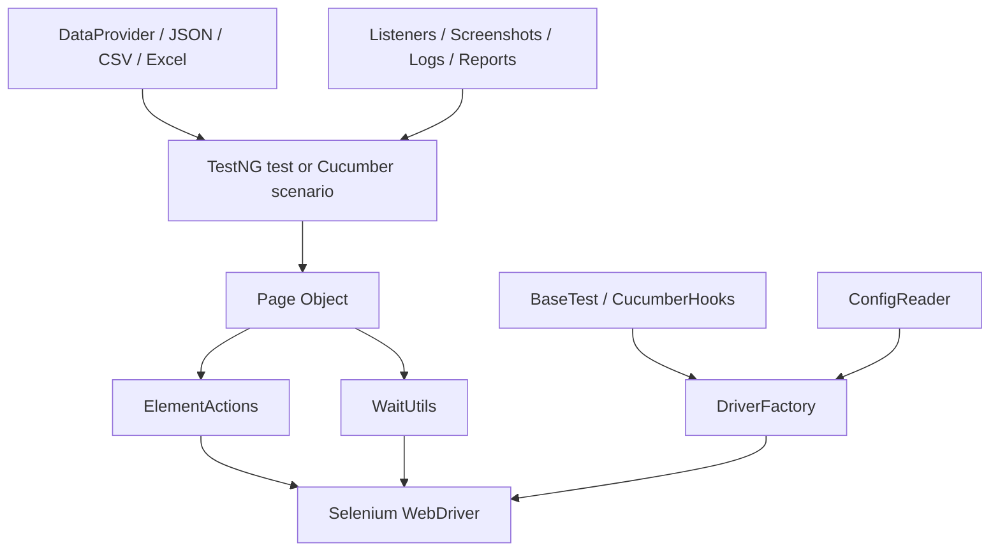
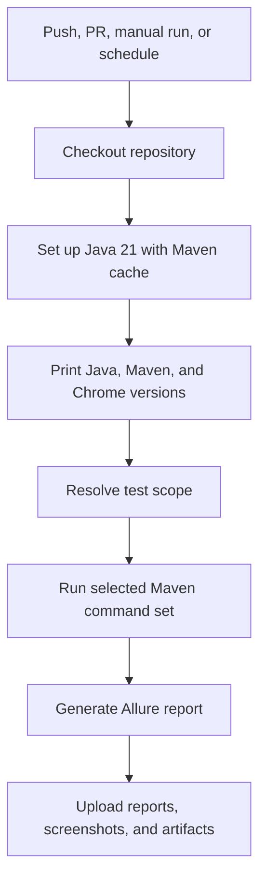

# Selenium Java SDET Learning Framework


Progressive Selenium Java UI automation learning framework for SDET interview
preparation, framework design practice, and portfolio demonstration.

This repository starts with Java and OOP foundations, then grows module by
module into a production-style Selenium framework with TestNG, Page Object
Model, wrapper methods, waits, configuration, data-driven testing,
screenshots, logging, Extent Reports, Allure, parallel execution, Selenium Grid
support, Cucumber BDD, and GitHub Actions CI.

The goal is not just to show a finished framework. The goal is to show how a
framework evolves and why each layer exists.

## Modular Learning Structure

This repository is intentionally built as a linear learning path, not as a
one-shot final framework.

Each module was developed on its own branch, completed, tagged, and then
carried forward into `main`. That gives learners two useful ways to study the
project:

| Git Object | Purpose |
| --- | --- |
| `module-XX-name` branch | shows the completed module checkpoint as a named learning branch |
| `module-XX-complete` tag | marks the exact commit where that module was completed |
| `main` | always points to the latest completed framework state |

Inspect the available checkpoints:

```bash
git branch --list 'module-*'
git tag --list 'module-*-complete' --sort=version:refname
```

Study the framework at a specific point:

```bash
git checkout module-04-complete
git checkout module-09-complete
git checkout module-18-complete
git checkout main
```

When checking out a tag, Git enters detached HEAD mode. That is fine for
reading and running tests. If you want to experiment from a checkpoint, create
a practice branch:

```bash
git switch -c practice/module-09 module-09-complete
```

Compare two completed checkpoints:

```bash
git diff module-08-complete..module-09-complete
```

Recommended study flow for each module:

1. Read `docs/module-XX-*/00-module-overview.md`.
2. Review the module's focused concept docs.
3. Open the source files linked from the docs.
4. Run the module's quality gate commands.
5. Compare the checkpoint with the previous module.

This structure is deliberate. The final framework matters, but the main
learning value is seeing why each layer was introduced.

## Learning Phases

| Phase | Modules | Learning Goal |
| --- | ---: | --- |
| Java and OOP foundations | 01-02 | understand the Java syntax and OOP ideas that framework code uses |
| Raw Selenium WebDriver | 03-07 | learn browser sessions, locators, waits, forms, alerts, windows, frames, files, Actions, JavaScript, and Shadow DOM |
| TestNG and framework foundation | 08-11 | introduce suite execution, `BaseTest`, Page Objects, wrappers, waits, config, and driver lifecycle |
| Data, diagnostics, and reporting | 12-14 | add DataProviders, JSON/CSV/Excel data, screenshots, listeners, retries, logs, Extent, and Allure |
| Scale and collaboration | 15-17 | add parallel execution, Selenium Grid support, Cucumber BDD, and GitHub Actions CI |
| Capstone and portfolio packaging | 18 | review the final architecture and prepare the project for portfolio/interview use |

## Module Checkpoints

| Checkpoint | What The Project Contains |
| --- | --- |
| `module-01-complete` | Java classes, objects, methods, constructors, collections, and control flow |
| `module-02-complete` | OOP concepts mapped to Selenium framework thinking |
| `module-03-complete` | first Selenium WebDriver and TestNG tests |
| `module-04-complete` | locators, WebElement commands, XPath, chained locators, and common locator exceptions |
| `module-05-complete` | implicit waits, explicit waits, fluent waits, expected conditions, and dynamic elements |
| `module-06-complete` | forms, buttons, text fields, links, images, checkboxes, radios, dropdowns, and alerts |
| `module-07-complete` | windows, frames, files, Actions API, JavaScriptExecutor, Shadow DOM, tables, and calendars |
| `module-08-complete` | TestNG lifecycle, groups, suite XML, Maven execution, and `BaseTest` |
| `module-09-complete` | Page Object Model with SauceDemo page classes |
| `module-10-complete` | `ElementActions` and `WaitUtils` wrapper layer |
| `module-11-complete` | `ConfigReader`, `DriverFactory`, and local/Grid execution modes |
| `module-12-complete` | data-driven testing with DataProvider, JSON, CSV, and Excel |
| `module-13-complete` | TestNG listeners, screenshots, retry analyzer, and Log4j2 diagnostics |
| `module-14-complete` | Extent Reports, Allure reporting, and safe artifact handling |
| `module-15-complete` | parallel execution, ThreadLocal driver handling, and Selenium Grid support |
| `module-16-complete` | Cucumber BDD, Gherkin, hooks, step definitions, and page object reuse |
| `module-17-complete` | GitHub Actions CI with selectable smoke/regression/BDD/parallel/full scopes |
| `module-18-complete` | final architecture review, runbook, portfolio packaging, and interview preparation |

## Final Framework State

| Area | Implementation |
| --- | --- |
| Language | Java 21 |
| Build tool | Maven |
| Browser automation | Selenium WebDriver |
| Test framework | TestNG |
| BDD layer | Cucumber with TestNG runner |
| Application under test | SauceDemo |
| Selenium playground | The Internet and focused local HTML fixtures |
| Page model | dynamic `By` locators, no PageFactory |
| Driver lifecycle | `DriverFactory` with local and Grid modes |
| Actions and waits | `ElementActions` and `WaitUtils` |
| Data | TestNG DataProvider, JSON, CSV, Excel |
| Diagnostics | Log4j2, screenshots, retry analyzer, TestNG listener |
| Reports | Surefire, Extent, Allure, Cucumber HTML/JSON |
| Parallel execution | TestNG method-level parallel suite with ThreadLocal drivers |
| CI | GitHub Actions workflow with manual test scope selection |

## Application Under Test

The primary application under test is
[SauceDemo](https://www.saucedemo.com), a public demo e-commerce site commonly
used for UI automation practice.

The raw Selenium modules also use [The Internet](https://the-internet.herokuapp.com)
for focused browser concepts such as checkboxes, waits, alerts, frames,
windows, file upload, hovers, JavaScript behavior, and dynamic elements.

Local HTML fixtures are included only where a stable, inspectable training page
helps teach the concept better than a public site.

## Project Structure

```text
.
├── .github/workflows/              # GitHub Actions CI
├── docs/                           # module-by-module learning documentation
├── src/main/java/com/learning/
│   ├── examples/                   # beginner Java/OOP learning examples
│   └── framework/                  # reusable Selenium framework code
├── src/test/java/com/learning/tests/
│   ├── learning/                   # raw Selenium concept tests
│   ├── base/                       # TestNG browser lifecycle
│   ├── saucedemo/                  # framework-style SauceDemo tests
│   ├── bdd/                        # Cucumber runner, hooks, context, steps
│   ├── dataproviders/              # TestNG data providers
│   ├── listeners/                  # TestNG listener and retry support
│   └── reports/                    # Extent and Allure support
├── src/test/resources/
│   ├── config/                     # framework config
│   ├── features/                   # Gherkin feature files
│   ├── testdata/                   # JSON, CSV, Excel data
│   └── module06,module07/          # local Selenium learning fixtures
├── testng.xml                      # sequential framework regression
├── testng-parallel.xml             # parallel framework regression
├── testng-cucumber.xml             # Cucumber BDD suite
└── pom.xml                         # Maven dependencies and plugins
```

## Architecture

The final framework separates test intent from Selenium mechanics.



Important framework files:

| File | Purpose |
| --- | --- |
| `src/main/java/com/learning/framework/driver/DriverFactory.java` | owns local and RemoteWebDriver creation through ThreadLocal storage |
| `src/main/java/com/learning/framework/config/ConfigReader.java` | reads framework configuration and system-property overrides |
| `src/main/java/com/learning/framework/actions/ElementActions.java` | centralizes common Selenium element commands |
| `src/main/java/com/learning/framework/waits/WaitUtils.java` | centralizes explicit wait behavior |
| `src/main/java/com/learning/framework/pages/saucedemo/` | SauceDemo Page Objects |
| `src/test/java/com/learning/tests/base/BaseTest.java` | TestNG setup and teardown for browser-based tests |
| `src/test/java/com/learning/tests/dataproviders/LoginDataProviders.java` | hardcoded, JSON, CSV, and Excel DataProvider examples |
| `src/test/java/com/learning/tests/listeners/` | TestNG listener, retry analyzer, and retry transformer |
| `src/test/java/com/learning/tests/bdd/` | Cucumber runner, hooks, context, and steps |

## Prerequisites

- Java 21
- Maven
- Chrome, Firefox, or Edge

Selenium Manager is used by Selenium WebDriver, so a separate driver-manager
dependency is not required for the normal local flow.

## Test Suites And Maven Commands

This project uses Maven Surefire to run TestNG tests. The default Maven command
and the suite XML commands serve different learning purposes.

### Default Discovery

```bash
mvn test
```

Runs all test classes discovered by Surefire using the default include pattern
from `pom.xml`:

```text
**/*Test.java
```

This is the broadest local validation path. It can include:

- raw Selenium learning tests under `src/test/java/com/learning/tests/learning/`
- framework-style SauceDemo TestNG tests.
- the Cucumber TestNG runner.

Use this when you want to validate the full current project, including earlier
learning examples.

### Sequential Framework Regression

```bash
mvn test -DsuiteXmlFile=testng.xml
```

Runs the main framework regression suite.

`testng.xml` includes:

- `SauceDemoPageObjectTest`
- `SauceDemoDataDrivenTest`
- `FrameworkTestListener`
- `RetryAnnotationTransformer`
- TestNG `regression` group filtering

This is the best everyday framework confidence command because it avoids the
raw learning playground tests and focuses on the final SauceDemo framework
flow.

### Smoke Regression

```bash
mvn test -DsuiteXmlFile=testng.xml -Dgroups=smoke
```

Runs the fastest high-value TestNG checks from the framework suite.

Smoke tests are also part of the regression group, so they represent the
smallest useful signal before pushing or opening a pull request.

### Parallel Regression

```bash
mvn test -DsuiteXmlFile=testng-parallel.xml
```

Runs the same core SauceDemo regression classes with:

```text
parallel="methods"
thread-count="3"
```

This suite validates framework thread safety:

- each test method gets its own browser session.
- `DriverFactory` uses `ThreadLocal` driver storage.
- `BaseTest` avoids shared mutable WebDriver state.
- listeners, screenshots, logs, and reports remain safe during parallel execution.

Use this after changing driver lifecycle, waits, page objects, listeners,
screenshots, reports, or data providers.

### Cucumber BDD Suite

```bash
mvn test -DsuiteXmlFile=testng-cucumber.xml
```

Runs the Cucumber TestNG runner:

```text
com.learning.tests.bdd.runners.CucumberTest
```

This validates the BDD layer:

- Gherkin feature files under `src/test/resources/features/`.
- step definitions under `src/test/java/com/learning/tests/bdd/steps/`.
- hooks and scenario context.
- reuse of the same page objects and framework services.

Run only Cucumber smoke scenarios:

```bash
mvn test -DsuiteXmlFile=testng-cucumber.xml -Dcucumber.filter.tags="@smoke"
```

### Browser And Execution Overrides

Run headed for debugging:

```bash
mvn test -DsuiteXmlFile=testng.xml -Dheadless=false
```

Run a different browser:

```bash
mvn test -DsuiteXmlFile=testng.xml -Dbrowser=firefox
mvn test -DsuiteXmlFile=testng.xml -Dbrowser=edge
```

Run through Selenium Grid:

```bash
mvn test -DsuiteXmlFile=testng.xml \
  -DexecutionMode=grid \
  -DgridUrl=http://localhost:4444
```

Generate Allure after a test run:

```bash
mvn allure:report
```

### Which Command Should I Use?

| Goal | Command |
| --- | --- |
| Fast local confidence | `mvn test -DsuiteXmlFile=testng.xml -Dgroups=smoke` |
| Main framework regression | `mvn test -DsuiteXmlFile=testng.xml` |
| Validate parallel safety | `mvn test -DsuiteXmlFile=testng-parallel.xml` |
| Validate BDD layer | `mvn test -DsuiteXmlFile=testng-cucumber.xml` |
| Run BDD smoke only | `mvn test -DsuiteXmlFile=testng-cucumber.xml -Dcucumber.filter.tags="@smoke"` |
| Run every discovered test | `mvn test` |
| Debug with visible browser | `mvn test -DsuiteXmlFile=testng.xml -Dheadless=false` |
| Generate Allure report | `mvn allure:report` |

## Configuration

Default configuration lives in:

```text
src/test/resources/config/config.properties
```

Common overrides:

```bash
mvn test -Dbrowser=chrome
mvn test -Dbrowser=firefox
mvn test -Dheadless=false
mvn test -DexecutionMode=grid -DgridUrl=http://localhost:4444
```

Supported browser values:

- `chrome`
- `firefox`
- `edge`

Supported execution modes:

- `local`
- `grid`

## Reports And Artifacts

Generated files are intentionally ignored by Git.

| Output | Path |
| --- | --- |
| Surefire/TestNG reports | `target/surefire-reports/` |
| Extent report | `target/extent-report/extent.html` |
| Cucumber HTML report | `target/cucumber-report/cucumber.html` |
| Cucumber JSON | `target/cucumber-report/cucumber.json` |
| Allure results | `target/allure-results/` |
| Allure report | `target/allure-report/` |
| Screenshots | `target/screenshots/` |
| Logs | `logs/` |

## Continuous Integration

GitHub Actions is configured in:

```text
.github/workflows/ui-tests.yml
```

The workflow is named `UI Tests`.

It runs on:

- pushes to `main`.
- pull requests targeting `main`.
- manual workflow dispatch.
- a weekly scheduled run every Monday at `02:00 UTC`.

The workflow uses:

- Ubuntu GitHub-hosted runner.
- Java 21 through `actions/setup-java`.
- Maven dependency caching.
- headless Chrome.
- Maven batch mode for CI-friendly logs.

### CI Scope Selection

Manual runs support a `test_scope` input.

| Scope | Commands Run | Purpose |
| --- | --- | --- |
| `smoke` | TestNG smoke + Cucumber smoke | default fast confidence path |
| `regression` | sequential TestNG regression + full Cucumber suite | broader functional confidence |
| `bdd` | Cucumber suite only | validates Gherkin, hooks, context, and steps |
| `parallel` | parallel TestNG suite only | validates ThreadLocal driver and parallel-safe framework behavior |
| `full` | all discovered tests + parallel suite | broadest scheduled/manual validation |

Default behavior:

- normal push or pull request: `smoke`.
- scheduled weekly run: `full`.
- manual run: selected scope.

### CI Execution Flow



### Artifact Uploads

Artifacts are uploaded even when tests fail, because failed UI tests need
evidence.

| Artifact | Path |
| --- | --- |
| Surefire/TestNG reports | `target/surefire-reports/` |
| Extent report | `target/extent-report/` |
| Cucumber report | `target/cucumber-report/` |
| Allure results and report | `target/allure-results/`, `target/allure-report/` |
| Failure screenshots | `target/screenshots/` |

The CI workflow does not commit generated reports back to the repository.
Reports are evidence for a specific run, so they stay as workflow artifacts.

### Why The CI Is Designed This Way

The CI setup teaches real framework tradeoffs:

- smoke checks give fast feedback for normal pushes and pull requests.
- regression checks validate the main user journeys more deeply.
- BDD checks prove that Cucumber reuses the framework instead of duplicating browser logic.
- parallel checks prove that browser sessions, reports, screenshots, and listeners are thread-safe.
- full scheduled runs catch broader failures without slowing every normal push.
- uploaded artifacts make failures diagnosable without rerunning locally first.

## Documentation

Start here:

- [Documentation index](docs/README.md)
- [Module 18 final architecture review](docs/module-18-capstone-and-portfolio/01-final-architecture-review.md)
- [Module 18 runbook and portfolio guide](docs/module-18-capstone-and-portfolio/02-runbook-and-portfolio-guide.md)

The docs are written to teach concepts behind the code, not just list files.
Most module docs include source links, walkthroughs, common mistakes, interview
readiness notes, revision checklists, and quality gates.

## Learning And Interview Focus

This repository is designed to help explain:

- how Selenium WebDriver maps to real browser behavior.
- why Page Object Model reduces locator and flow duplication.
- why wrapper methods centralize waits and Selenium commands.
- why `ThreadLocal` matters for parallel WebDriver execution.
- how TestNG DataProviders separate data from test flow.
- how screenshots, logs, listeners, Extent, and Allure improve failure diagnosis.
- how Cucumber sits above the framework without replacing page objects.
- how CI chooses between fast smoke checks and broader regression coverage.

## Repository Hygiene

Tracked:

- source code.
- tests.
- docs.
- config.
- workflows.
- suite XML files.

Ignored:

- generated Maven output under `target/`.
- generated reports.
- screenshots.
- logs.
- local IDE/editor files.

## Known Limitations

- SauceDemo and The Internet are public demo sites, so availability can affect
  local and CI runs.
- Selenium Grid support is implemented, but CI does not start a Grid service.
- Cross-browser matrix CI is intentionally deferred.
- Reports are generated as workflow artifacts, not published to GitHub Pages.
- Comments and docs are intentionally richer than production code because this
  is a learning framework.
