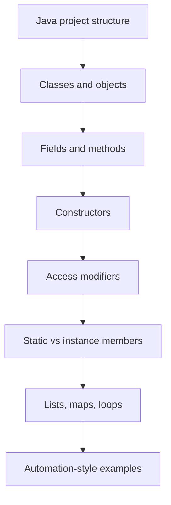

# Module 01 - Java OOP Foundation

## What This Module Builds

This module creates the first compileable Java/Maven project and introduces
the Java concepts needed before Selenium appears.

The code is intentionally small. It models automation ideas without using
Selenium yet:

- `_01_BrowserSession` represents a future browser session.
- `_02_LoginAttempt` represents user input for a login form.
- `_03_TestCaseSummary` represents a simple test case and its steps.
- `_04_Module01Demo` runs the examples and shows collections, loops, objects, and
  method calls.

## Why We Start Here

Selenium frameworks are Java projects first. If classes, objects,
constructors, access modifiers, methods, and collections are unclear, later
framework code such as `BaseTest`, `LoginPage`, and `DriverFactory` will feel
like magic.

This module makes those ideas visible before Selenium is introduced.

## Learning Flow



## Concepts Covered

| Concept | Where to Study |
| --- | --- |
| Maven project structure | `pom.xml` |
| Class and object | `_01_BrowserSession`, `_02_LoginAttempt` |
| Fields and methods | all Module 01 classes |
| Constructor | `_01_BrowserSession`, `_02_LoginAttempt`, `_03_TestCaseSummary` |
| Access modifiers | private fields and public methods |
| `static` | `_01_BrowserSession.DEFAULT_BROWSER`, `createdSessionCount` |
| Lists | `_03_TestCaseSummary`, `_04_Module01Demo` |
| Maps | `_04_Module01Demo` |
| Loops | `_04_Module01Demo` |

## Files Added Or Changed

| File | Status | Purpose |
| --- | --- | --- |
| `pom.xml` | added | Java 21 Maven project setup and `exec:java` entrypoint |
| `README.md` | added | Project entrypoint and current module commands |
| `src/main/java/com/learning/examples/module01/_01_BrowserSession.java` | added | class, fields, constructors, static members |
| `src/main/java/com/learning/examples/module01/_02_LoginAttempt.java` | added | form-style object with simple validation methods |
| `src/main/java/com/learning/examples/module01/_03_TestCaseSummary.java` | added | list usage and defensive copy |
| `src/main/java/com/learning/examples/module01/_04_Module01Demo.java` | added | runnable demo for objects, collections, and loops |

## Source Organization Note

Module 01 code lives under `com.learning.examples.module01` because these
classes are teaching examples, not reusable Selenium framework classes.

The package `com.learning.framework` is reserved for real framework code that
appears later, such as page objects, driver management, config readers,
wrappers, waits, screenshots, and reporting services.

## What Is Intentionally Deferred

- No Selenium dependency yet.
- No TestNG dependency yet.
- No `BaseTest`.
- No Page Object Model.
- No browser launch.

Those concepts come later after the Java foundations are clear.

## Quality Gate

Run:

```bash
mvn compile
mvn exec:java
```

Both commands should complete successfully.
