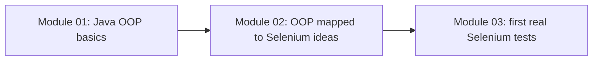
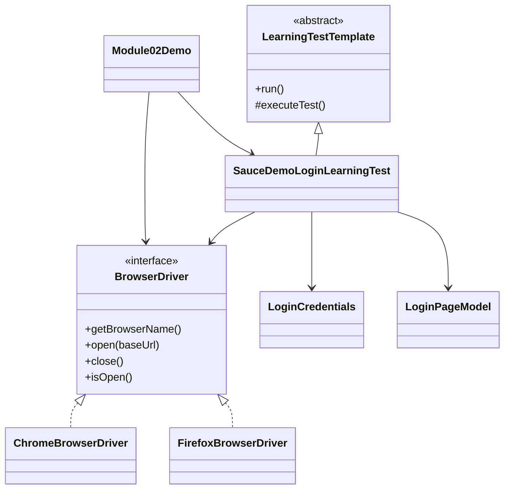

# Module 02 - OOP for Selenium

## What This Module Adds

Module 02 connects Java OOP concepts from Module 01 to the way Selenium
frameworks are designed.

Module 01 answered: what are classes, objects, fields, methods, constructors,
collections, and static members?

Module 02 answers: how do those same ideas show up when we design browser
automation code?



The module still does not launch a real browser. That is intentional. The goal
is to understand the OOP shape before Selenium WebDriver is added in Module 03.

## Why This Module Exists Before Selenium

Real Selenium code often starts with a line like this:

```java
WebDriver driver = new ChromeDriver();
```

That one line contains several OOP ideas:

- `WebDriver` is an interface.
- `ChromeDriver` is a concrete class.
- `driver` is a polymorphic reference.
- the test talks to the browser through a shared abstraction.

If those ideas are unclear, Selenium framework classes such as `BaseTest`,
`LoginPage`, `DriverFactory`, and wrapper methods will feel like memorized
patterns instead of understandable design.

## Files Added Or Changed

| File | Status | Purpose |
| --- | --- | --- |
| `pom.xml` | changed | updates `mvn exec:java` to run the Module 02 demo |
| `README.md` | changed | updates the current module status and commands |
| `src/main/java/com/learning/examples/module02/BrowserDriver.java` | added | interface that models the future `WebDriver` abstraction |
| `src/main/java/com/learning/examples/module02/ChromeBrowserDriver.java` | added | concrete browser implementation, similar in role to `ChromeDriver` |
| `src/main/java/com/learning/examples/module02/FirefoxBrowserDriver.java` | added | second implementation to make polymorphism visible |
| `src/main/java/com/learning/examples/module02/LoginCredentials.java` | added | encapsulated test data object with validation |
| `src/main/java/com/learning/examples/module02/LoginPageModel.java` | added | page-style class that hides login mechanics behind public methods |
| `src/main/java/com/learning/examples/module02/LearningTestTemplate.java` | added | small abstract template showing inheritance without building `BaseTest` yet |
| `src/main/java/com/learning/examples/module02/SauceDemoLoginLearningTest.java` | added | concrete learning test that extends the template |
| `src/main/java/com/learning/examples/module02/InvalidTestDataException.java` | added | custom exception for invalid learning test data |
| `src/main/java/com/learning/examples/module02/Module02Demo.java` | added | runnable demo for interfaces, polymorphism, inheritance, exceptions, and collections |
| `docs/module-02-oops-for-selenium/00-module-overview.md` | added | module map, file ownership, deferred scope, and quality gate |
| `docs/module-02-oops-for-selenium/01-encapsulation-and-abstraction.md` | added | explains private data and public actions in Selenium-style design |
| `docs/module-02-oops-for-selenium/02-inheritance-interfaces-polymorphism.md` | added | explains Selenium's `WebDriver driver = new ChromeDriver()` pattern |
| `docs/module-02-oops-for-selenium/03-exception-handling-and-collections.md` | added | explains validation, custom exceptions, and lists in automation |
| `docs/module-02-oops-for-selenium/exercises.md` | added | practice tasks with hints and expected outcomes |

## Previous Module Files Reused

Module 02 does not import Module 01 classes directly. It builds on the same
concepts and keeps the old examples available for comparison:

- `src/main/java/com/learning/examples/module01/BrowserSession.java`
- `src/main/java/com/learning/examples/module01/LoginAttempt.java`
- `src/main/java/com/learning/examples/module01/TestCaseSummary.java`
- `src/main/java/com/learning/examples/module01/Module01Demo.java`

## Source Ownership

All Module 02 source code lives under:

```text
src/main/java/com/learning/examples/module02/
```

These files are learning examples, not reusable framework classes. Real
framework packages under `com.learning.framework` are still deferred until the
curriculum reaches framework construction.

## Module 02 Dependency Map



## What Is Intentionally Deferred

Module 02 does not add:

- Selenium WebDriver dependency.
- real `ChromeDriver` browser launch.
- TestNG dependency.
- real assertions.
- `BaseTest`.
- Page Object Model implementation.
- framework wrappers, waits, config, reports, or screenshots.

Those pieces start in later modules after the raw OOP mapping is clear.

## Quality Gate

Run:

```bash
mvn compile
mvn exec:java
```

Expected outcome:

- the project compiles with Java 21.
- `mvn exec:java` runs `Module02Demo`.
- the console output shows the same login learning flow executed through two
  different browser implementations.
