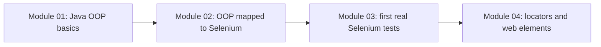
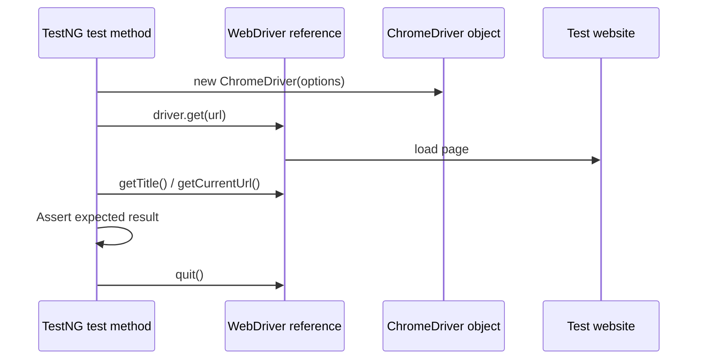

# Module 03 - First Selenium Tests

## What This Module Adds

Module 03 introduces real Selenium WebDriver and minimal TestNG tests.

Module 02 used compileable learning objects to explain this OOP shape:

```java
_01_BrowserDriver browser = new _02_ChromeBrowserDriver();
```

Module 03 now uses the real Selenium shape:

```java
WebDriver driver = new ChromeDriver(options);
```



This module intentionally keeps the tests raw. There is no `BaseTest`, no page
object, no wrapper method, no config reader, and no centralized wait utility.
The repetition is visible on purpose so later modules can remove it.

## Dependency Versions

Dependency versions were checked on May 6, 2026:

| Dependency | Version | Why |
| --- | --- | --- |
| `org.seleniumhq.selenium:selenium-java` | `4.43.0` | latest Maven Central release for Selenium Java when this module was created |
| `org.testng:testng` | `7.12.0` | latest Maven Central release for TestNG when this module was created |
| `org.slf4j:slf4j-simple` | `2.0.17` | test-scope provider to keep TestNG internal logging quiet |

`slf4j-simple` is not the framework logging solution. Log4j2 is still deferred
until the logging module.

## Files Added Or Changed

| File | Status | Purpose |
| --- | --- | --- |
| `pom.xml` | changed | adds Selenium, TestNG, Surefire, and test-scope SLF4J provider |
| `README.md` | changed | updates current module status and Selenium test commands |
| `src/test/java/com/learning/tests/learning/_01_FirstBrowserTest.java` | added | first raw ChromeDriver test using The Internet |
| `src/test/java/com/learning/tests/learning/_02_NavigationTest.java` | added | demonstrates `get`, `navigate().to`, back, forward, and refresh |
| `src/test/java/com/learning/tests/learning/_03_SauceDemoPageLoadTest.java` | added | opens SauceDemo and asserts page title/URL without locators |
| `docs/module-03-first-selenium-tests/00-module-overview.md` | added | module map, file ownership, deferred scope, and quality gate |
| `docs/module-03-first-selenium-tests/01-selenium-manager-and-chromedriver.md` | added | explains Selenium Manager, WebDriverManager comparison, ChromeDriver, and headless mode |
| `docs/module-03-first-selenium-tests/02-testng-raw-test-structure.md` | added | explains minimal TestNG usage and intentional duplication |
| `docs/module-03-first-selenium-tests/03-navigation-and-assertions.md` | added | explains browser navigation and assertions |
| `docs/module-03-first-selenium-tests/exercises.md` | added | practice tasks with hints and expected outcomes |

## Previous Module Files Reused

Module 03 does not import Module 02 classes. It reuses the concepts:

- interface reference: `WebDriver driver`.
- concrete class: `new ChromeDriver(options)`.
- polymorphism: tests talk through the `WebDriver` type.
- lifecycle thinking: create driver, use driver, quit driver.

The Module 02 learning files remain available under:

```text
src/main/java/com/learning/examples/module02/
```

## Source Ownership

Module 03 Selenium tests live under:

```text
src/test/java/com/learning/tests/learning/
```

These are raw learning tests, not framework tests. They are intentionally
duplicated and explicit.

The `learning/` test package is shared by raw Selenium modules, so its class
prefixes are global across the folder. Module 03 owns `_01_` through `_03_`;
later raw Selenium modules continue that sequence instead of restarting at
`_01_`.

## Test Flow



## What Is Intentionally Deferred

Module 03 does not add:

- element locators.
- form input.
- waits.
- screenshots.
- logging.
- page objects.
- `BaseTest`.
- config reader.
- cross-browser strategy.
- Selenium Grid.

Those concepts appear later after raw Selenium has been experienced directly.

## Quality Gate

Run:

```bash
mvn test
mvn test -Dheadless=false
```

Expected outcome:

- Maven compiles main and test code.
- TestNG runs three Selenium tests.
- Chrome opens through Selenium Manager.
- tests pass against The Internet and SauceDemo.

Use `-Dheadless=false` only when you want to see the browser window.
