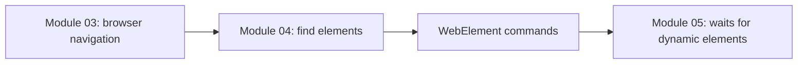
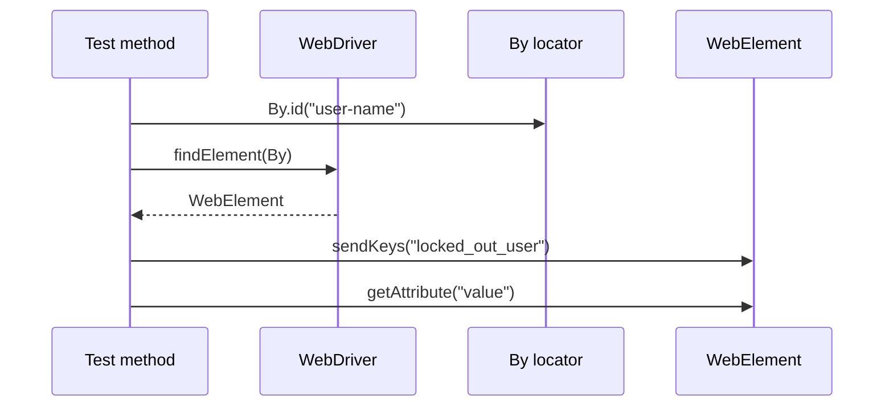

# Module 04 - Locators and Web Elements

## What This Module Adds

Module 04 teaches how Selenium finds elements and performs first element
actions.

Module 03 proved that Selenium can launch Chrome, navigate, and assert title
or URL. Module 04 moves from browser-level commands to page-level element
commands.



## Files Added Or Changed

| File | Status | Purpose |
| --- | --- | --- |
| `README.md` | changed | updates current module status |
| `src/test/java/com/learning/tests/learning/_01_LocatorStrategyTest.java` | added | demonstrates `By.id`, `By.name`, `By.className`, `By.tagName`, CSS, XPath, `findElement`, and `findElements` |
| `src/test/java/com/learning/tests/learning/_02_LinkLocatorTest.java` | added | demonstrates `By.linkText`, `By.partialLinkText`, and click navigation |
| `src/test/java/com/learning/tests/learning/_03_WebElementCommandTest.java` | added | demonstrates `sendKeys`, `clear`, `click`, `getText`, and `getAttribute` |
| `docs/module-04-locators-and-web-elements/00-module-overview.md` | added | module map, file ownership, deferred scope, and quality gate |
| `docs/module-04-locators-and-web-elements/01-locator-strategies.md` | added | explains locator strategies and stability rules |
| `docs/module-04-locators-and-web-elements/02-findelement-vs-findelements.md` | added | explains single vs list element lookup behavior |
| `docs/module-04-locators-and-web-elements/03-webelement-commands.md` | added | explains first element commands and gotchas |
| `docs/module-04-locators-and-web-elements/exercises.md` | added | practice tasks with hints and expected outcomes |

## Previous Module Files Reused

Module 04 builds directly on the raw Selenium tests from Module 03:

- `src/test/java/com/learning/tests/learning/_01_FirstBrowserTest.java`
- `src/test/java/com/learning/tests/learning/_02_NavigationTest.java`
- `src/test/java/com/learning/tests/learning/_03_SauceDemoPageLoadTest.java`

The setup duplication remains intentional. This module still does not add a
base class.

## Source Ownership

Module 04 tests live under:

```text
src/test/java/com/learning/tests/learning/
```

They are raw learning tests, not framework tests.

## Locator Flow



## What Is Intentionally Deferred

Module 04 does not add:

- waits.
- dynamic element handling.
- stale element recovery.
- page objects.
- wrapper methods.
- centralized locator storage.
- `BaseTest`.
- screenshots or logging.

Those appear later after raw locator and WebElement behavior is clear.

## Quality Gate

Run:

```bash
mvn test
mvn test -Dheadless=false
```

Expected outcome:

- TestNG runs six Selenium tests.
- Module 03 browser tests still pass.
- Module 04 locator and WebElement tests pass.
- Chrome opens visibly when `-Dheadless=false` is used.
