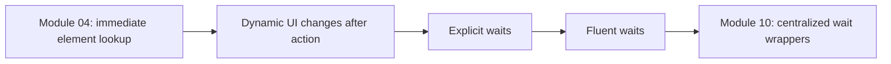
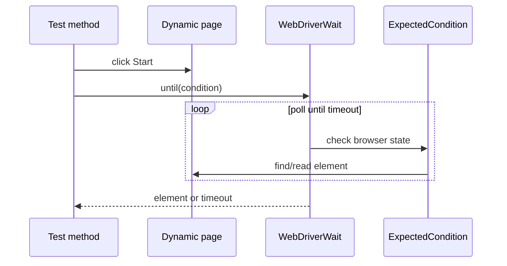

# Module 05 - Waits and Dynamic Elements

## What This Module Adds

Module 05 teaches timing problems in browser automation and introduces
Selenium waits.

Module 04 found elements immediately. Module 05 shows what happens when the UI
changes after the test action:



The module still keeps waits inside raw test classes. Centralized wait
utilities are intentionally deferred until the framework wrapper module.

## Files Added Or Changed

| File | Status | Purpose |
| --- | --- | --- |
| `README.md` | changed | updates current module status |
| `src/test/java/com/learning/tests/learning/ExplicitWaitTest.java` | added | waits for hidden dynamic text to become visible |
| `src/test/java/com/learning/tests/learning/DynamicControlsWaitTest.java` | added | waits for checkbox removal/addition and input enablement |
| `src/test/java/com/learning/tests/learning/FluentWaitTest.java` | added | demonstrates custom timeout, polling, and ignored exceptions |
| `src/test/java/com/learning/tests/learning/ImplicitWaitAndTimeoutTest.java` | added | demonstrates implicit wait setup and controlled timeout assertion |
| `docs/module-05-waits-and-dynamic-elements/00-module-overview.md` | added | module map, file ownership, deferred scope, and quality gate |
| `docs/module-05-waits-and-dynamic-elements/01-implicit-explicit-fluent-waits.md` | added | explains wait types and usage tradeoffs |
| `docs/module-05-waits-and-dynamic-elements/02-expected-conditions.md` | added | explains conditions used in this module |
| `docs/module-05-waits-and-dynamic-elements/03-dynamic-elements-and-timeouts.md` | added | explains dynamic UI, changing DOM shape, and timeout failures |
| `docs/module-05-waits-and-dynamic-elements/exercises.md` | added | practice tasks with hints and expected outcomes |

## Previous Module Files Reused

Module 05 builds on raw browser and locator tests:

- `src/test/java/com/learning/tests/learning/FirstBrowserTest.java`
- `src/test/java/com/learning/tests/learning/LocatorStrategyTest.java`
- `src/test/java/com/learning/tests/learning/WebElementCommandTest.java`

The new wait tests still duplicate driver creation and cleanup intentionally.

## Source Ownership

Module 05 tests live under:

```text
src/test/java/com/learning/tests/learning/
```

These are raw learning tests, not framework wait utilities.

## Wait Flow



## What Is Intentionally Deferred

Module 05 does not add:

- centralized `WaitUtils`.
- wrapper methods.
- page objects.
- retry logic.
- screenshot on timeout.
- custom framework exceptions for timeouts.
- JavaScript fallback clicks.

Those appear after the learner has seen raw wait duplication and timing
failures directly.

## Quality Gate

Run:

```bash
mvn test
mvn test -Dheadless=false
```

Expected outcome:

- TestNG runs eleven Selenium tests.
- dynamic loading and dynamic controls tests pass.
- the controlled timeout test catches and asserts `TimeoutException`.
- visible mode passes when `-Dheadless=false` is used.
