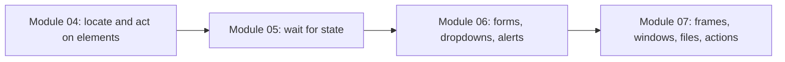
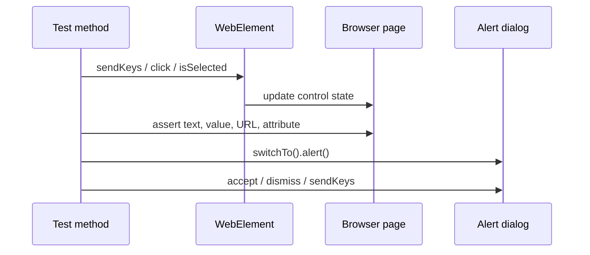

# Module 06 - Forms, Alerts, Dropdowns

## What This Module Adds

Module 06 expands raw Selenium from locating elements to handling common
interactive controls.

Module 04 introduced `WebElement` commands. Module 05 introduced waits for
dynamic page state. Module 06 now applies those ideas to form controls,
dropdowns, alerts, and a login form:



The tests are still raw Selenium learning tests. There is no `BaseTest`,
page object, driver factory, or wrapper method yet.

## Why A Local Fixture Exists

The module uses The Internet wherever that playground has a clear page for the
topic:

- checkboxes: `https://the-internet.herokuapp.com/checkboxes`.
- dropdowns: `https://the-internet.herokuapp.com/dropdown`.
- alerts: `https://the-internet.herokuapp.com/javascript_alerts`.
- form authentication: `https://the-internet.herokuapp.com/login`.

The local fixture exists only for controls that The Internet does not provide
as a compact, stable teaching page in this module: textarea, radio group,
image attribute reading, hyperlink fragment navigation, and a simple button
that updates visible text. The fixture is intentionally a complete learning
page with headings, labels, visible results, and HTML comments. Each local
interaction now has a visible learner-facing result, so the page can be
reviewed manually as well as through Selenium assertions.

## Files Added Or Changed

| File | Status | Purpose |
| --- | --- | --- |
| [src/test/resources/module06/form-controls.html](../../src/test/resources/module06/form-controls.html) | added | complete local learning fixture for textarea, radio, image, hyperlink, and button examples with visible action results |
| [src/test/java/com/learning/tests/learning/_11_TextboxTextareaButtonTest.java](../../src/test/java/com/learning/tests/learning/_11_TextboxTextareaButtonTest.java) | added | demonstrates textbox, textarea, button click, and reading a saved profile summary |
| [src/test/java/com/learning/tests/learning/_12_RadioImageHyperlinkTest.java](../../src/test/java/com/learning/tests/learning/_12_RadioImageHyperlinkTest.java) | added | demonstrates radio buttons with visible state, image attributes, and hyperlink navigation |
| [src/test/java/com/learning/tests/learning/_13_CheckboxDropdownTest.java](../../src/test/java/com/learning/tests/learning/_13_CheckboxDropdownTest.java) | added | demonstrates checkbox state and Selenium `Select` dropdown actions |
| [src/test/java/com/learning/tests/learning/_14_AlertsAndAuthenticationTest.java](../../src/test/java/com/learning/tests/learning/_14_AlertsAndAuthenticationTest.java) | added | demonstrates JavaScript alerts, confirms, prompts, and form authentication |
| [docs/module-06-forms-alerts-dropdowns/00-module-overview.md](00-module-overview.md) | added | module map, file ownership, deferred scope, and quality gate |
| [docs/module-06-forms-alerts-dropdowns/01-textbox-textarea-buttons.md](01-textbox-textarea-buttons.md) | added | explains input, textarea, and button actions |
| [docs/module-06-forms-alerts-dropdowns/02-checkbox-radio-links-images.md](02-checkbox-radio-links-images.md) | added | explains selected state, radio groups, hyperlinks, and images |
| [docs/module-06-forms-alerts-dropdowns/03-dropdowns-select.md](03-dropdowns-select.md) | added | explains HTML dropdowns and Selenium `Select` |
| [docs/module-06-forms-alerts-dropdowns/04-alerts-and-authentication.md](04-alerts-and-authentication.md) | added | explains alert handling and login form flow |
| [docs/module-06-forms-alerts-dropdowns/99-interview-review.md](99-interview-review.md) | added | interview-ready revision for form controls, dropdowns, alerts, and authentication |
| [docs/module-06-forms-alerts-dropdowns/exercises.md](exercises.md) | added | practice tasks with hints and expected outcomes |

## Module Source Links

Use these links as the source-reading checklist for this checkpoint. They point only to files that exist at Module 06.

| File | Status | Why It Matters |
| --- | --- | --- |
| [AGENTS.md](../../AGENTS.md) | Changed | Module session metadata |
| [CLAUDE.md](../../CLAUDE.md) | Changed | Module session metadata |
| [README.md](../../README.md) | Changed | Repository learning guide |
| [src/test/java/com/learning/tests/learning/_11_TextboxTextareaButtonTest.java](../../src/test/java/com/learning/tests/learning/_11_TextboxTextareaButtonTest.java) | Added | Raw Selenium learning test source |
| [src/test/java/com/learning/tests/learning/_12_RadioImageHyperlinkTest.java](../../src/test/java/com/learning/tests/learning/_12_RadioImageHyperlinkTest.java) | Added | Raw Selenium learning test source |
| [src/test/java/com/learning/tests/learning/_13_CheckboxDropdownTest.java](../../src/test/java/com/learning/tests/learning/_13_CheckboxDropdownTest.java) | Added | Raw Selenium learning test source |
| [src/test/java/com/learning/tests/learning/_14_AlertsAndAuthenticationTest.java](../../src/test/java/com/learning/tests/learning/_14_AlertsAndAuthenticationTest.java) | Added | Raw Selenium learning test source |
| [src/test/resources/module06/form-controls.html](../../src/test/resources/module06/form-controls.html) | Added | Local Selenium learning fixture |

## Previous Module Files Reused

Module 06 builds on these raw learning examples:

- [src/test/java/com/learning/tests/learning/_04_LocatorStrategyTest.java](../../src/test/java/com/learning/tests/learning/_04_LocatorStrategyTest.java)
- [src/test/java/com/learning/tests/learning/_06_WebElementCommandTest.java](../../src/test/java/com/learning/tests/learning/_06_WebElementCommandTest.java)
- [src/test/java/com/learning/tests/learning/_07_ExplicitWaitTest.java](../../src/test/java/com/learning/tests/learning/_07_ExplicitWaitTest.java)
- [src/test/java/com/learning/tests/learning/_08_DynamicControlsWaitTest.java](../../src/test/java/com/learning/tests/learning/_08_DynamicControlsWaitTest.java)

The shared `learning/` package continues its global sequence. Module 06 owns
`_11_` through `_14_`.

## Source Ownership

Module 06 tests live under:

```text
src/test/java/com/learning/tests/learning/
```

They are raw Selenium concept tests, not framework tests.

The local fixture lives under:

```text
src/test/resources/module06/form-controls.html
```

It is a complete learning fixture for controls that are not conveniently
available on The Internet. It is not framework code and it is not the AUT for
the final framework.

## Interaction Flow



## What Is Intentionally Deferred

Module 06 does not add:

- page objects.
- reusable form helpers.
- custom dropdown wrappers.
- alert utility classes.
- JavaScriptExecutor.
- screenshots.
- logging.
- data-driven credential sets.
- retry or click fallback logic.

Those appear after raw control behavior is clear.

## Quality Gate

Run:

```bash
mvn test
mvn test -Dheadless=false
```

Expected outcome:

- TestNG runs twenty-five Selenium tests.
- local fixture tests pass from [src/test/resources/module06/form-controls.html](../../src/test/resources/module06/form-controls.html).
- The Internet checkbox, dropdown, alert, and login tests pass.
- visible mode passes when `-Dheadless=false` is used.

## Readiness Standard

Before Module 07 adds advanced browser mechanics, a learner should be able to
explain:

- textbox vs textarea value handling.
- button click behavior and why assertions must check the resulting state.
- checkbox vs radio selected-state rules.
- hyperlink navigation and image attribute checks.
- why Selenium `Select` only works with real `<select>` elements.
- alert, confirm, and prompt handling through `switchTo().alert()`.
- why login navigation needs an explicit wait after submit.
- what stays raw now and what later page objects/wrappers will centralize.

Use `99-interview-review.md` as the final Module 06 revision pass.
