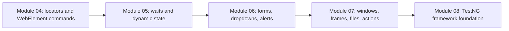
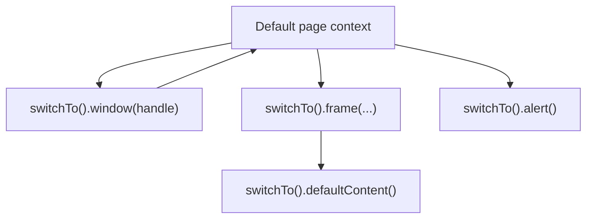

# Module 07 - Windows, Frames, Files, Actions

## What This Module Adds

Module 07 is the final raw Selenium mechanics module before the project starts
building a reusable TestNG framework foundation.

Modules 03 through 06 taught browser launch, locators, waits, forms,
dropdowns, and alerts. Module 07 adds browser-context changes, files, mouse
and keyboard gestures, Shadow DOM, date pickers, tables, JavaScriptExecutor,
and exception patterns.



The tests are still raw learning tests. The duplication is intentional because
Module 08 will make the need for `BaseTest` visible.

## Why A Local Fixture Still Exists

Module 07 now uses The Internet first wherever it has a clear page:

- windows/tabs: `https://the-internet.herokuapp.com/windows`.
- nested frames: `https://the-internet.herokuapp.com/nested_frames`.
- file upload: `https://the-internet.herokuapp.com/upload`.
- hovers: `https://the-internet.herokuapp.com/hovers`.
- key presses: `https://the-internet.herokuapp.com/key_presses`.
- web table reading: `https://the-internet.herokuapp.com/tables`.
- broken images: `https://the-internet.herokuapp.com/broken_images`.

The local fixture remains only for gaps where the public playground is missing,
too broad, or not deterministic enough for a beginner lesson: exact download
content, reliable drag/drop, open Shadow DOM click behavior, calendar/date
picker examples, visible row action output, deterministic sorting, and a
hidden element for exception teaching. The local fixture must be usable by a
human learner too, so these examples include visible action feedback such as
drag state, selected date text, selected-row highlighting, and sort status.

## Files Added Or Changed

| File | Status | Purpose |
| --- | --- | --- |
| `src/test/resources/module07/advanced-interactions.html` | added | complete local learning fixture for exact download content, visible drag/drop, calendar feedback, row selection, sorting status, Shadow DOM, and controlled exceptions |
| `src/test/resources/module07/upload-sample.txt` | added | file uploaded through `<input type="file">` |
| `src/test/java/com/learning/tests/learning/_15_WindowsAndFramesTest.java` | added | demonstrates window handles and nested frame switching |
| `src/test/java/com/learning/tests/learning/_16_FileUploadDownloadTest.java` | added | demonstrates file upload and download validation |
| `src/test/java/com/learning/tests/learning/_17_MouseKeyboardShadowDomTest.java` | added | demonstrates hover, keyboard keys, drag/drop, and Shadow DOM |
| `src/test/java/com/learning/tests/learning/_18_CalendarAndWebTableTest.java` | added | demonstrates date picker strategies, table extraction, row actions, and sorting |
| `src/test/java/com/learning/tests/learning/_19_JavaScriptAndExceptionsTest.java` | added | demonstrates JavaScriptExecutor, broken image detection, and advanced Selenium exceptions |
| `docs/module-07-windows-frames-files-actions/00-module-overview.md` | added | module map, file ownership, deferred scope, and quality gate |
| `docs/module-07-windows-frames-files-actions/01-windows-and-frames.md` | added | explains window handles, frame switching, and nested frames |
| `docs/module-07-windows-frames-files-actions/02-files-actions-shadow-dom.md` | added | explains file upload/download, mouse/keyboard actions, drag/drop, and Shadow DOM |
| `docs/module-07-windows-frames-files-actions/03-calendars-tables-javascript.md` | added | explains date pickers, web tables, sortable tables, JavaScriptExecutor, and broken images |
| `docs/module-07-windows-frames-files-actions/04-selenium-exceptions-map.md` | added | maps advanced Selenium exceptions to causes and later framework handling |
| `docs/module-07-windows-frames-files-actions/exercises.md` | added | practice tasks with hints and expected outcomes |

## Previous Module Files Reused

Module 07 builds on these raw learning examples:

- `src/test/java/com/learning/tests/learning/_04_LocatorStrategyTest.java`
- `src/test/java/com/learning/tests/learning/_07_ExplicitWaitTest.java`
- `src/test/java/com/learning/tests/learning/_10_ImplicitWaitAndTimeoutTest.java`
- `src/test/java/com/learning/tests/learning/_13_CheckboxDropdownTest.java`
- `src/test/java/com/learning/tests/learning/_14_AlertsAndAuthenticationTest.java`

The shared `learning/` package continues its global sequence. Module 07 owns
`_15_` through `_19_`.

## Source Ownership

Module 07 tests live under:

```text
src/test/java/com/learning/tests/learning/
```

They are raw Selenium concept tests, not framework tests.

Module 07 fixture files live under:

```text
src/test/resources/module07/
```

They are local test pages used only where The Internet does not provide a
clear or deterministic teaching page. They are not framework code and they are
not the final AUT.

## Context Switching Map



The main lesson is that Selenium can only interact with the currently active
browser context. Windows, frames, alerts, and Shadow DOM each require a
different access pattern.

## What Is Intentionally Deferred

Module 07 does not add:

- `BaseTest`.
- page objects.
- driver factory.
- reusable file utilities.
- reusable table helpers.
- reusable action wrappers.
- screenshot-on-failure.
- logging or reporting.
- Selenium Grid.

Those start after this raw mechanics phase.

## Quality Gate

Run:

```bash
mvn test
mvn test -Dheadless=false
```

Expected outcome:

- TestNG runs forty Selenium tests.
- The Internet window, frame, upload, hover, key press, table, and broken image
  tests pass.
- Module 07 local fixture tests pass for exact download, visible drag/drop,
  calendar feedback, row action selection, sorting status, Shadow DOM, and
  controlled exceptions.
- the file upload test sends `upload-sample.txt`.
- the download test creates and validates `module07-download.txt`.
- window, frame, action, table, Shadow DOM, JavaScript, and exception tests
  pass.
