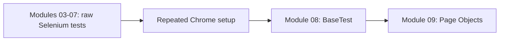
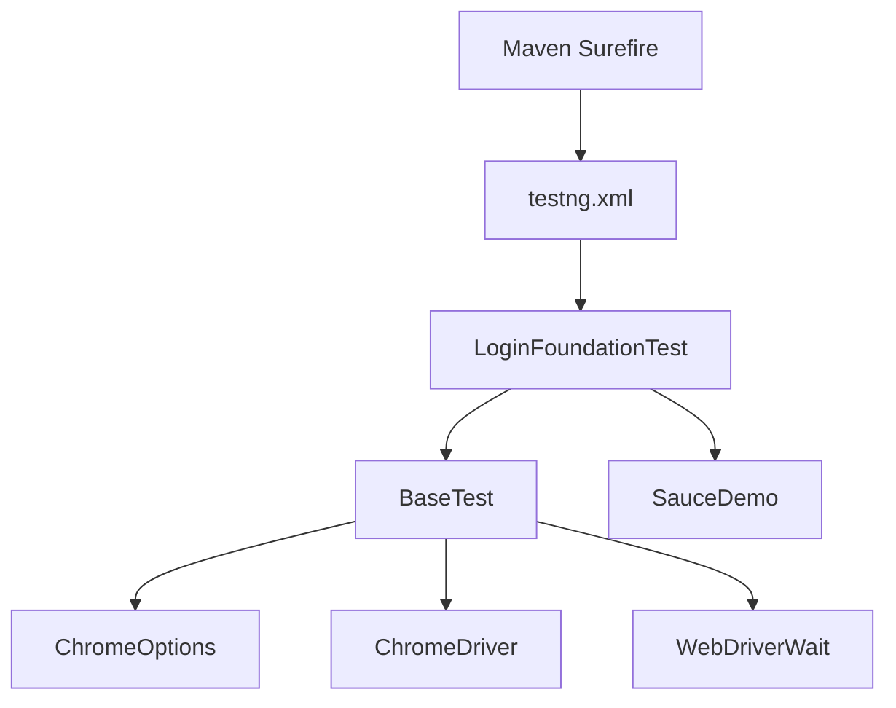

# Module 08 - TestNG Framework Foundation

## What This Module Adds

Module 08 is the first framework module. Modules 03 through 07 intentionally
kept browser setup inside each raw Selenium test so the repetition was visible.
This module extracts that repeated setup and cleanup into a reusable TestNG
base class.



The goal is not to build the final framework in one jump. The goal is to add
one clear layer:

```text
Test class -> BaseTest -> WebDriver
```

Page Objects, wrapper actions, config readers, driver factories, screenshots,
logs, and reports are intentionally still deferred.

The module should be studied as the first "framework boundary" module. It does
not make the tests fully abstract. It teaches where browser lifecycle belongs
before the project starts moving page behavior out of test classes.

## Why This Module Exists Now

By the end of Module 07, every raw Selenium class repeated some version of:

```java
ChromeOptions options = new ChromeOptions();
WebDriver driver = new ChromeDriver(options);
WebDriverWait wait = new WebDriverWait(driver, Duration.ofSeconds(10));
driver.quit();
```

That repetition is the right first framework problem to solve because it is
small, obvious, and high-value. It also teaches a real OOP design move:
inherit common setup behavior instead of copying it into every test class.

## Files Added Or Changed

| File | Status | Purpose |
| --- | --- | --- |
| [CLAUDE.md](../../CLAUDE.md) | changed | marks Module 08 as the active module and keeps future sessions aligned |
| [AGENTS.md](../../AGENTS.md) | changed | exact mirror of [CLAUDE.md](../../CLAUDE.md) |
| [pom.xml](../../pom.xml) | changed | adds a Maven profile so `-DsuiteXmlFile=testng.xml` can run a named TestNG suite |
| [testng.xml](../../testng.xml) | added | defines the Module 08 SauceDemo regression suite and group selection |
| [src/test/java/com/learning/tests/base/BaseTest.java](../../src/test/java/com/learning/tests/base/BaseTest.java) | added | owns per-test Chrome setup, `WebDriverWait`, and browser cleanup |
| [src/test/java/com/learning/tests/saucedemo/LoginFoundationTest.java](../../src/test/java/com/learning/tests/saucedemo/LoginFoundationTest.java) | added | first SauceDemo framework-style tests using inherited setup |
| [docs/module-08-testng-framework-foundation/00-module-overview.md](00-module-overview.md) | added | module purpose, file map, deferred scope, and quality gate |
| [docs/module-08-testng-framework-foundation/01-testng-lifecycle-and-basetest.md](01-testng-lifecycle-and-basetest.md) | added | explains TestNG annotations and browser lifecycle |
| [docs/module-08-testng-framework-foundation/02-suite-xml-groups-and-maven.md](02-suite-xml-groups-and-maven.md) | added | explains [testng.xml](../../testng.xml), groups, and Maven Surefire execution |
| [docs/module-08-testng-framework-foundation/03-inheritance-and-framework-boundaries.md](03-inheritance-and-framework-boundaries.md) | added | explains inheritance, `protected`, and why this is not POM yet |
| [docs/module-08-testng-framework-foundation/99-interview-review.md](99-interview-review.md) | added | interview-ready Module 08 revision guide |
| [docs/module-08-testng-framework-foundation/exercises.md](exercises.md) | added | practice tasks with hints and expected outcomes |

## Module Source Links

Use these links as the source-reading checklist for this checkpoint. They point only to files that exist at Module 08.

| File | Status | Why It Matters |
| --- | --- | --- |
| [AGENTS.md](../../AGENTS.md) | Changed | Module session metadata |
| [CLAUDE.md](../../CLAUDE.md) | Changed | Module session metadata |
| [pom.xml](../../pom.xml) | Changed | Maven build and dependency configuration |
| [src/test/java/com/learning/tests/base/BaseTest.java](../../src/test/java/com/learning/tests/base/BaseTest.java) | Added | Test framework base class |
| [src/test/java/com/learning/tests/saucedemo/LoginFoundationTest.java](../../src/test/java/com/learning/tests/saucedemo/LoginFoundationTest.java) | Added | SauceDemo TestNG test source |
| [testng.xml](../../testng.xml) | Added | TestNG suite configuration |

## Previous Module Files Reused

Module 08 does not modify the raw Selenium learning tests. It uses them as the
reason for the new abstraction:

- [src/test/java/com/learning/tests/learning/_01_FirstBrowserTest.java](../../src/test/java/com/learning/tests/learning/_01_FirstBrowserTest.java)
- [src/test/java/com/learning/tests/learning/_07_ExplicitWaitTest.java](../../src/test/java/com/learning/tests/learning/_07_ExplicitWaitTest.java)
- [src/test/java/com/learning/tests/learning/_15_WindowsAndFramesTest.java](../../src/test/java/com/learning/tests/learning/_15_WindowsAndFramesTest.java)
- [src/test/java/com/learning/tests/learning/_19_JavaScriptAndExceptionsTest.java](../../src/test/java/com/learning/tests/learning/_19_JavaScriptAndExceptionsTest.java)

Those classes remain useful revision material because they show what the
framework layer is replacing.

## Source Ownership

```text
src/test/java/com/learning/tests/base/
```

Framework test support code. Module 08 starts this package with `BaseTest`.

```text
src/test/java/com/learning/tests/saucedemo/
```

SauceDemo test classes. These are no longer raw Selenium concept tests, but
they are also not Page Object tests yet.

```text
src/test/java/com/learning/tests/learning/
```

Raw Selenium learning tests from previous modules. Do not move them into the
framework packages.

## Dependency Map



The important direction is that test classes depend on `BaseTest`; `BaseTest`
does not know any SauceDemo locators or test assertions.

## Execution Walkthrough

When a learner runs:

```bash
mvn test -DsuiteXmlFile=testng.xml
```

the checkpoint works like this:

```text
Maven Surefire loads testng.xml
        |
        v
TestNG finds LoginFoundationTest
        |
        v
@BeforeClass prepares loginUrl
        |
        v
@BeforeMethod in BaseTest creates Chrome and WebDriverWait
        |
        v
@Test uses inherited driver and wait to test SauceDemo login
        |
        v
@AfterMethod in BaseTest quits Chrome
        |
        v
@AfterClass clears loginUrl
```

That flow is the core of Module 08. If you can trace it from command line to
browser cleanup, the rest of the module becomes easier.

## Code Concepts To Master

| Concept | Where To Read | What To Understand |
| --- | --- | --- |
| TestNG lifecycle | [BaseTest.java](../../src/test/java/com/learning/tests/base/BaseTest.java), [LoginFoundationTest.java](../../src/test/java/com/learning/tests/saucedemo/LoginFoundationTest.java) | which annotations run once, which run per test method, and why browser setup is per method |
| Inheritance | [LoginFoundationTest.java](../../src/test/java/com/learning/tests/saucedemo/LoginFoundationTest.java) | how `extends BaseTest` gives the child class access to `driver` and `wait` |
| Protected fields | [BaseTest.java](../../src/test/java/com/learning/tests/base/BaseTest.java) | why this module allows child tests to use framework-owned browser objects |
| TestNG groups | [testng.xml](../../testng.xml), [LoginFoundationTest.java](../../src/test/java/com/learning/tests/saucedemo/LoginFoundationTest.java) | how `smoke` and `regression` labels control suite selection |
| Maven Surefire profile | [pom.xml](../../pom.xml) | how `-DsuiteXmlFile=testng.xml` switches from default discovery to named suite execution |
| Deferred Page Object Model | [LoginFoundationTest.java](../../src/test/java/com/learning/tests/saucedemo/LoginFoundationTest.java) | why locators stay in the test for one more module |

## What Is Intentionally Deferred

Module 08 does not add:

- Page Objects.
- `ElementActions`.
- centralized wait utilities.
- `ConfigReader`.
- `DriverFactory`.
- cross-browser execution.
- screenshot-on-failure.
- logging.
- reports.
- parallel execution.

This restraint matters. If all framework layers arrive at once, the learner
cannot tell which abstraction solved which problem.

## Quality Gate

Run:

```bash
mvn test -Dtest=LoginFoundationTest
mvn test -DsuiteXmlFile=testng.xml
mvn test
```

Expected outcome:

- `LoginFoundationTest` passes with two SauceDemo tests.
- [testng.xml](../../testng.xml) runs the `regression` group from the SauceDemo framework test.
- full `mvn test` still runs the previous raw learning tests plus Module 08.
- browser setup and cleanup happen through `BaseTest`, not inside the new test
  methods.

## Framework Readiness Standard

Before moving to Module 09, a learner should be able to explain:

- why `BaseTest` exists.
- why `@BeforeMethod` creates a browser per test.
- why `@AfterMethod` uses `quit()`.
- why `driver` and `wait` are `protected`.
- why `@BeforeClass` is not used for browser setup here.
- how [testng.xml](../../testng.xml) selects classes and groups.
- why locators still remain in `LoginFoundationTest` until Page Objects are
  introduced.
