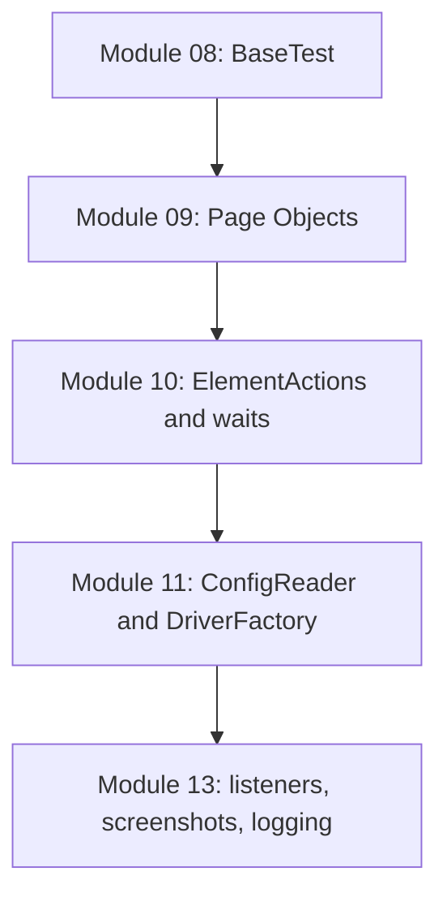

# Inheritance and Framework Boundaries

## Files In This Topic

This topic reads these files:

- [src/test/java/com/learning/tests/base/BaseTest.java](../../src/test/java/com/learning/tests/base/BaseTest.java)
- [src/test/java/com/learning/tests/saucedemo/LoginFoundationTest.java](../../src/test/java/com/learning/tests/saucedemo/LoginFoundationTest.java)


## The First Framework Boundary

Module 08 creates the first real boundary:

```text
BaseTest: browser lifecycle
LoginFoundationTest: SauceDemo behavior and assertions
```

That boundary is small but important. A framework becomes confusing when one
class owns too many responsibilities.

## What Belongs In `BaseTest`

In Module 08, `BaseTest` may own:

- Chrome startup.
- headless option.
- window size.
- shared `WebDriverWait`.
- browser cleanup.

It should not own:

- login locators.
- usernames or passwords.
- product assertions.
- page-specific helper methods.
- report logic.
- cross-browser factory logic.

Some of those responsibilities will appear later, but not all inside
`BaseTest`. For example, Module 11 will move driver creation into
`DriverFactory` instead of growing `BaseTest` endlessly.

## Why This Is Not Page Object Model Yet

`LoginFoundationTest` still contains locators:

```java
private static final By USERNAME_INPUT = By.id("user-name");
```

That is intentional. Module 08 teaches TestNG foundation and inheritance.
Module 09 will teach Page Object Model.

If this module added `LoginPage` immediately, two new ideas would arrive at the
same time:

- inherited browser lifecycle.
- page-level encapsulation.

Keeping them separate makes the learning path easier to reason about.

## Local Helper Method vs Page Object

`LoginFoundationTest` has:

```java
private void loginAs(String username, String password) {
    driver.findElement(USERNAME_INPUT).sendKeys(username);
    driver.findElement(PASSWORD_INPUT).sendKeys(password);
    driver.findElement(LOGIN_BUTTON).click();
}
```

This is a local helper, not a Page Object.

Why?

- it is private to one test class.
- it still uses raw Selenium directly.
- it still stores locators in the test class.
- it does not model a page as a reusable object.

Module 09 will move this idea into `LoginPage`, where it becomes reusable
across multiple test classes.

## Why Constants Are Used For Locators

Locators are stored as constants:

```java
private static final By LOGIN_BUTTON = By.id("login-button");
```

This teaches two useful habits:

- avoid duplicating locator strings across test methods.
- name the element by business meaning, not by selector syntax.

The naming should describe the UI element. The `By.id(...)` detail is the
implementation.

## Framework Growth Path

The intended progression is:



Each layer removes a specific type of duplication:

- `BaseTest` removes duplicated browser lifecycle.
- Page Objects remove duplicated locators and page actions.
- `ElementActions` removes duplicated find/wait/click/type logic.
- `ConfigReader` and `DriverFactory` remove hardcoded browser settings.
- listeners and logging remove manual failure diagnosis work.

## Interview Readiness

**Question: Why use inheritance for `BaseTest`?**

Because every test class needs the same setup and cleanup. Inheritance lets
child test classes reuse lifecycle behavior without copying it.

**Question: Is `BaseTest` the final driver design?**

No. It is the first framework step. Module 11 will introduce `DriverFactory`
and configuration so `BaseTest` coordinates driver creation instead of
constructing Chrome directly.

**Question: Why not make `driver` private?**

If `driver` were private, child tests could not access it directly. Module 08
uses `protected` so child classes can use the driver while the framework is
still simple. Later modules will reduce direct driver usage through page
objects and wrapper actions.
