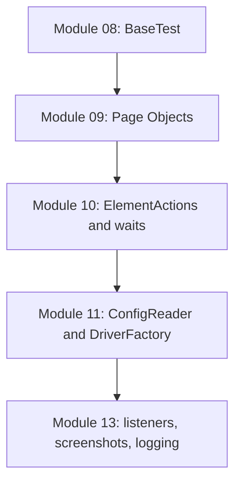

# Inheritance and Framework Boundaries

## Files In This Topic

This topic reads these files:

- [src/test/java/com/learning/tests/base/BaseTest.java](../../src/test/java/com/learning/tests/base/BaseTest.java)
- [src/test/java/com/learning/tests/saucedemo/LoginFoundationTest.java](../../src/test/java/com/learning/tests/saucedemo/LoginFoundationTest.java)


## The First Framework Boundary

Module 08 creates the first real boundary:

```text
BaseTest: browser lifecycle
LoginFoundationTest: SauceDemo behavior and assertions
```

That boundary is small but important. A framework becomes confusing when one
class owns too many responsibilities.

The design question for this module is:

```text
What code is repeated by many browser tests, but is not specific to SauceDemo?
```

The answer is browser setup, wait setup, and browser cleanup. That is why
those responsibilities move to [BaseTest](../../src/test/java/com/learning/tests/base/BaseTest.java).
The SauceDemo URL, locators, credentials, and assertions stay in
[LoginFoundationTest](../../src/test/java/com/learning/tests/saucedemo/LoginFoundationTest.java).

## What Belongs In `BaseTest`

In Module 08, `BaseTest` may own:

- Chrome startup.
- headless option.
- window size.
- shared `WebDriverWait`.
- browser cleanup.

It should not own:

- login locators.
- usernames or passwords.
- product assertions.
- page-specific helper methods.
- report logic.
- cross-browser factory logic.

Some of those responsibilities will appear later, but not all inside
`BaseTest`. For example, Module 11 will move driver creation into
`DriverFactory` instead of growing `BaseTest` endlessly.

The mental model is:

```text
BaseTest should answer: "How does a test get a clean browser?"
BaseTest should not answer: "How does SauceDemo login work?"
```

That rule protects the framework from becoming application-specific too early.

## What Belongs In `LoginFoundationTest`

`LoginFoundationTest` owns the first framework-style application checks:

- open SauceDemo.
- enter credentials.
- submit login.
- wait for the expected result.
- assert product page or error-message behavior.

It owns these locators because Module 09 has not introduced Page Objects yet:

```java
private static final By USERNAME_INPUT = By.id("user-name");
private static final By LOGIN_ERROR = By.cssSelector("[data-test='error']");
```

This is still better than the raw modules because browser lifecycle is no
longer duplicated. It is not yet final because the test class still knows too
much about the page structure.

## Why This Is Not Page Object Model Yet

`LoginFoundationTest` still contains locators:

```java
private static final By USERNAME_INPUT = By.id("user-name");
```

That is intentional. Module 08 teaches TestNG foundation and inheritance.
Module 09 will teach Page Object Model.

If this module added `LoginPage` immediately, two new ideas would arrive at the
same time:

- inherited browser lifecycle.
- page-level encapsulation.

Keeping them separate makes the learning path easier to reason about.

## Local Helper Method vs Page Object

`LoginFoundationTest` has:

```java
private void loginAs(String username, String password) {
    driver.findElement(USERNAME_INPUT).sendKeys(username);
    driver.findElement(PASSWORD_INPUT).sendKeys(password);
    driver.findElement(LOGIN_BUTTON).click();
}
```

This is a local helper, not a Page Object.

Why?

- it is private to one test class.
- it still uses raw Selenium directly.
- it still stores locators in the test class.
- it does not model a page as a reusable object.

Module 09 will move this idea into `LoginPage`, where it becomes reusable
across multiple test classes.

The helper is still valuable in Module 08 because it removes duplication inside
the class:

```text
standard user test -> loginAs(...)
locked-out user test -> loginAs(...)
```

But the helper is not reusable outside this class because it depends on private
locators owned by this class. That is the exact limitation Module 09 will solve.

## Why Constants Are Used For Locators

Locators are stored as constants:

```java
private static final By LOGIN_BUTTON = By.id("login-button");
```

This teaches two useful habits:

- avoid duplicating locator strings across test methods.
- name the element by business meaning, not by selector syntax.

The naming should describe the UI element. The `By.id(...)` detail is the
implementation.

The keywords matter:

```java
private static final By LOGIN_BUTTON = By.id("login-button");
```

- `private`: only this class can use the locator.
- `static`: one locator constant belongs to the class, not to each test object.
- `final`: the locator reference should not be reassigned.
- `By`: Selenium locator strategy object.

This gives learners a bridge from Java OOP syntax to Selenium framework style.

## Why Assertions Stay In The Test

`LoginFoundationTest` performs assertions directly:

```java
Assert.assertEquals(driver.findElement(PRODUCTS_TITLE).getText(), "Products");
Assert.assertEquals(driver.findElements(INVENTORY_ITEMS).size(), 6);
```

That is correct for Module 08. Assertions describe the expected outcome of the
test scenario. `BaseTest` should not assert SauceDemo behavior because it is a
framework lifecycle class.

Later, Page Objects will provide readable methods for page state, but the test
will still decide what is expected.

## Why `@BeforeClass` Is Only For Class Data

`LoginFoundationTest` uses:

```java
@BeforeClass(alwaysRun = true)
public void setUpClassData() {
    loginUrl = "https://www.saucedemo.com/";
}
```

This method does not open a browser. It only prepares data shared by the test
methods in this class.

That is the difference:

| Annotation | Module 08 Use | Why |
| --- | --- | --- |
| `@BeforeClass` | set `loginUrl` | data can be shared safely |
| `@BeforeMethod` | create browser | browser state should not be shared |
| `@AfterMethod` | quit browser | cleanup must happen after every test |
| `@AfterClass` | clear `loginUrl` | class data cleanup |

This is one of the most important TestNG lifecycle lessons in the module.

## Framework Growth Path

The intended progression is:



Each layer removes a specific type of duplication:

- `BaseTest` removes duplicated browser lifecycle.
- Page Objects remove duplicated locators and page actions.
- `ElementActions` removes duplicated find/wait/click/type logic.
- `ConfigReader` and `DriverFactory` remove hardcoded browser settings.
- listeners and logging remove manual failure diagnosis work.

Notice that each later abstraction has a reason. Module 08 should not add those
classes before the learner can name the pain:

| Pain Observed | Later Solution |
| --- | --- |
| repeated locators and page actions | Page Objects |
| repeated find/wait/click/type code | wrapper actions |
| hardcoded browser settings | configuration reader |
| browser construction growing in `BaseTest` | driver factory |
| hard-to-debug failures | screenshots, logging, reports |

## Interview Readiness

**Question: Why use inheritance for `BaseTest`?**

Because every test class needs the same setup and cleanup. Inheritance lets
child test classes reuse lifecycle behavior without copying it.

**Question: Is `BaseTest` the final driver design?**

No. It is the first framework step. Module 11 will introduce `DriverFactory`
and configuration so `BaseTest` coordinates driver creation instead of
constructing Chrome directly.

**Question: Why not make `driver` private?**

If `driver` were private, child tests could not access it directly. Module 08
uses `protected` so child classes can use the driver while the framework is
still simple. Later modules will reduce direct driver usage through page
objects and wrapper actions.

**Question: Why are locators still in the test class?**

Because Module 08 is teaching TestNG lifecycle and the first framework
boundary. Moving locators into Page Objects is a separate design lesson in
Module 09. Keeping the ideas separate makes it clear that `BaseTest` solves
browser lifecycle duplication, not page modeling.

**Question: What would be a bad use of `BaseTest`?**

Adding SauceDemo-specific helper methods, locators, credentials, product names,
or assertions. That would make the base class application-specific and harder
to reuse.

## Revision Drill

Open the two Java files and answer without looking at the docs:

1. Which class starts Chrome?
2. Which class knows the login button locator?
3. Which method runs before every test method?
4. Which method runs once before all tests in the class?
5. Which class owns assertions?
6. Why is `loginAs(...)` not a Page Object method yet?

If any answer is unclear, reread this module before moving to Module 09.
