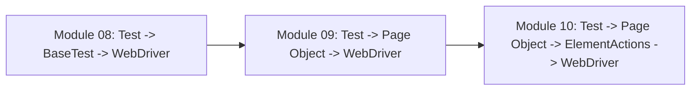
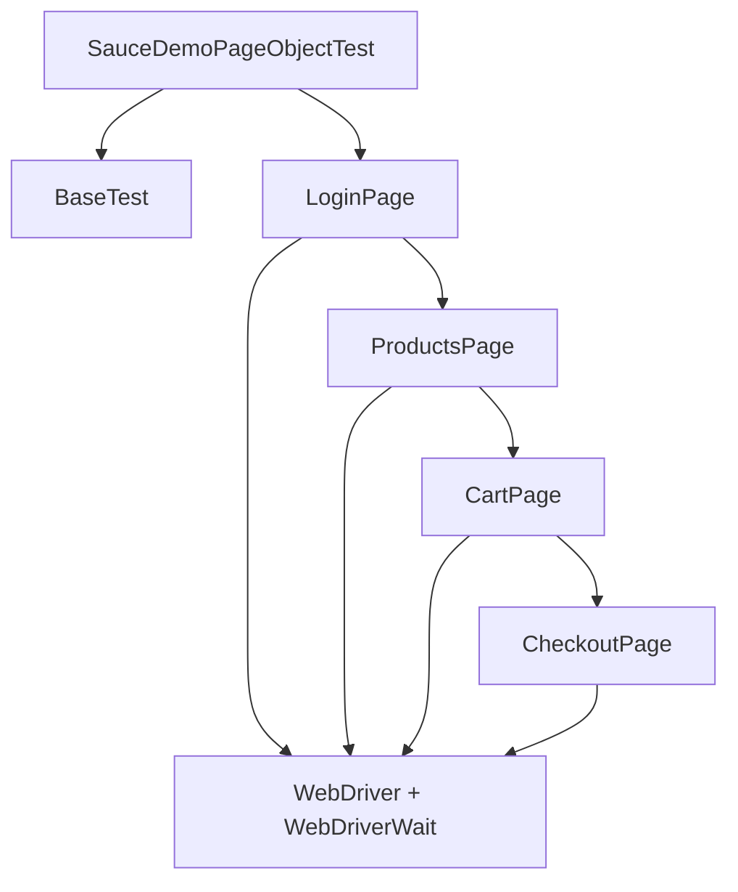

# Module 09 - Page Object Model

## What This Module Adds

Module 09 introduces Page Object Model for SauceDemo.

Module 08 solved browser lifecycle duplication with `BaseTest`. The next
duplication is page knowledge: login locators, product-card lookup, cart
assertions, and checkout steps should not live directly inside test methods.



Module 09 keeps raw Selenium calls inside page objects on purpose. Module 10
will introduce wrapper methods around those Selenium calls.

## Why This Module Exists Now

`LoginFoundationTest` from Module 08 proved that shared browser setup works,
but it still kept page-specific details in the test class:

```java
private static final By USERNAME_INPUT = By.id("user-name");
```

That is not where locators belong in a framework. A test should explain the
workflow. A page object should know how the page is built.

Module 09 changes the test style from low-level page mechanics:

```java
driver.findElement(By.id("user-name")).sendKeys("standard_user");
```

to workflow-oriented code:

```java
ProductsPage productsPage = new LoginPage(driver, wait)
        .open()
        .loginAs(standardUser, password);
```

## Files Added Or Changed

| File | Status | Purpose |
| --- | --- | --- |
| [CLAUDE.md](../../CLAUDE.md) | changed | marks Module 09 as the active module and keeps future sessions aligned |
| [AGENTS.md](../../AGENTS.md) | changed | exact mirror of [CLAUDE.md](../../CLAUDE.md) |
| [testng.xml](../../testng.xml) | changed | points the suite at the new Page Object based SauceDemo test |
| [src/main/java/com/learning/framework/pages/saucedemo/LoginPage.java](../../src/main/java/com/learning/framework/pages/saucedemo/LoginPage.java) | added | owns login-page locators and login actions |
| [src/main/java/com/learning/framework/pages/saucedemo/ProductsPage.java](../../src/main/java/com/learning/framework/pages/saucedemo/ProductsPage.java) | added | owns product inventory interactions and cart navigation |
| [src/main/java/com/learning/framework/pages/saucedemo/CartPage.java](../../src/main/java/com/learning/framework/pages/saucedemo/CartPage.java) | added | owns cart assertions and checkout navigation |
| [src/main/java/com/learning/framework/pages/saucedemo/CheckoutPage.java](../../src/main/java/com/learning/framework/pages/saucedemo/CheckoutPage.java) | added | owns the first checkout screen boundary and information-form state |
| `src/test/java/com/learning/tests/saucedemo/LoginFoundationTest.java` | removed | replaced by the Page Object based test class |
| [src/test/java/com/learning/tests/saucedemo/SauceDemoPageObjectTest.java](../../src/test/java/com/learning/tests/saucedemo/SauceDemoPageObjectTest.java) | added | verifies SauceDemo workflows through Page Objects |
| [docs/module-09-page-object-model/00-module-overview.md](00-module-overview.md) | added | module purpose, file map, dependency map, and quality gate |
| [docs/module-09-page-object-model/01-pom-concepts-and-boundaries.md](01-pom-concepts-and-boundaries.md) | added | explains Page Object responsibilities and boundaries |
| [docs/module-09-page-object-model/02-page-transitions-and-test-flow.md](02-page-transitions-and-test-flow.md) | added | explains page-to-page returns and readable workflow tests |
| [docs/module-09-page-object-model/03-pagefactory-vs-by-locators.md](03-pagefactory-vs-by-locators.md) | added | explains PageFactory as context and why this framework uses `By` locators |
| [docs/module-09-page-object-model/99-interview-review.md](99-interview-review.md) | added | interview-ready Module 09 revision guide |
| [docs/module-09-page-object-model/exercises.md](exercises.md) | added | practice tasks with hints and expected outcomes |

## Module Source Links

Use these links as the source-reading checklist for this checkpoint. They point only to files that exist at Module 09.

| File | Status | Why It Matters |
| --- | --- | --- |
| [AGENTS.md](../../AGENTS.md) | Changed | Module session metadata |
| [CLAUDE.md](../../CLAUDE.md) | Changed | Module session metadata |
| [src/main/java/com/learning/framework/pages/saucedemo/CartPage.java](../../src/main/java/com/learning/framework/pages/saucedemo/CartPage.java) | Added | Framework Page Object source |
| [src/main/java/com/learning/framework/pages/saucedemo/CheckoutPage.java](../../src/main/java/com/learning/framework/pages/saucedemo/CheckoutPage.java) | Added | Framework Page Object source |
| [src/main/java/com/learning/framework/pages/saucedemo/LoginPage.java](../../src/main/java/com/learning/framework/pages/saucedemo/LoginPage.java) | Added | Framework Page Object source |
| [src/main/java/com/learning/framework/pages/saucedemo/ProductsPage.java](../../src/main/java/com/learning/framework/pages/saucedemo/ProductsPage.java) | Added | Framework Page Object source |
| [src/test/java/com/learning/tests/saucedemo/SauceDemoPageObjectTest.java](../../src/test/java/com/learning/tests/saucedemo/SauceDemoPageObjectTest.java) | Added | SauceDemo TestNG test source |
| [testng.xml](../../testng.xml) | Changed | TestNG suite configuration |

## Previous Module Files Reused

Module 09 builds directly on:

- [src/test/java/com/learning/tests/base/BaseTest.java](../../src/test/java/com/learning/tests/base/BaseTest.java)
- [testng.xml](../../testng.xml)
- [pom.xml](../../pom.xml)

`BaseTest` still owns browser setup and cleanup. The new page objects receive
the active `driver` and `wait` from the test class.

## Source Ownership

```text
src/main/java/com/learning/framework/pages/saucedemo/
```

Reusable framework page objects. These classes model SauceDemo pages and are
not learning-only examples.

```text
src/test/java/com/learning/tests/saucedemo/
```

SauceDemo tests. Tests should express workflows and assertions, not locator
implementation details.

```text
src/test/java/com/learning/tests/base/
```

Test lifecycle support. `BaseTest` remains application-neutral.

## Dependency Map



Important direction:

- tests depend on page objects.
- page objects depend on Selenium.
- page objects do not depend on tests.
- `BaseTest` does not know SauceDemo locators.

## What Is Intentionally Deferred

Module 09 does not add:

- `ElementActions`.
- centralized wait utilities.
- reusable dropdown/table/browser utilities.
- `ConfigReader`.
- `DriverFactory`.
- screenshots, logs, or reports.
- PageFactory as the primary design.

The page objects still call `driver.findElement(...)` directly. That is the
duplication Module 10 will solve.

## Quality Gate

Run:

```bash
mvn test -Dtest=SauceDemoPageObjectTest
mvn test -DsuiteXmlFile=testng.xml
mvn test
```

Expected outcome:

- the Page Object SauceDemo test class passes.
- the TestNG XML suite points to `SauceDemoPageObjectTest`.
- full `mvn test` still runs raw learning tests plus framework tests.
- `BaseTest` remains focused on lifecycle.
- SauceDemo locators live in page objects, not test methods.
- checkout coverage verifies the transition into the checkout information page;
  full checkout data entry is intentionally deferred.

## Framework Readiness Standard

Before moving to Module 10, a learner should be able to explain:

- what a Page Object is.
- why locators are private inside page classes.
- why test methods should read like workflows.
- why successful page actions can return the next page object.
- why negative login returns `LoginPage` instead of `ProductsPage`.
- why this project uses `By` locators instead of PageFactory.
- which raw Selenium duplication still remains for Module 10.
