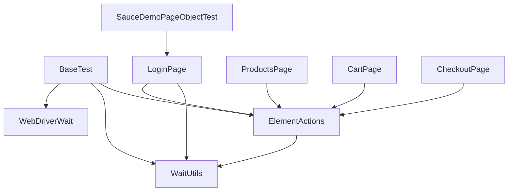

# Module 10 - Wrapper Methods and Waits

## What This Module Adds

Module 10 introduces the first reusable wrapper layer around Selenium element
commands.

Module 09 moved locators into Page Objects, but the page objects still repeated
low-level Selenium mechanics:

```java
wait.until(ExpectedConditions.visibilityOfElementLocated(locator));
driver.findElement(locator).click();
driver.findElement(locator).sendKeys(value);
```

Module 10 centralizes those mechanics:

```text
Test -> Page Object -> ElementActions -> WaitUtils -> Selenium WebDriver
```


This is still a beginner-friendly wrapper layer. It does not add screenshot
capture, Log4j2, JavaScript click fallback, retry analyzers, or driver factory.

## Why This Module Exists Now

The Page Object Model made tests readable. The remaining duplication moved
inside page classes. That is the correct moment to introduce wrapper methods.

The framework now has three responsibility layers:

- `BaseTest` owns browser lifecycle.
- Page Objects own page behavior and locators.
- `ElementActions` and `WaitUtils` own repeated Selenium mechanics.

## Files Added Or Changed

| File | Status | Purpose |
| --- | --- | --- |
| [CLAUDE.md](../../CLAUDE.md) | changed | marks Module 10 as the active module and keeps future sessions aligned |
| [AGENTS.md](../../AGENTS.md) | changed | exact mirror of [CLAUDE.md](../../CLAUDE.md) |
| [testng.xml](../../testng.xml) | changed | renames the suite to match the Module 10 wrapper checkpoint |
| [src/main/java/com/learning/framework/waits/WaitUtils.java](../../src/main/java/com/learning/framework/waits/WaitUtils.java) | added | centralizes common explicit wait conditions |
| [src/main/java/com/learning/framework/actions/ElementActions.java](../../src/main/java/com/learning/framework/actions/ElementActions.java) | added | centralizes common click, type, text, display, count, and dropdown actions |
| [src/test/java/com/learning/tests/base/BaseTest.java](../../src/test/java/com/learning/tests/base/BaseTest.java) | changed | creates `WaitUtils` and `ElementActions` for framework tests |
| [src/main/java/com/learning/framework/pages/saucedemo/LoginPage.java](../../src/main/java/com/learning/framework/pages/saucedemo/LoginPage.java) | changed | uses wrapper methods instead of direct wait/find/type/click logic |
| [src/main/java/com/learning/framework/pages/saucedemo/ProductsPage.java](../../src/main/java/com/learning/framework/pages/saucedemo/ProductsPage.java) | changed | uses wrapper methods for product-page actions and state reads |
| [src/main/java/com/learning/framework/pages/saucedemo/CartPage.java](../../src/main/java/com/learning/framework/pages/saucedemo/CartPage.java) | changed | uses wrapper methods for cart state and checkout navigation |
| [src/main/java/com/learning/framework/pages/saucedemo/CheckoutPage.java](../../src/main/java/com/learning/framework/pages/saucedemo/CheckoutPage.java) | changed | uses wrapper methods for checkout page state |
| [src/test/java/com/learning/tests/saucedemo/SauceDemoPageObjectTest.java](../../src/test/java/com/learning/tests/saucedemo/SauceDemoPageObjectTest.java) | changed | passes wrapper services into the first page object |
| [docs/module-10-wrapper-methods-and-waits/00-module-overview.md](00-module-overview.md) | added | module purpose, file map, dependency map, and quality gate |
| [docs/module-10-wrapper-methods-and-waits/01-element-actions.md](01-element-actions.md) | added | explains action wrappers and their current limits |
| [docs/module-10-wrapper-methods-and-waits/02-wait-utils.md](02-wait-utils.md) | added | explains centralized explicit waits |
| [docs/module-10-wrapper-methods-and-waits/03-page-object-refactor.md](03-page-object-refactor.md) | added | explains how page objects changed from Module 09 |
| [docs/module-10-wrapper-methods-and-waits/99-interview-review.md](99-interview-review.md) | added | interview-ready Module 10 revision guide |
| [docs/module-10-wrapper-methods-and-waits/exercises.md](exercises.md) | added | practice tasks with hints and expected outcomes |

## Module Source Links

Use these links as the source-reading checklist for this checkpoint. They point only to files that exist at Module 10.

| File | Status | Why It Matters |
| --- | --- | --- |
| [AGENTS.md](../../AGENTS.md) | Changed | Module session metadata |
| [CLAUDE.md](../../CLAUDE.md) | Changed | Module session metadata |
| [src/main/java/com/learning/framework/actions/ElementActions.java](../../src/main/java/com/learning/framework/actions/ElementActions.java) | Added | Framework Selenium action wrapper |
| [src/main/java/com/learning/framework/pages/saucedemo/CartPage.java](../../src/main/java/com/learning/framework/pages/saucedemo/CartPage.java) | Changed | Framework Page Object source |
| [src/main/java/com/learning/framework/pages/saucedemo/CheckoutPage.java](../../src/main/java/com/learning/framework/pages/saucedemo/CheckoutPage.java) | Changed | Framework Page Object source |
| [src/main/java/com/learning/framework/pages/saucedemo/LoginPage.java](../../src/main/java/com/learning/framework/pages/saucedemo/LoginPage.java) | Changed | Framework Page Object source |
| [src/main/java/com/learning/framework/pages/saucedemo/ProductsPage.java](../../src/main/java/com/learning/framework/pages/saucedemo/ProductsPage.java) | Changed | Framework Page Object source |
| [src/main/java/com/learning/framework/waits/WaitUtils.java](../../src/main/java/com/learning/framework/waits/WaitUtils.java) | Added | Framework wait utility source |
| [src/test/java/com/learning/tests/base/BaseTest.java](../../src/test/java/com/learning/tests/base/BaseTest.java) | Changed | Test framework base class |
| [src/test/java/com/learning/tests/saucedemo/SauceDemoPageObjectTest.java](../../src/test/java/com/learning/tests/saucedemo/SauceDemoPageObjectTest.java) | Changed | SauceDemo TestNG test source |
| [testng.xml](../../testng.xml) | Changed | TestNG suite configuration |

## Previous Module Files Reused

Module 10 builds directly on:

- [src/test/java/com/learning/tests/base/BaseTest.java](../../src/test/java/com/learning/tests/base/BaseTest.java)
- [src/main/java/com/learning/framework/pages/saucedemo/LoginPage.java](../../src/main/java/com/learning/framework/pages/saucedemo/LoginPage.java)
- [src/main/java/com/learning/framework/pages/saucedemo/ProductsPage.java](../../src/main/java/com/learning/framework/pages/saucedemo/ProductsPage.java)
- [src/main/java/com/learning/framework/pages/saucedemo/CartPage.java](../../src/main/java/com/learning/framework/pages/saucedemo/CartPage.java)
- [src/main/java/com/learning/framework/pages/saucedemo/CheckoutPage.java](../../src/main/java/com/learning/framework/pages/saucedemo/CheckoutPage.java)
- [src/test/java/com/learning/tests/saucedemo/SauceDemoPageObjectTest.java](../../src/test/java/com/learning/tests/saucedemo/SauceDemoPageObjectTest.java)

The tests still describe SauceDemo workflows. The page objects still own
locators. The new wrapper layer changes how page objects perform actions.

## Dependency Map



`ElementActions` depends on `WaitUtils`. Page Objects depend on both wrapper
services. Tests do not call `driver.findElement(...)` for normal page
interactions.

## What Is Intentionally Deferred

Module 10 does not add:

- Log4j2.
- screenshots on failure.
- Extent or Allure steps.
- JavaScript click fallback.
- stale element retry loops.
- custom framework exceptions.
- `ConfigReader`.
- `DriverFactory`.
- `ThreadLocal<WebDriver>`.

These are valuable, but adding them here would blur the learning goal. Module
10 is about the first action/wait abstraction.

## Quality Gate

Run:

```bash
mvn test -Dtest=SauceDemoPageObjectTest
mvn test -DsuiteXmlFile=testng.xml
mvn test
```

Expected outcome:

- the SauceDemo Page Object tests pass through wrapper methods.
- the TestNG XML suite still runs the Page Object regression group.
- full `mvn test` still runs raw learning tests plus framework tests.
- Page Objects no longer repeat the common `wait.until(...).click()` and
  `findElement(...).sendKeys(...)` patterns for normal actions.

## Framework Readiness Standard

Before moving to Module 11, a learner should be able to explain:

- why wrapper methods exist.
- how `ElementActions.click(...)` differs from direct `driver.findElement`.
- why waits belong near the action layer.
- what `WaitUtils` centralizes.
- why `BaseTest` creates wrapper services for tests.
- why logging and screenshot diagnostics are still deferred.
- what driver configuration problem remains for `DriverFactory`.
