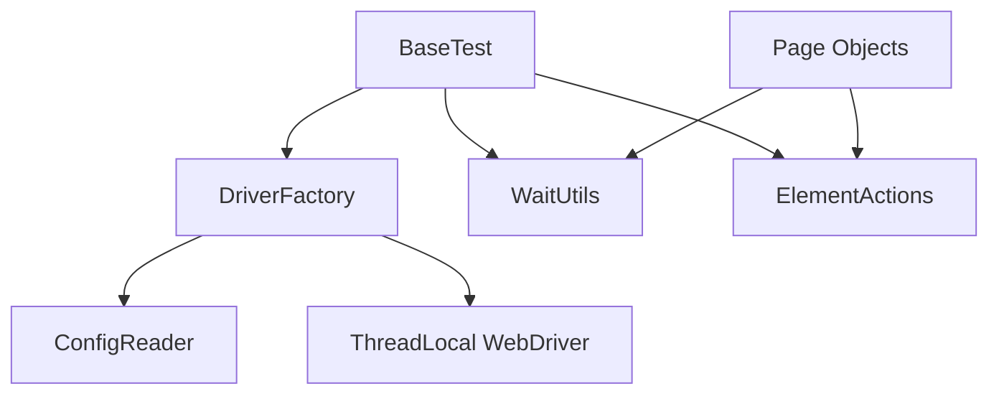
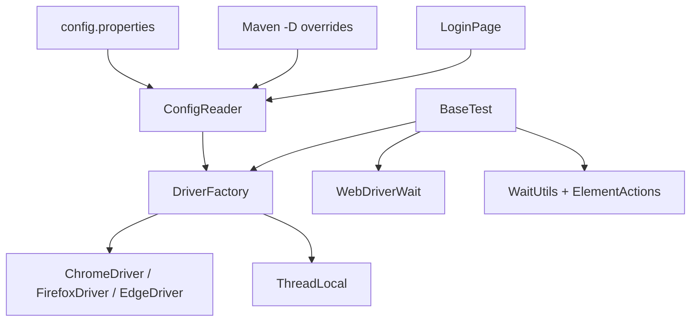

# Module 11 - Config and Driver Factory

## What This Module Adds

Module 11 externalizes browser and environment configuration and moves browser
creation out of `BaseTest`.

The framework flow now becomes:

```text
Test -> BaseTest -> DriverFactory -> ConfigReader -> WebDriver
Test -> Page Object -> ElementActions -> WaitUtils -> WebDriver
```



Module 10 centralized element actions and waits. Module 11 centralizes browser
creation, timeout configuration, base URL, and runtime overrides.

## How To Study This Module

Read the source in this order:

1. Start with [config.properties](../../src/test/resources/config/config.properties)
   to see the default runtime values.
2. Read [ConfigReader.java](../../src/main/java/com/learning/framework/config/ConfigReader.java)
   to understand how file values and `-D` overrides are resolved.
3. Read [DriverFactory.java](../../src/main/java/com/learning/framework/driver/DriverFactory.java)
   to see how those config values become browser options, timeouts, and
   `ThreadLocal` driver storage.
4. Read [BaseTest.java](../../src/test/java/com/learning/tests/base/BaseTest.java)
   to see what lifecycle work remains after browser creation moves out.
5. Read [LoginPage.java](../../src/main/java/com/learning/framework/pages/saucedemo/LoginPage.java)
   to see how page navigation now uses `baseUrl`.

The learning goal is to trace one value end to end. For example,
`headless=true` starts in `config.properties`, is read by `ConfigReader`, is
used by `DriverFactory`, and changes the browser option used by Selenium.

## Why This Module Exists Now

Before Module 11, `BaseTest` still knew too much about browser setup:

```java
ChromeOptions options = new ChromeOptions();
options.addArguments("--headless=new");
options.addArguments("--window-size=1440,900");
driver = new ChromeDriver(options);
```

That was acceptable while learning TestNG lifecycle. It becomes limiting once
the framework needs:

- different browsers.
- headless on/off control.
- environment URLs.
- page-load timeout settings.
- future CI overrides.
- future parallel execution.

Module 11 moves those concerns into `ConfigReader` and `DriverFactory`.

This is also the point where the framework starts preparing for different run
contexts. Local runs, CI runs, and future Grid runs should not require editing
Java source code. Configuration should change at the command line or in config
files; framework code should read those values through a controlled API.

## Files Added Or Changed

| File | Status | Purpose |
| --- | --- | --- |
| [CLAUDE.md](../../CLAUDE.md) | changed | marks Module 11 as the active module and keeps future sessions aligned |
| [AGENTS.md](../../AGENTS.md) | changed | exact mirror of [CLAUDE.md](../../CLAUDE.md) |
| [src/test/resources/config/config.properties](../../src/test/resources/config/config.properties) | added | default browser, base URL, timeout, and window-size configuration |
| [src/main/java/com/learning/framework/config/ConfigReader.java](../../src/main/java/com/learning/framework/config/ConfigReader.java) | added | reads config values and applies `System.getProperty` override precedence |
| [src/main/java/com/learning/framework/driver/DriverFactory.java](../../src/main/java/com/learning/framework/driver/DriverFactory.java) | added | creates, returns, and quits browser sessions through `ThreadLocal<WebDriver>` |
| [src/test/java/com/learning/tests/base/BaseTest.java](../../src/test/java/com/learning/tests/base/BaseTest.java) | changed | delegates driver lifecycle to `DriverFactory` and reads wait timeout from config |
| [src/main/java/com/learning/framework/pages/saucedemo/LoginPage.java](../../src/main/java/com/learning/framework/pages/saucedemo/LoginPage.java) | changed | opens the configured `baseUrl` instead of a hardcoded URL |
| [testng.xml](../../testng.xml) | changed | renames the suite to match the Module 11 configured-driver checkpoint |
| [docs/module-11-config-and-driver-factory/00-module-overview.md](00-module-overview.md) | added | module purpose, file map, dependency map, and quality gate |
| [docs/module-11-config-and-driver-factory/01-config-reader.md](01-config-reader.md) | added | explains config files, typed getters, and override precedence |
| [docs/module-11-config-and-driver-factory/02-driver-factory.md](02-driver-factory.md) | added | explains browser creation, lifecycle, timeouts, and `ThreadLocal` |
| [docs/module-11-config-and-driver-factory/03-basetest-refactor.md](03-basetest-refactor.md) | added | explains how `BaseTest` changed and what stayed out of it |
| [docs/module-11-config-and-driver-factory/99-interview-review.md](99-interview-review.md) | added | interview-ready Module 11 revision guide |
| [docs/module-11-config-and-driver-factory/exercises.md](exercises.md) | added | practice tasks with hints and expected outcomes |

## Module Source Links

Use these links as the source-reading checklist for this checkpoint. They point only to files that exist at Module 11.

| File | Status | Why It Matters |
| --- | --- | --- |
| [AGENTS.md](../../AGENTS.md) | Changed | Module session metadata |
| [CLAUDE.md](../../CLAUDE.md) | Changed | Module session metadata |
| [src/main/java/com/learning/framework/config/ConfigReader.java](../../src/main/java/com/learning/framework/config/ConfigReader.java) | Added | Framework configuration source |
| [src/main/java/com/learning/framework/driver/DriverFactory.java](../../src/main/java/com/learning/framework/driver/DriverFactory.java) | Added | Framework driver lifecycle source |
| [src/main/java/com/learning/framework/pages/saucedemo/LoginPage.java](../../src/main/java/com/learning/framework/pages/saucedemo/LoginPage.java) | Changed | Framework Page Object source |
| [src/test/java/com/learning/tests/base/BaseTest.java](../../src/test/java/com/learning/tests/base/BaseTest.java) | Changed | Test framework base class |
| [src/test/resources/config/config.properties](../../src/test/resources/config/config.properties) | Added | Runtime test configuration |
| [testng.xml](../../testng.xml) | Changed | TestNG suite configuration |

## Previous Module Files Reused

Module 11 builds directly on:

- [src/test/java/com/learning/tests/base/BaseTest.java](../../src/test/java/com/learning/tests/base/BaseTest.java)
- [src/main/java/com/learning/framework/actions/ElementActions.java](../../src/main/java/com/learning/framework/actions/ElementActions.java)
- [src/main/java/com/learning/framework/waits/WaitUtils.java](../../src/main/java/com/learning/framework/waits/WaitUtils.java)
- SauceDemo page objects:
  [LoginPage.java](../../src/main/java/com/learning/framework/pages/saucedemo/LoginPage.java),
  [ProductsPage.java](../../src/main/java/com/learning/framework/pages/saucedemo/ProductsPage.java),
  [CartPage.java](../../src/main/java/com/learning/framework/pages/saucedemo/CartPage.java), and
  [CheckoutPage.java](../../src/main/java/com/learning/framework/pages/saucedemo/CheckoutPage.java)
- [src/test/java/com/learning/tests/saucedemo/SauceDemoPageObjectTest.java](../../src/test/java/com/learning/tests/saucedemo/SauceDemoPageObjectTest.java)

The wrapper and page-object layers remain intact. Only browser setup and
configuration ownership change.

## Runtime Flow

When [SauceDemoPageObjectTest.java](../../src/test/java/com/learning/tests/saucedemo/SauceDemoPageObjectTest.java)
runs at this checkpoint:

1. TestNG calls `setUpBrowser()` in
   [BaseTest.java](../../src/test/java/com/learning/tests/base/BaseTest.java).
2. `BaseTest` calls `DriverFactory.createDriver()`.
3. [DriverFactory.java](../../src/main/java/com/learning/framework/driver/DriverFactory.java)
   asks [ConfigReader.java](../../src/main/java/com/learning/framework/config/ConfigReader.java)
   for browser, headless, timeout, and window-size values.
4. `ConfigReader` first checks JVM system properties such as `-Dheadless=false`.
   If no override exists, it reads
   [config.properties](../../src/test/resources/config/config.properties).
5. `DriverFactory` creates the selected browser and stores it in
   `ThreadLocal<WebDriver>`.
6. `BaseTest` retrieves the driver, creates `WebDriverWait`, `WaitUtils`, and
   `ElementActions`.
7. [LoginPage.java](../../src/main/java/com/learning/framework/pages/saucedemo/LoginPage.java)
   opens `ConfigReader.getBaseUrl()` instead of a hardcoded URL.

This flow is the Module 11 ownership model: config reads are centralized,
driver construction is centralized, and test lifecycle still starts from
`BaseTest`.

## Source Ownership

```text
src/main/java/com/learning/framework/config/
```

Framework configuration readers and typed accessors.

```text
src/main/java/com/learning/framework/driver/
```

Driver lifecycle and browser creation.

```text
src/test/resources/config/
```

Test framework runtime configuration for this learning project.

## Source Ownership Table

| Source | Owner Type | What To Learn |
| --- | --- | --- |
| [config.properties](../../src/test/resources/config/config.properties) | test runtime config | default browser, URL, timeout, and window-size values |
| [ConfigReader.java](../../src/main/java/com/learning/framework/config/ConfigReader.java) | framework config service | classpath loading, system-property override precedence, typed getters |
| [DriverFactory.java](../../src/main/java/com/learning/framework/driver/DriverFactory.java) | driver lifecycle service | browser selection, options, timeouts, `ThreadLocal`, cleanup |
| [BaseTest.java](../../src/test/java/com/learning/tests/base/BaseTest.java) | TestNG lifecycle base | setup/teardown sequencing and wrapper service creation |
| [LoginPage.java](../../src/main/java/com/learning/framework/pages/saucedemo/LoginPage.java) | page object | environment-aware navigation through `baseUrl` |
| [testng.xml](../../testng.xml) | suite configuration | regression group execution at the configured-driver checkpoint |

## Dependency Map With Values



Examples:

- `browser=chrome` controls the `switch` expression in
  [DriverFactory.java](../../src/main/java/com/learning/framework/driver/DriverFactory.java).
- `headless=true` controls browser option arguments.
- `explicitWaitSeconds=10` controls the `WebDriverWait` created in
  [BaseTest.java](../../src/test/java/com/learning/tests/base/BaseTest.java).
- `baseUrl=https://www.saucedemo.com/` controls `LoginPage.open()`.

## What Is Intentionally Deferred

Module 11 does not add:

- true parallel suite execution.
- Selenium Grid.
- environment-specific config files.
- secrets management.
- remote WebDriver.
- Docker browser execution.
- logging and screenshots.

`ThreadLocal<WebDriver>` is introduced now as preparation. Actual parallel
execution waits until Module 15.

## What Changed From Module 10

Module 10:

```text
BaseTest -> ChromeOptions -> ChromeDriver
LoginPage -> hardcoded SauceDemo URL
```

Module 11:

```text
BaseTest -> DriverFactory -> ConfigReader -> WebDriver
LoginPage -> ConfigReader.getBaseUrl()
```

This is not just a refactor for cleanliness. It changes the framework from
"source-code configured" to "runtime configured."

## Quality Gate

Run:

```bash
mvn test -Dtest=SauceDemoPageObjectTest
mvn test -Dtest=SauceDemoPageObjectTest -Dbrowser=chrome -Dheadless=true
mvn test -DsuiteXmlFile=testng.xml
mvn test
```

Expected outcome:

- framework tests pass with default config.
- framework tests pass when browser/headless are supplied as system property
  overrides.
- full `mvn test` still runs raw learning tests plus framework tests.
- `BaseTest` no longer creates `ChromeDriver` directly.
- `LoginPage` opens the configured `baseUrl`.

## Framework Readiness Standard

Before moving to Module 12, a learner should be able to explain:

- why configuration belongs outside source code.
- how system property overrides beat file defaults.
- why driver creation moved from `BaseTest` to `DriverFactory`.
- how `ThreadLocal<WebDriver>` prepares for parallel execution.
- why page-load timeout and implicit wait are driver-level settings.
- why explicit wait timeout still feeds `WebDriverWait`.
- what data-driven testing problem remains for Module 12.
- why `ConfigReader` should not create browsers.
- why `DriverFactory` should not know about page objects or assertions.
