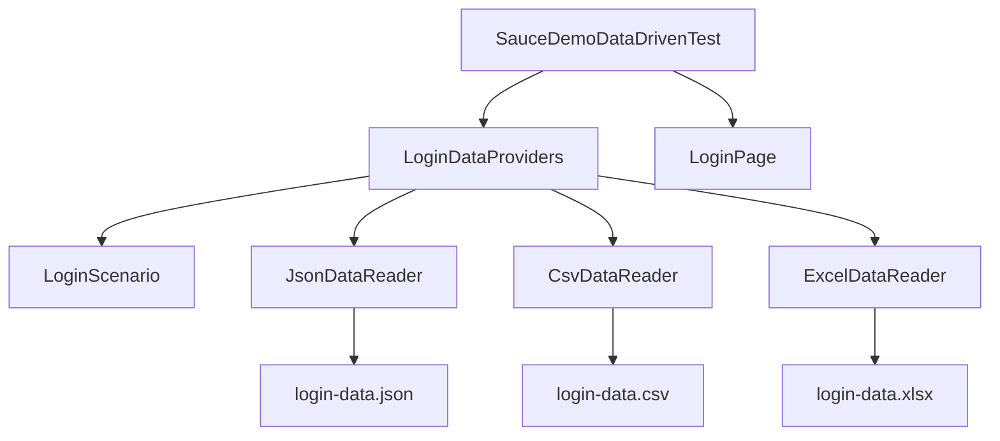

# Module 12 - Data Driven Testing

## What This Module Adds

Module 12 teaches data-driven testing with TestNG.

The framework can now run the same login behavior against multiple data rows
without duplicating test logic:

```text
Data file -> Data reader -> DataProvider -> LoginScenario -> Test -> Page Object
```


Module 11 gave the framework configurable browser lifecycle. Module 12 adds
configurable test data.

## Why This Module Exists Now

Previous framework tests hardcoded login rows inside test methods or class
fields. That is fine for one or two examples. It does not scale when teams
need to cover:

- valid users.
- locked-out users.
- missing passwords.
- role-based users.
- repeated regression rows.
- business-owned spreadsheets.

Data-driven testing separates scenario data from test behavior.

## Files Added Or Changed

| File | Status | Purpose |
| --- | --- | --- |
| [CLAUDE.md](../../CLAUDE.md) | changed | marks Module 12 as the active module and keeps future sessions aligned |
| [AGENTS.md](../../AGENTS.md) | changed | exact mirror of [CLAUDE.md](../../CLAUDE.md) |
| [pom.xml](../../pom.xml) | changed | adds Jackson, Apache POI, and a Log4j-to-SLF4J bridge used by POI |
| [testng.xml](../../testng.xml) | changed | includes the new data-driven SauceDemo test class |
| [src/test/java/com/learning/tests/models/LoginScenario.java](../../src/test/java/com/learning/tests/models/LoginScenario.java) | added | immutable POJO/record representing one login data row |
| [src/main/java/com/learning/framework/data/JsonDataReader.java](../../src/main/java/com/learning/framework/data/JsonDataReader.java) | added | reads JSON test data with Jackson |
| [src/main/java/com/learning/framework/data/CsvDataReader.java](../../src/main/java/com/learning/framework/data/CsvDataReader.java) | added | reads simple header-based CSV test data |
| [src/main/java/com/learning/framework/data/ExcelDataReader.java](../../src/main/java/com/learning/framework/data/ExcelDataReader.java) | added | reads `.xlsx` data with Apache POI |
| [src/test/java/com/learning/tests/dataproviders/LoginDataProviders.java](../../src/test/java/com/learning/tests/dataproviders/LoginDataProviders.java) | added | exposes hardcoded, JSON, CSV, and Excel TestNG DataProviders |
| [src/test/java/com/learning/tests/saucedemo/SauceDemoDataDrivenTest.java](../../src/test/java/com/learning/tests/saucedemo/SauceDemoDataDrivenTest.java) | added | runs login scenarios from every data source |
| [src/test/resources/testdata/login-data.json](../../src/test/resources/testdata/login-data.json) | added | JSON login scenarios |
| [src/test/resources/testdata/login-data.csv](../../src/test/resources/testdata/login-data.csv) | added | CSV login scenarios |
| [src/test/resources/testdata/login-data.xlsx](../../src/test/resources/testdata/login-data.xlsx) | added | Excel login scenarios |
| [docs/module-12-data-driven-testing/00-module-overview.md](00-module-overview.md) | added | module purpose, file map, dependency map, and quality gate |
| [docs/module-12-data-driven-testing/01-testng-dataproviders.md](01-testng-dataproviders.md) | added | explains TestNG DataProvider mechanics |
| [docs/module-12-data-driven-testing/02-data-readers-json-csv-excel.md](02-data-readers-json-csv-excel.md) | added | explains each external data reader and tradeoffs |
| [docs/module-12-data-driven-testing/03-pojos-and-test-data-design.md](03-pojos-and-test-data-design.md) | added | explains `LoginScenario`, deterministic data, and data ownership |
| [docs/module-12-data-driven-testing/99-interview-review.md](99-interview-review.md) | added | interview-ready Module 12 revision guide |
| [docs/module-12-data-driven-testing/exercises.md](exercises.md) | added | practice tasks with hints and expected outcomes |

## Module Source Links

Use these links as the source-reading checklist for this checkpoint. They point only to files that exist at Module 12.

| File | Status | Why It Matters |
| --- | --- | --- |
| [AGENTS.md](../../AGENTS.md) | Changed | Module session metadata |
| [CLAUDE.md](../../CLAUDE.md) | Changed | Module session metadata |
| [pom.xml](../../pom.xml) | Changed | Maven build and dependency configuration |
| [src/main/java/com/learning/framework/data/CsvDataReader.java](../../src/main/java/com/learning/framework/data/CsvDataReader.java) | Added | Framework test-data reader source |
| [src/main/java/com/learning/framework/data/ExcelDataReader.java](../../src/main/java/com/learning/framework/data/ExcelDataReader.java) | Added | Framework test-data reader source |
| [src/main/java/com/learning/framework/data/JsonDataReader.java](../../src/main/java/com/learning/framework/data/JsonDataReader.java) | Added | Framework test-data reader source |
| [src/test/java/com/learning/tests/dataproviders/LoginDataProviders.java](../../src/test/java/com/learning/tests/dataproviders/LoginDataProviders.java) | Added | TestNG data provider source |
| [src/test/java/com/learning/tests/models/LoginScenario.java](../../src/test/java/com/learning/tests/models/LoginScenario.java) | Added | Test data model source |
| [src/test/java/com/learning/tests/saucedemo/SauceDemoDataDrivenTest.java](../../src/test/java/com/learning/tests/saucedemo/SauceDemoDataDrivenTest.java) | Added | SauceDemo TestNG test source |
| [src/test/resources/testdata/login-data.csv](../../src/test/resources/testdata/login-data.csv) | Added | External test data |
| [src/test/resources/testdata/login-data.json](../../src/test/resources/testdata/login-data.json) | Added | External test data |
| [src/test/resources/testdata/login-data.xlsx](../../src/test/resources/testdata/login-data.xlsx) | Added | External test data |
| [testng.xml](../../testng.xml) | Changed | TestNG suite configuration |

## Previous Module Files Reused

Module 12 builds directly on:

- [src/test/java/com/learning/tests/base/BaseTest.java](../../src/test/java/com/learning/tests/base/BaseTest.java)
- [src/main/java/com/learning/framework/pages/saucedemo/LoginPage.java](../../src/main/java/com/learning/framework/pages/saucedemo/LoginPage.java)
- [src/main/java/com/learning/framework/pages/saucedemo/ProductsPage.java](../../src/main/java/com/learning/framework/pages/saucedemo/ProductsPage.java)
- [src/main/java/com/learning/framework/actions/ElementActions.java](../../src/main/java/com/learning/framework/actions/ElementActions.java)
- [src/main/java/com/learning/framework/waits/WaitUtils.java](../../src/main/java/com/learning/framework/waits/WaitUtils.java)
- [src/main/java/com/learning/framework/config/ConfigReader.java](../../src/main/java/com/learning/framework/config/ConfigReader.java)
- [src/main/java/com/learning/framework/driver/DriverFactory.java](../../src/main/java/com/learning/framework/driver/DriverFactory.java)

The browser, page-object, wrapper, and config layers are reused. Module 12 only
changes how scenario rows are supplied to tests.

## Dependency Map



## What Is Intentionally Deferred

Module 12 does not add:

- generated fake data.
- randomized data.
- database data.
- API-created test data.
- secrets management.
- parallel data isolation.
- retry logic for flaky rows.

The data is deterministic because this is still a foundation module. Random or
generated data is useful only when the framework can report and reproduce the
exact values used.

## Quality Gate

Run:

```bash
mvn test -Dtest=SauceDemoDataDrivenTest
mvn test -DsuiteXmlFile=testng.xml
mvn test
```

Expected outcome:

- hardcoded, JSON, CSV, and Excel DataProviders all run.
- `SauceDemoDataDrivenTest` runs eight login invocations.
- the XML suite runs both Page Object and data-driven SauceDemo tests.
- full `mvn test` still runs raw learning tests plus framework tests.
- test logic is not duplicated per data file.

## Framework Readiness Standard

Before moving to Module 13, a learner should be able to explain:

- what a TestNG `@DataProvider` returns.
- why tests receive `LoginScenario` instead of separate raw strings.
- when hardcoded data is acceptable.
- when JSON, CSV, or Excel data is useful.
- why deterministic data is preferred at this stage.
- why generated/random data is deferred.
- how data readers differ from test methods.
