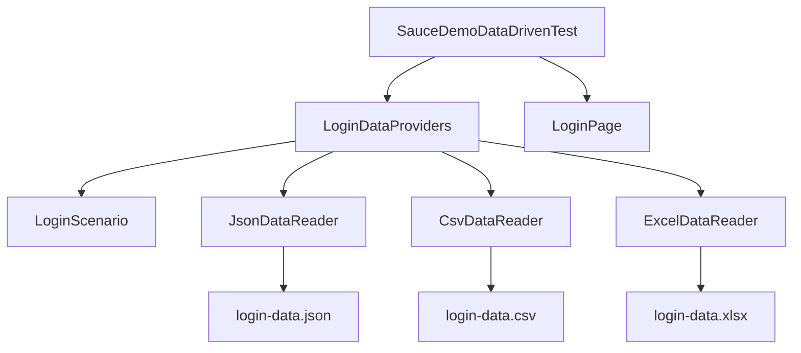

# Module 12 - Data Driven Testing

## What This Module Adds

Module 12 teaches data-driven testing with TestNG.

The framework can now run the same login behavior against multiple data rows
without duplicating test logic:

```text
Data file -> Data reader -> DataProvider -> LoginScenario -> Test -> Page Object
```


Module 11 gave the framework configurable browser lifecycle. Module 12 adds
configurable test data.

## How To Study This Module

Read the source in this order:

1. Start with the data files:
   [login-data.json](../../src/test/resources/testdata/login-data.json),
   [login-data.csv](../../src/test/resources/testdata/login-data.csv), and
   [login-data.xlsx](../../src/test/resources/testdata/login-data.xlsx).
2. Read [LoginScenario.java](../../src/test/java/com/learning/tests/models/LoginScenario.java)
   to see the Java shape every row should become.
3. Read [JsonDataReader.java](../../src/main/java/com/learning/framework/data/JsonDataReader.java),
   [CsvDataReader.java](../../src/main/java/com/learning/framework/data/CsvDataReader.java), and
   [ExcelDataReader.java](../../src/main/java/com/learning/framework/data/ExcelDataReader.java)
   to compare how each file format is parsed.
4. Read [LoginDataProviders.java](../../src/test/java/com/learning/tests/dataproviders/LoginDataProviders.java)
   to see how parsed rows become TestNG `Object[][]` data.
5. Read [SauceDemoDataDrivenTest.java](../../src/test/java/com/learning/tests/saucedemo/SauceDemoDataDrivenTest.java)
   to see how the same login workflow runs against every row.

The learning target is to trace one scenario row from a file, through a reader,
through a DataProvider, into `runLoginScenario(...)`.

## Why This Module Exists Now

Previous framework tests hardcoded login rows inside test methods or class
fields. That is fine for one or two examples. It does not scale when teams
need to cover:

- valid users.
- locked-out users.
- missing passwords.
- role-based users.
- repeated regression rows.
- business-owned spreadsheets.

Data-driven testing separates scenario data from test behavior.

This module is deliberately about test-data ownership, not about adding new
Selenium behavior. The browser lifecycle, page objects, wrapper actions, waits,
and configuration from earlier modules are reused. Only the source of login
scenario rows changes.

## Files Added Or Changed

| File | Status | Purpose |
| --- | --- | --- |
| [CLAUDE.md](../../CLAUDE.md) | changed | marks Module 12 as the active module and keeps future sessions aligned |
| [AGENTS.md](../../AGENTS.md) | changed | exact mirror of [CLAUDE.md](../../CLAUDE.md) |
| [pom.xml](../../pom.xml) | changed | adds Jackson, Apache POI, and a Log4j-to-SLF4J bridge used by POI |
| [testng.xml](../../testng.xml) | changed | includes the new data-driven SauceDemo test class |
| [src/test/java/com/learning/tests/models/LoginScenario.java](../../src/test/java/com/learning/tests/models/LoginScenario.java) | added | immutable POJO/record representing one login data row |
| [src/main/java/com/learning/framework/data/JsonDataReader.java](../../src/main/java/com/learning/framework/data/JsonDataReader.java) | added | reads JSON test data with Jackson |
| [src/main/java/com/learning/framework/data/CsvDataReader.java](../../src/main/java/com/learning/framework/data/CsvDataReader.java) | added | reads simple header-based CSV test data |
| [src/main/java/com/learning/framework/data/ExcelDataReader.java](../../src/main/java/com/learning/framework/data/ExcelDataReader.java) | added | reads `.xlsx` data with Apache POI |
| [src/test/java/com/learning/tests/dataproviders/LoginDataProviders.java](../../src/test/java/com/learning/tests/dataproviders/LoginDataProviders.java) | added | exposes hardcoded, JSON, CSV, and Excel TestNG DataProviders |
| [src/test/java/com/learning/tests/saucedemo/SauceDemoDataDrivenTest.java](../../src/test/java/com/learning/tests/saucedemo/SauceDemoDataDrivenTest.java) | added | runs login scenarios from every data source |
| [src/test/resources/testdata/login-data.json](../../src/test/resources/testdata/login-data.json) | added | JSON login scenarios |
| [src/test/resources/testdata/login-data.csv](../../src/test/resources/testdata/login-data.csv) | added | CSV login scenarios |
| [src/test/resources/testdata/login-data.xlsx](../../src/test/resources/testdata/login-data.xlsx) | added | Excel login scenarios |
| [docs/module-12-data-driven-testing/00-module-overview.md](00-module-overview.md) | added | module purpose, file map, dependency map, and quality gate |
| [docs/module-12-data-driven-testing/01-testng-dataproviders.md](01-testng-dataproviders.md) | added | explains TestNG DataProvider mechanics |
| [docs/module-12-data-driven-testing/02-data-readers-json-csv-excel.md](02-data-readers-json-csv-excel.md) | added | explains each external data reader and tradeoffs |
| [docs/module-12-data-driven-testing/03-pojos-and-test-data-design.md](03-pojos-and-test-data-design.md) | added | explains `LoginScenario`, deterministic data, and data ownership |
| [docs/module-12-data-driven-testing/99-interview-review.md](99-interview-review.md) | added | interview-ready Module 12 revision guide |
| [docs/module-12-data-driven-testing/exercises.md](exercises.md) | added | practice tasks with hints and expected outcomes |

## Module Source Links

Use these links as the source-reading checklist for this checkpoint. They point only to files that exist at Module 12.

| File | Status | Why It Matters |
| --- | --- | --- |
| [AGENTS.md](../../AGENTS.md) | Changed | Module session metadata |
| [CLAUDE.md](../../CLAUDE.md) | Changed | Module session metadata |
| [pom.xml](../../pom.xml) | Changed | Maven build and dependency configuration |
| [src/main/java/com/learning/framework/data/CsvDataReader.java](../../src/main/java/com/learning/framework/data/CsvDataReader.java) | Added | Framework test-data reader source |
| [src/main/java/com/learning/framework/data/ExcelDataReader.java](../../src/main/java/com/learning/framework/data/ExcelDataReader.java) | Added | Framework test-data reader source |
| [src/main/java/com/learning/framework/data/JsonDataReader.java](../../src/main/java/com/learning/framework/data/JsonDataReader.java) | Added | Framework test-data reader source |
| [src/test/java/com/learning/tests/dataproviders/LoginDataProviders.java](../../src/test/java/com/learning/tests/dataproviders/LoginDataProviders.java) | Added | TestNG data provider source |
| [src/test/java/com/learning/tests/models/LoginScenario.java](../../src/test/java/com/learning/tests/models/LoginScenario.java) | Added | Test data model source |
| [src/test/java/com/learning/tests/saucedemo/SauceDemoDataDrivenTest.java](../../src/test/java/com/learning/tests/saucedemo/SauceDemoDataDrivenTest.java) | Added | SauceDemo TestNG test source |
| [src/test/resources/testdata/login-data.csv](../../src/test/resources/testdata/login-data.csv) | Added | External test data |
| [src/test/resources/testdata/login-data.json](../../src/test/resources/testdata/login-data.json) | Added | External test data |
| [src/test/resources/testdata/login-data.xlsx](../../src/test/resources/testdata/login-data.xlsx) | Added | External test data |
| [testng.xml](../../testng.xml) | Changed | TestNG suite configuration |

## Previous Module Files Reused

Module 12 builds directly on:

- [src/test/java/com/learning/tests/base/BaseTest.java](../../src/test/java/com/learning/tests/base/BaseTest.java)
- [src/main/java/com/learning/framework/pages/saucedemo/LoginPage.java](../../src/main/java/com/learning/framework/pages/saucedemo/LoginPage.java)
- [src/main/java/com/learning/framework/pages/saucedemo/ProductsPage.java](../../src/main/java/com/learning/framework/pages/saucedemo/ProductsPage.java)
- [src/main/java/com/learning/framework/actions/ElementActions.java](../../src/main/java/com/learning/framework/actions/ElementActions.java)
- [src/main/java/com/learning/framework/waits/WaitUtils.java](../../src/main/java/com/learning/framework/waits/WaitUtils.java)
- [src/main/java/com/learning/framework/config/ConfigReader.java](../../src/main/java/com/learning/framework/config/ConfigReader.java)
- [src/main/java/com/learning/framework/driver/DriverFactory.java](../../src/main/java/com/learning/framework/driver/DriverFactory.java)

The browser, page-object, wrapper, and config layers are reused. Module 12 only
changes how scenario rows are supplied to tests.

## Runtime Flow

When TestNG runs a data-driven method in
[SauceDemoDataDrivenTest.java](../../src/test/java/com/learning/tests/saucedemo/SauceDemoDataDrivenTest.java):

1. TestNG finds the method's `dataProvider` and `dataProviderClass`.
2. TestNG calls the matching static provider method in
   [LoginDataProviders.java](../../src/test/java/com/learning/tests/dataproviders/LoginDataProviders.java).
3. The provider either creates hardcoded [LoginScenario.java](../../src/test/java/com/learning/tests/models/LoginScenario.java)
   records or calls a reader utility.
4. JSON rows are read by [JsonDataReader.java](../../src/main/java/com/learning/framework/data/JsonDataReader.java)
   directly into `LoginScenario` records.
5. CSV and Excel rows are read by [CsvDataReader.java](../../src/main/java/com/learning/framework/data/CsvDataReader.java)
   and [ExcelDataReader.java](../../src/main/java/com/learning/framework/data/ExcelDataReader.java)
   as `Map<String, String>` rows, then converted into `LoginScenario`.
6. The provider returns `Object[][]`, where each row contains one
   `LoginScenario`.
7. TestNG invokes the same test method once per row.
8. The test delegates to `runLoginScenario(...)`, which uses
   [LoginPage.java](../../src/main/java/com/learning/framework/pages/saucedemo/LoginPage.java)
   and asserts either successful product-page navigation or login error text.

That is the core Module 12 pattern: data changes per invocation; the browser
workflow and assertions stay centralized.

## Dependency Map



## Source Ownership

| Source | Owner Type | What To Learn |
| --- | --- | --- |
| [LoginScenario.java](../../src/test/java/com/learning/tests/models/LoginScenario.java) | test-data model | immutable record representing one login row |
| [LoginDataProviders.java](../../src/test/java/com/learning/tests/dataproviders/LoginDataProviders.java) | TestNG data-provider class | converts hardcoded, JSON, CSV, and Excel data into `Object[][]` |
| [SauceDemoDataDrivenTest.java](../../src/test/java/com/learning/tests/saucedemo/SauceDemoDataDrivenTest.java) | data-driven test class | shared workflow and assertions for every data source |
| [JsonDataReader.java](../../src/main/java/com/learning/framework/data/JsonDataReader.java) | framework data reader | Jackson-backed classpath JSON parsing |
| [CsvDataReader.java](../../src/main/java/com/learning/framework/data/CsvDataReader.java) | framework data reader | simple header-based CSV parsing for deterministic module data |
| [ExcelDataReader.java](../../src/main/java/com/learning/framework/data/ExcelDataReader.java) | framework data reader | Apache POI `.xlsx` sheet parsing |
| [login-data.json](../../src/test/resources/testdata/login-data.json) | external test data | structured developer-friendly rows |
| [login-data.csv](../../src/test/resources/testdata/login-data.csv) | external test data | simple tabular rows |
| [login-data.xlsx](../../src/test/resources/testdata/login-data.xlsx) | external test data | business-spreadsheet style rows |
| [pom.xml](../../pom.xml) | Maven build config | Jackson, POI, and POI logging bridge dependencies |
| [testng.xml](../../testng.xml) | suite config | includes both Page Object and data-driven SauceDemo tests |

## Data Shape At This Checkpoint

All four data sources ultimately produce the same Java model:

```java
new LoginScenario(
        scenarioName,
        username,
        password,
        successfulLogin,
        expectedMessage
)
```

The current external files each contain two rows:

- a successful `standard_user` login expecting `Products`.
- a locked-out user login expecting an error message or stable error fragment.

The hardcoded provider also contains the same two scenario categories. That is
why [SauceDemoDataDrivenTest.java](../../src/test/java/com/learning/tests/saucedemo/SauceDemoDataDrivenTest.java)
has four test methods and eight total invocations.

## What Is Intentionally Deferred

Module 12 does not add:

- generated fake data.
- randomized data.
- database data.
- API-created test data.
- secrets management.
- parallel data isolation.
- retry logic for flaky rows.

The data is deterministic because this is still a foundation module. Random or
generated data is useful only when the framework can report and reproduce the
exact values used.

## Quality Gate

Run:

```bash
mvn test -Dtest=SauceDemoDataDrivenTest
mvn test -DsuiteXmlFile=testng.xml
mvn test
```

Expected outcome:

- hardcoded, JSON, CSV, and Excel DataProviders all run.
- `SauceDemoDataDrivenTest` runs eight login invocations.
- the XML suite runs both Page Object and data-driven SauceDemo tests.
- full `mvn test` still runs raw learning tests plus framework tests.
- test logic is not duplicated per data file.

## Framework Readiness Standard

Before moving to Module 13, a learner should be able to explain:

- what a TestNG `@DataProvider` returns.
- why tests receive `LoginScenario` instead of separate raw strings.
- when hardcoded data is acceptable.
- when JSON, CSV, or Excel data is useful.
- why deterministic data is preferred at this stage.
- why generated/random data is deferred.
- how data readers differ from test methods.
- how `Object[][]` maps to test method parameters.
- why CSV and Excel rows are converted through a map before becoming
  `LoginScenario`.
