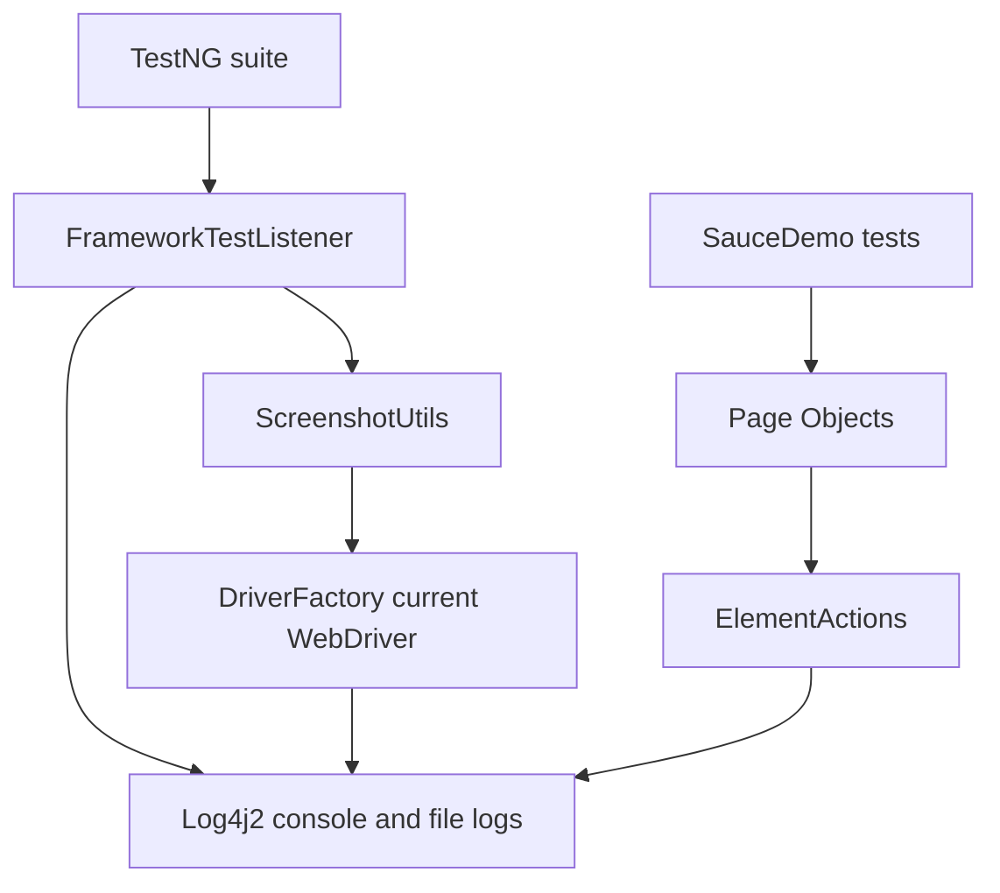

# Module 13 - Listeners, Screenshots, Logging

## Why This Module Exists

Module 12 made the framework run more scenarios from external data. More test
coverage also means more failure output. Module 13 adds the first diagnostic
layer so a failed UI test answers practical questions quickly:

- which test started, passed, failed, or skipped.
- which browser session was created.
- which framework action was being attempted.
- where the failure screenshot was saved.
- whether a retry was intentionally allowed.

This is not the final reporting layer. Extent Reports and Allure are deferred
to Module 14. This module builds the lower-level services those reports will
reuse.

## How It Builds On Previous Modules

Module 08 introduced TestNG lifecycle annotations. Module 09 introduced Page
Objects. Module 10 centralized common Selenium commands in wrappers. Module 11
centralized driver lifecycle. Module 12 introduced data rows.

Module 13 connects those pieces:



## Files Added Or Changed

| File path | Status | Purpose |
| --- | --- | --- |
| `pom.xml` | changed | replaces the temporary Log4j bridge with real `log4j-api` and `log4j-core` |
| `testng.xml` | changed | registers the TestNG listener and retry transformer for the module suite |
| `src/test/resources/log4j2.xml` | added | configures console and file logging with `testName` context |
| `src/test/resources/config/config.properties` | changed | adds default `retryCount=0` |
| `src/main/java/com/learning/framework/exceptions/FrameworkException.java` | added | creates framework-specific runtime exception vocabulary |
| `src/main/java/com/learning/framework/screenshots/ScreenshotUtils.java` | added | centralizes Selenium screenshot capture and file naming |
| `src/test/java/com/learning/tests/listeners/FrameworkTestListener.java` | added | logs TestNG lifecycle events and captures screenshots on failure |
| `src/test/java/com/learning/tests/listeners/FrameworkRetryAnalyzer.java` | added | optional retry logic controlled by `retryCount` |
| `src/test/java/com/learning/tests/listeners/RetryAnnotationTransformer.java` | added | applies retry analyzer centrally when retries are enabled |
| `src/main/java/com/learning/framework/driver/DriverFactory.java` | changed | logs browser creation and cleanup, uses `FrameworkException` |
| `src/main/java/com/learning/framework/actions/ElementActions.java` | changed | logs important wrapper actions without logging typed values |
| `src/main/java/com/learning/framework/config/ConfigReader.java` | changed | exposes `getRetryCount()` |
| `CLAUDE.md` and `AGENTS.md` | changed | mark Module 13 as the active module |

## Previous Files Reused

| File path | Why it matters here |
| --- | --- |
| `src/test/java/com/learning/tests/base/BaseTest.java` | still creates and quits the browser around every test |
| `src/main/java/com/learning/framework/driver/DriverFactory.java` | gives the listener access to the current test's browser |
| `src/main/java/com/learning/framework/actions/ElementActions.java` | best place for framework-level command logging |
| `src/test/java/com/learning/tests/models/LoginScenario.java` | listener uses scenario names instead of logging full data rows |
| `src/test/java/com/learning/tests/saucedemo/SauceDemoDataDrivenTest.java` | verifies listener output with data-driven test names |

## Source Ownership

- Framework service: `ScreenshotUtils`, `FrameworkException`.
- Framework lifecycle: `DriverFactory`.
- Framework action wrapper: `ElementActions`.
- Test framework support: `FrameworkTestListener`, `FrameworkRetryAnalyzer`,
  `RetryAnnotationTransformer`.
- Configuration: `log4j2.xml`, `config.properties`, `testng.xml`.
- Documentation: this module folder.

## What Is Intentionally Deferred

- Extent Reports and Allure attachments are deferred to Module 14.
- Screenshot comparison and visual testing are not introduced here.
- Parallel-safe report artifact naming is basic for now and will be revisited
  when parallel execution arrives.
- Retry policy is available but disabled by default because retries can hide
  real failures.

## Quality Gate

Run:

```bash
mvn test -DsuiteXmlFile=testng.xml
mvn test
```

Expected:

- the TestNG suite passes.
- `target/logs/test-execution.log` is created.
- console and file logs include `START`, `PASS`, and browser lifecycle lines.
- data-driven log names show scenario names, not full records or passwords.
- full repository tests continue to pass.

