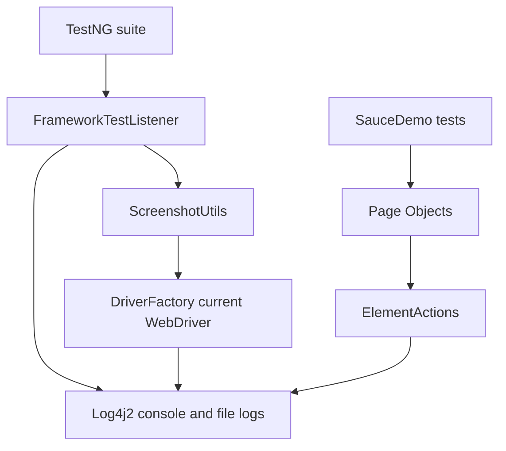

# Module 13 - Listeners, Screenshots, Logging

## Why This Module Exists

Module 12 made the framework run more scenarios from external data. More test
coverage also means more failure output. Module 13 adds the first diagnostic
layer so a failed UI test answers practical questions quickly:

- which test started, passed, failed, or skipped.
- which browser session was created.
- which framework action was being attempted.
- where the failure screenshot was saved.
- whether a retry was intentionally allowed.

This is not the final reporting layer. Extent Reports and Allure are deferred
to Module 14. This module builds the lower-level services those reports will
reuse.

## How It Builds On Previous Modules

Module 08 introduced TestNG lifecycle annotations. Module 09 introduced Page
Objects. Module 10 centralized common Selenium commands in wrappers. Module 11
centralized driver lifecycle. Module 12 introduced data rows.

Module 13 connects those pieces:



## How To Study This Module

Read the source in this order:

1. Start with [testng.xml](../../testng.xml) to see how TestNG registers
   [FrameworkTestListener.java](../../src/test/java/com/learning/tests/listeners/FrameworkTestListener.java)
   and [RetryAnnotationTransformer.java](../../src/test/java/com/learning/tests/listeners/RetryAnnotationTransformer.java).
2. Read [FrameworkTestListener.java](../../src/test/java/com/learning/tests/listeners/FrameworkTestListener.java)
   to understand test start, pass, fail, skip, screenshot, and log-context
   callbacks.
3. Read [ScreenshotUtils.java](../../src/main/java/com/learning/framework/screenshots/ScreenshotUtils.java)
   to see how Selenium screenshots become files under `target/screenshots`.
4. Read [log4j2.xml](../../src/test/resources/log4j2.xml), then inspect
   logging in [DriverFactory.java](../../src/main/java/com/learning/framework/driver/DriverFactory.java)
   and [ElementActions.java](../../src/main/java/com/learning/framework/actions/ElementActions.java).
5. Read [FrameworkRetryAnalyzer.java](../../src/test/java/com/learning/tests/listeners/FrameworkRetryAnalyzer.java),
   [RetryAnnotationTransformer.java](../../src/test/java/com/learning/tests/listeners/RetryAnnotationTransformer.java),
   [ConfigReader.java](../../src/main/java/com/learning/framework/config/ConfigReader.java),
   and [config.properties](../../src/test/resources/config/config.properties)
   to understand why retries exist but default to zero.
6. Finish with [FrameworkException.java](../../src/main/java/com/learning/framework/exceptions/FrameworkException.java)
   to understand how framework failures are labeled differently from product
   assertion failures.

The learning target is to trace a failed test: TestNG calls the listener,
Log4j2 records the failure with the current `testName`, the listener captures a
screenshot before browser teardown, and the screenshot path is stored on
`ITestResult` for Module 14 reporting.

## Files Added Or Changed

| File path | Status | Purpose |
| --- | --- | --- |
| [pom.xml](../../pom.xml) | changed | replaces the temporary Log4j bridge with real `log4j-api` and `log4j-core` |
| [testng.xml](../../testng.xml) | changed | registers the TestNG listener and retry transformer for the module suite |
| [src/test/resources/log4j2.xml](../../src/test/resources/log4j2.xml) | added | configures console and file logging with `testName` context |
| [src/test/resources/config/config.properties](../../src/test/resources/config/config.properties) | changed | adds default `retryCount=0` |
| [src/main/java/com/learning/framework/exceptions/FrameworkException.java](../../src/main/java/com/learning/framework/exceptions/FrameworkException.java) | added | creates framework-specific runtime exception vocabulary |
| [src/main/java/com/learning/framework/screenshots/ScreenshotUtils.java](../../src/main/java/com/learning/framework/screenshots/ScreenshotUtils.java) | added | centralizes Selenium screenshot capture and file naming |
| [src/test/java/com/learning/tests/listeners/FrameworkTestListener.java](../../src/test/java/com/learning/tests/listeners/FrameworkTestListener.java) | added | logs TestNG lifecycle events and captures screenshots on failure |
| [src/test/java/com/learning/tests/listeners/FrameworkRetryAnalyzer.java](../../src/test/java/com/learning/tests/listeners/FrameworkRetryAnalyzer.java) | added | optional retry logic controlled by `retryCount` |
| [src/test/java/com/learning/tests/listeners/RetryAnnotationTransformer.java](../../src/test/java/com/learning/tests/listeners/RetryAnnotationTransformer.java) | added | applies retry analyzer centrally when retries are enabled |
| [src/main/java/com/learning/framework/driver/DriverFactory.java](../../src/main/java/com/learning/framework/driver/DriverFactory.java) | changed | logs browser creation and cleanup, uses `FrameworkException` |
| [src/main/java/com/learning/framework/actions/ElementActions.java](../../src/main/java/com/learning/framework/actions/ElementActions.java) | changed | logs important wrapper actions without logging typed values |
| [src/main/java/com/learning/framework/config/ConfigReader.java](../../src/main/java/com/learning/framework/config/ConfigReader.java) | changed | exposes `getRetryCount()` |
| [CLAUDE.md](../../CLAUDE.md) and [AGENTS.md](../../AGENTS.md) | changed | mark Module 13 as the active module |

## Module Source Links

Use these links as the source-reading checklist for this checkpoint. They point only to files that exist at Module 13.

| File | Status | Why It Matters |
| --- | --- | --- |
| [AGENTS.md](../../AGENTS.md) | Changed | Module session metadata |
| [CLAUDE.md](../../CLAUDE.md) | Changed | Module session metadata |
| [pom.xml](../../pom.xml) | Changed | Maven build and dependency configuration |
| [src/main/java/com/learning/framework/actions/ElementActions.java](../../src/main/java/com/learning/framework/actions/ElementActions.java) | Changed | Framework Selenium action wrapper |
| [src/main/java/com/learning/framework/config/ConfigReader.java](../../src/main/java/com/learning/framework/config/ConfigReader.java) | Changed | Framework configuration source |
| [src/main/java/com/learning/framework/driver/DriverFactory.java](../../src/main/java/com/learning/framework/driver/DriverFactory.java) | Changed | Framework driver lifecycle source |
| [src/main/java/com/learning/framework/exceptions/FrameworkException.java](../../src/main/java/com/learning/framework/exceptions/FrameworkException.java) | Added | Framework exception source |
| [src/main/java/com/learning/framework/screenshots/ScreenshotUtils.java](../../src/main/java/com/learning/framework/screenshots/ScreenshotUtils.java) | Added | Framework screenshot utility source |
| [src/test/java/com/learning/tests/listeners/FrameworkRetryAnalyzer.java](../../src/test/java/com/learning/tests/listeners/FrameworkRetryAnalyzer.java) | Added | TestNG listener or retry support |
| [src/test/java/com/learning/tests/listeners/FrameworkTestListener.java](../../src/test/java/com/learning/tests/listeners/FrameworkTestListener.java) | Added | TestNG listener or retry support |
| [src/test/java/com/learning/tests/listeners/RetryAnnotationTransformer.java](../../src/test/java/com/learning/tests/listeners/RetryAnnotationTransformer.java) | Added | TestNG listener or retry support |
| [src/test/resources/config/config.properties](../../src/test/resources/config/config.properties) | Changed | Runtime test configuration |
| [src/test/resources/log4j2.xml](../../src/test/resources/log4j2.xml) | Added | Test runtime resource |
| [testng.xml](../../testng.xml) | Changed | TestNG suite configuration |

## Previous Files Reused

| File path | Why it matters here |
| --- | --- |
| [src/test/java/com/learning/tests/base/BaseTest.java](../../src/test/java/com/learning/tests/base/BaseTest.java) | still creates and quits the browser around every test |
| [src/main/java/com/learning/framework/driver/DriverFactory.java](../../src/main/java/com/learning/framework/driver/DriverFactory.java) | gives the listener access to the current test's browser |
| [src/main/java/com/learning/framework/actions/ElementActions.java](../../src/main/java/com/learning/framework/actions/ElementActions.java) | best place for framework-level command logging |
| [src/test/java/com/learning/tests/models/LoginScenario.java](../../src/test/java/com/learning/tests/models/LoginScenario.java) | listener uses scenario names instead of logging full data rows |
| [src/test/java/com/learning/tests/saucedemo/SauceDemoDataDrivenTest.java](../../src/test/java/com/learning/tests/saucedemo/SauceDemoDataDrivenTest.java) | verifies listener output with data-driven test names |

## Source Ownership

- Framework service: `ScreenshotUtils`, `FrameworkException`.
- Framework lifecycle: `DriverFactory`.
- Framework action wrapper: `ElementActions`.
- Test framework support: `FrameworkTestListener`, `FrameworkRetryAnalyzer`,
  `RetryAnnotationTransformer`.
- Configuration: `log4j2.xml`, `config.properties`, [testng.xml](../../testng.xml).
- Documentation: this module folder.

## Runtime Flow

For a passing test:

1. TestNG starts the suite from [testng.xml](../../testng.xml).
2. `FrameworkTestListener.onTestStart(...)` builds a safe display name and
   puts it into Log4j2 `ThreadContext` as `testName`.
3. `BaseTest` creates the browser through
   [DriverFactory.java](../../src/main/java/com/learning/framework/driver/DriverFactory.java),
   which logs browser creation.
4. Page objects call [ElementActions.java](../../src/main/java/com/learning/framework/actions/ElementActions.java),
   which logs key wrapper actions at `DEBUG`.
5. `FrameworkTestListener.onTestSuccess(...)` logs `PASS` and clears
   `ThreadContext`.
6. `BaseTest` quits the browser through `DriverFactory.quitDriver()`.

For a failing test:

1. TestNG calls `FrameworkTestListener.onTestFailure(...)` while the browser is
   still alive.
2. The listener logs `FAIL` with the thrown exception.
3. The listener calls
   [ScreenshotUtils.capture(...)](../../src/main/java/com/learning/framework/screenshots/ScreenshotUtils.java).
4. `ScreenshotUtils` saves a timestamped PNG under `target/screenshots`.
5. The listener stores the screenshot path on `ITestResult` using the
   `screenshotPath` attribute and writes a TestNG `Reporter.log(...)` entry.
6. `ThreadContext` is cleared so the next test does not inherit the old
   `testName`.

That sequence is why diagnostics belong in listener/framework services, not in
individual test methods.

## Diagnostic Artifact Map

| Artifact | Created By | Path Or Storage | Purpose |
| --- | --- | --- | --- |
| console logs | [log4j2.xml](../../src/test/resources/log4j2.xml) | standard output | immediate local feedback |
| file logs | [log4j2.xml](../../src/test/resources/log4j2.xml) | `target/logs/test-execution.log` | durable execution story |
| failure screenshots | [ScreenshotUtils.java](../../src/main/java/com/learning/framework/screenshots/ScreenshotUtils.java) | `target/screenshots/*.png` | browser state evidence |
| screenshot path attribute | [FrameworkTestListener.java](../../src/test/java/com/learning/tests/listeners/FrameworkTestListener.java) | `ITestResult` attribute `screenshotPath` | handoff point for Module 14 reports |
| retry decision | [FrameworkRetryAnalyzer.java](../../src/test/java/com/learning/tests/listeners/FrameworkRetryAnalyzer.java) | TestNG retry callback | optional rerun control |

## What Is Intentionally Deferred

- Extent Reports and Allure attachments are deferred to Module 14.
- Screenshot comparison and visual testing are not introduced here.
- Parallel-safe report artifact naming is basic for now and will be revisited
  when parallel execution arrives.
- Retry policy is available but disabled by default because retries can hide
  real failures.

## What Changed From Module 12

Module 12:

```text
DataProvider -> Test -> Page Object -> Wrapper -> WebDriver
```

Module 13 adds cross-cutting diagnostics around that flow:

```text
TestNG listener -> logs, screenshots, retry decisions, framework exceptions
```

The test methods still do not contain screenshot, logging, or retry plumbing.
That is the framework design point: diagnostics are cross-cutting behavior.

## Quality Gate

Run:

```bash
mvn test -DsuiteXmlFile=testng.xml
mvn test
```

Expected:

- the TestNG suite passes.
- `target/logs/test-execution.log` is created.
- console and file logs include `START`, `PASS`, and browser lifecycle lines.
- data-driven log names show scenario names, not full records or passwords.
- full repository tests continue to pass.

## Framework Readiness Standard

Before moving to Module 14, a learner should be able to explain:

- how TestNG finds and calls listener classes.
- why screenshot capture happens in `onTestFailure`.
- how `ThreadContext` puts `testName` into every log line on the current thread.
- why `LoginScenario` parameters are logged by scenario name only.
- why retry is configurable and disabled by default.
- how `FrameworkException` differs from a TestNG assertion failure.
- how Module 14 can reuse the screenshot path stored on `ITestResult`.
