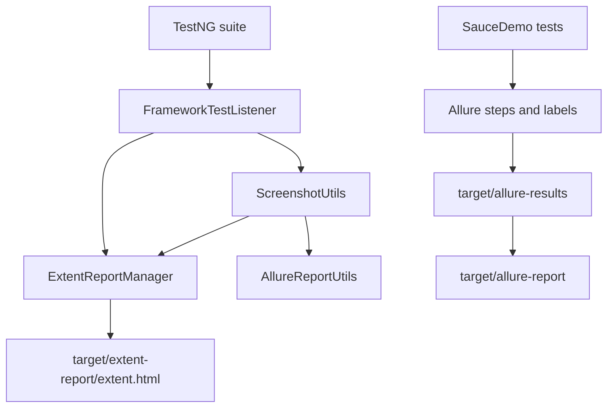

# Module 14 - Extent and Allure Reporting

## Why This Module Exists

Module 13 gave the framework logs, screenshots, and listener hooks. Module 14
turns those raw diagnostics into report artifacts that a tester, lead, or
interviewer can inspect after a run.

This module adds two reporting styles:

- Extent Reports for a readable standalone HTML report.
- Allure for structured result files, labels, steps, and generated dashboards.

The goal is not to pick one winner. The goal is to understand what each report
is good at and how a framework connects report output to tests without pushing
reporting code into page objects.

## How It Builds On Previous Modules



Module 14 reuses Module 13's listener position instead of adding a second
custom listener for Extent. Allure's TestNG integration is provided by the
`allure-testng` dependency, so `testng.xml` does not explicitly list the Allure
listener. Listing it manually creates duplicate listener warnings.

## Files Added Or Changed

| File path | Status | Purpose |
| --- | --- | --- |
| `pom.xml` | changed | adds ExtentReports, Allure TestNG, and Allure Maven plugin versions |
| `testng.xml` | changed | renames the suite for Module 14 and keeps the framework listener active |
| `src/test/resources/allure.properties` | added | sets Allure results output to `target/allure-results` |
| `src/test/java/com/learning/tests/reports/ExtentReportManager.java` | added | owns Extent setup, current test tracking, status logging, screenshot attachment, and flush |
| `src/test/java/com/learning/tests/reports/AllureReportUtils.java` | added | attaches screenshot files to Allure without exposing stream handling in the listener |
| `src/test/java/com/learning/tests/listeners/FrameworkTestListener.java` | changed | sends pass/fail/skip status and screenshots to Extent and Allure |
| `src/test/java/com/learning/tests/saucedemo/SauceDemoPageObjectTest.java` | changed | adds Allure labels and safe no-op steps |
| `src/test/java/com/learning/tests/saucedemo/SauceDemoDataDrivenTest.java` | changed | adds Allure labels and scenario-level steps |
| `src/test/java/com/learning/tests/models/LoginScenario.java` | changed | masks password in `toString()` so reports do not leak credentials |
| `CLAUDE.md` and `AGENTS.md` | changed | mark Module 14 as the active module |

## Previous Files Reused

| File path | Why it matters here |
| --- | --- |
| `src/main/java/com/learning/framework/screenshots/ScreenshotUtils.java` | still creates the screenshot file that reports attach |
| `src/test/java/com/learning/tests/listeners/FrameworkTestListener.java` | central place where TestNG status becomes report status |
| `src/test/java/com/learning/tests/models/LoginScenario.java` | shows why data model string output matters in reports |
| `src/test/resources/log4j2.xml` | still controls log output while reports are generated |

## Report Outputs

After a suite run:

- Extent HTML: `target/extent-report/extent.html`
- Allure raw results: `target/allure-results/`
- Allure generated report: `target/allure-report/`
- Logs: `target/logs/test-execution.log`

## What Is Intentionally Deferred

- Opening `mvn allure:serve` automatically is not part of verification because
  it starts a long-running local server.
- Advanced Allure categories, environment files, executor metadata, and trend
  history are deferred.
- Parallel-safe report naming will be revisited in Module 15.
- CI artifact upload is deferred to Module 17.

## Quality Gate

Run:

```bash
mvn test -DsuiteXmlFile=testng.xml
mvn allure:report
mvn test
```

Expected:

- suite tests pass.
- `target/extent-report/extent.html` exists.
- `target/allure-results/` contains result JSON files.
- `target/allure-report/` is generated by `mvn allure:report`.
- report artifacts do not contain raw `secret_sauce`.
- full repository tests continue to pass.

