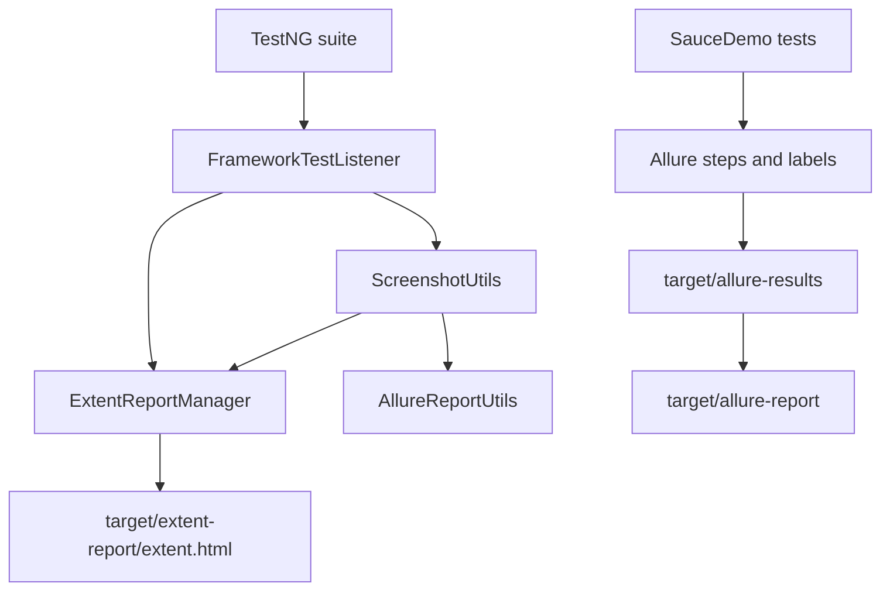

# Module 14 - Extent and Allure Reporting

## Why This Module Exists

Module 13 gave the framework logs, screenshots, and listener hooks. Module 14
turns those raw diagnostics into report artifacts that a tester, lead, or
interviewer can inspect after a run.

This module adds two reporting styles:

- Extent Reports for a readable standalone HTML report.
- Allure for structured result files, labels, steps, and generated dashboards.

The goal is not to pick one winner. The goal is to understand what each report
is good at and how a framework connects report output to tests without pushing
reporting code into page objects.

## How It Builds On Previous Modules



Module 14 reuses Module 13's listener position instead of adding a second
custom listener for Extent. Allure's TestNG integration is provided by the
`allure-testng` dependency, so [testng.xml](../../testng.xml) does not explicitly list the Allure
listener. Listing it manually creates duplicate listener warnings.

## How To Study This Module

Read the source in this order:

1. Start with [pom.xml](../../pom.xml) to see the ExtentReports dependency,
   Allure TestNG dependency, and Allure Maven plugin.
2. Read [testng.xml](../../testng.xml) and notice that it registers only the
   framework listener and retry transformer. Allure is not listed manually.
3. Read [FrameworkTestListener.java](../../src/test/java/com/learning/tests/listeners/FrameworkTestListener.java)
   to see where TestNG lifecycle events are translated into Extent status and
   Allure screenshot attachments.
4. Read [ExtentReportManager.java](../../src/test/java/com/learning/tests/reports/ExtentReportManager.java)
   to understand suite-level initialization, per-test `ThreadLocal<ExtentTest>`,
   screenshot attachment, and `flush()`.
5. Read [AllureReportUtils.java](../../src/test/java/com/learning/tests/reports/AllureReportUtils.java)
   to see how an existing screenshot file becomes an Allure attachment.
6. Read [SauceDemoPageObjectTest.java](../../src/test/java/com/learning/tests/saucedemo/SauceDemoPageObjectTest.java)
   and [SauceDemoDataDrivenTest.java](../../src/test/java/com/learning/tests/saucedemo/SauceDemoDataDrivenTest.java)
   to inspect labels, severity, and steps.
7. Read [LoginScenario.java](../../src/test/java/com/learning/tests/models/LoginScenario.java)
   to understand why report-safe `toString()` output matters.

The learning target is to trace one failing test: TestNG reports failure to the
framework listener, the listener captures one screenshot, Extent attaches the
same path, Allure attaches the same image stream, and both reports avoid raw
password output.

## Files Added Or Changed

| File path | Status | Purpose |
| --- | --- | --- |
| [pom.xml](../../pom.xml) | changed | adds ExtentReports, Allure TestNG, and Allure Maven plugin versions |
| [testng.xml](../../testng.xml) | changed | renames the suite for Module 14 and keeps the framework listener active |
| [src/test/resources/allure.properties](../../src/test/resources/allure.properties) | added | sets Allure results output to `target/allure-results` |
| [src/test/java/com/learning/tests/reports/ExtentReportManager.java](../../src/test/java/com/learning/tests/reports/ExtentReportManager.java) | added | owns Extent setup, current test tracking, status logging, screenshot attachment, and flush |
| [src/test/java/com/learning/tests/reports/AllureReportUtils.java](../../src/test/java/com/learning/tests/reports/AllureReportUtils.java) | added | attaches screenshot files to Allure without exposing stream handling in the listener |
| [src/test/java/com/learning/tests/listeners/FrameworkTestListener.java](../../src/test/java/com/learning/tests/listeners/FrameworkTestListener.java) | changed | sends pass/fail/skip status and screenshots to Extent and Allure |
| [src/test/java/com/learning/tests/saucedemo/SauceDemoPageObjectTest.java](../../src/test/java/com/learning/tests/saucedemo/SauceDemoPageObjectTest.java) | changed | adds Allure labels and safe no-op steps |
| [src/test/java/com/learning/tests/saucedemo/SauceDemoDataDrivenTest.java](../../src/test/java/com/learning/tests/saucedemo/SauceDemoDataDrivenTest.java) | changed | adds Allure labels and scenario-level steps |
| [src/test/java/com/learning/tests/models/LoginScenario.java](../../src/test/java/com/learning/tests/models/LoginScenario.java) | changed | masks password in `toString()` so reports do not leak credentials |
| [CLAUDE.md](../../CLAUDE.md) and [AGENTS.md](../../AGENTS.md) | changed | mark Module 14 as the active module |

## Module Source Links

Use these links as the source-reading checklist for this checkpoint. They point only to files that exist at Module 14.

| File | Status | Why It Matters |
| --- | --- | --- |
| [.gitignore](../../.gitignore) | Changed | Generated artifact hygiene |
| [AGENTS.md](../../AGENTS.md) | Changed | Module session metadata |
| [CLAUDE.md](../../CLAUDE.md) | Changed | Module session metadata |
| [pom.xml](../../pom.xml) | Changed | Maven build and dependency configuration |
| [src/test/java/com/learning/tests/listeners/FrameworkTestListener.java](../../src/test/java/com/learning/tests/listeners/FrameworkTestListener.java) | Changed | TestNG listener or retry support |
| [src/test/java/com/learning/tests/models/LoginScenario.java](../../src/test/java/com/learning/tests/models/LoginScenario.java) | Changed | Test data model source |
| [src/test/java/com/learning/tests/reports/AllureReportUtils.java](../../src/test/java/com/learning/tests/reports/AllureReportUtils.java) | Added | Reporting test support |
| [src/test/java/com/learning/tests/reports/ExtentReportManager.java](../../src/test/java/com/learning/tests/reports/ExtentReportManager.java) | Added | Reporting test support |
| [src/test/java/com/learning/tests/saucedemo/SauceDemoDataDrivenTest.java](../../src/test/java/com/learning/tests/saucedemo/SauceDemoDataDrivenTest.java) | Changed | SauceDemo TestNG test source |
| [src/test/java/com/learning/tests/saucedemo/SauceDemoPageObjectTest.java](../../src/test/java/com/learning/tests/saucedemo/SauceDemoPageObjectTest.java) | Changed | SauceDemo TestNG test source |
| [src/test/resources/allure.properties](../../src/test/resources/allure.properties) | Added | Test runtime resource |
| [testng.xml](../../testng.xml) | Changed | TestNG suite configuration |

## Previous Files Reused

| File path | Why it matters here |
| --- | --- |
| [src/main/java/com/learning/framework/screenshots/ScreenshotUtils.java](../../src/main/java/com/learning/framework/screenshots/ScreenshotUtils.java) | still creates the screenshot file that reports attach |
| [src/test/java/com/learning/tests/listeners/FrameworkTestListener.java](../../src/test/java/com/learning/tests/listeners/FrameworkTestListener.java) | central place where TestNG status becomes report status |
| [src/test/java/com/learning/tests/models/LoginScenario.java](../../src/test/java/com/learning/tests/models/LoginScenario.java) | shows why data model string output matters in reports |
| [src/test/resources/log4j2.xml](../../src/test/resources/log4j2.xml) | still controls log output while reports are generated |

## Report Outputs

After a suite run:

- Extent HTML: `target/extent-report/extent.html`
- Allure raw results: `target/allure-results/`
- Allure generated report: `target/allure-report/`
- Logs: `target/logs/test-execution.log`

## Runtime Flow

When `mvn test -DsuiteXmlFile=testng.xml` runs:

1. TestNG starts the Module 14 suite.
2. [FrameworkTestListener.java](../../src/test/java/com/learning/tests/listeners/FrameworkTestListener.java)
   receives `onStart(...)` and calls
   [ExtentReportManager.initialize(...)](../../src/test/java/com/learning/tests/reports/ExtentReportManager.java).
3. For each test, `onTestStart(...)` creates an Extent test entry and sets
   Log4j2 `testName` context.
4. Allure's TestNG integration observes the same test execution through the
   `allure-testng` dependency.
5. SauceDemo tests add Allure labels and simple `Allure.step(...)` calls.
6. On pass, the listener marks the Extent test as passed.
7. On failure, the listener captures one screenshot through Module 13's
   `ScreenshotUtils`, then passes the same screenshot path to Extent and
   Allure.
8. On suite finish, the listener calls `ExtentReportManager.flush()` so the
   Extent HTML file is written.
9. `mvn allure:report` converts raw Allure results into the HTML dashboard.

That flow keeps reporting integration centralized. Test methods may declare
labels and business-readable steps, but they do not own report lifecycle,
report flushing, or screenshot file handling.

## Source Ownership

| Source | Owner Type | What To Learn |
| --- | --- | --- |
| [ExtentReportManager.java](../../src/test/java/com/learning/tests/reports/ExtentReportManager.java) | report manager | Extent setup, current test tracking, status updates, screenshot attachment, flush |
| [AllureReportUtils.java](../../src/test/java/com/learning/tests/reports/AllureReportUtils.java) | report adapter | Allure screenshot attachment without stream handling in listener |
| [FrameworkTestListener.java](../../src/test/java/com/learning/tests/listeners/FrameworkTestListener.java) | TestNG listener | converts TestNG lifecycle into logging, Extent status, and Allure attachments |
| [SauceDemoPageObjectTest.java](../../src/test/java/com/learning/tests/saucedemo/SauceDemoPageObjectTest.java) | test class | Allure labels and workflow steps for Page Object tests |
| [SauceDemoDataDrivenTest.java](../../src/test/java/com/learning/tests/saucedemo/SauceDemoDataDrivenTest.java) | test class | Allure labels and data-row steps for data-driven tests |
| [LoginScenario.java](../../src/test/java/com/learning/tests/models/LoginScenario.java) | test data model | masked `toString()` for safe parameter rendering |
| [allure.properties](../../src/test/resources/allure.properties) | Allure runtime config | result output directory |
| [pom.xml](../../pom.xml) | build config | reporting dependencies and Allure Maven plugin |

## What Is Intentionally Deferred

- Opening `mvn allure:serve` automatically is not part of verification because
  it starts a long-running local server.
- Advanced Allure categories, environment files, executor metadata, and trend
  history are deferred.
- Parallel-safe report naming will be revisited in Module 15.
- CI artifact upload is deferred to Module 17.

## What Changed From Module 13

Module 13:

```text
Listener -> logs + screenshot path
```

Module 14:

```text
Listener -> logs + Extent status + Allure attachment + screenshot path
Tests -> Allure labels and steps
LoginScenario -> masked report parameter output
```

The reporting layer consumes the diagnostics layer. It does not replace logs,
screenshots, or TestNG assertions.

## Quality Gate

Run:

```bash
mvn test -DsuiteXmlFile=testng.xml
mvn allure:report
mvn test
```

Expected:

- suite tests pass.
- `target/extent-report/extent.html` exists.
- `target/allure-results/` contains result JSON files.
- `target/allure-report/` is generated by `mvn allure:report`.
- report artifacts do not contain raw `secret_sauce`.
- full repository tests continue to pass.

## Framework Readiness Standard

Before moving to Module 15, a learner should be able to explain:

- why Extent and Allure are generated differently.
- where Extent starts, records test status, attaches screenshots, and flushes.
- why Allure raw results are not the final HTML report.
- why Allure is not manually registered in [testng.xml](../../testng.xml).
- how the same screenshot file is reused by Extent and Allure.
- why `LoginScenario.toString()` masks the password.
- why generated report artifacts belong under `target/` and not source control.
