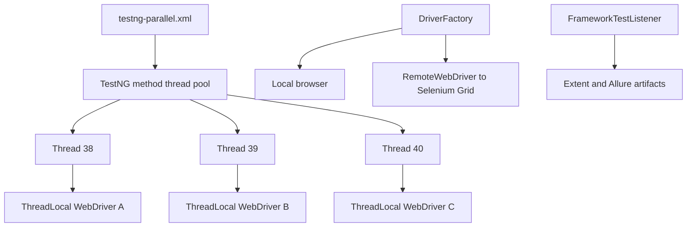

# Module 15 - Parallel Execution and Selenium Grid

## Why This Module Exists

Sequential UI tests are easier to reason about, but they become slow as the
suite grows. Module 15 teaches controlled parallel execution and prepares the
framework for Selenium Grid.

The module is deliberately conservative:

- [testng.xml](../../testng.xml) remains a sequential suite.
- [testng-parallel.xml](../../testng-parallel.xml) is the explicit parallel suite.
- local browser execution remains the default.
- Grid execution is available through configuration, but it is not required for
  local verification.

## How It Builds On Previous Modules

Module 11 introduced `ThreadLocal<WebDriver>` in `DriverFactory`. Module 13
introduced listener and logging context. Module 14 introduced report artifacts.

Module 15 makes those ideas real under parallel load:



## Files Added Or Changed

| File path | Status | Purpose |
| --- | --- | --- |
| [testng.xml](../../testng.xml) | changed | renamed as the Module 15 sequential suite |
| [testng-parallel.xml](../../testng-parallel.xml) | added | runs the SauceDemo regression with `parallel="methods"` and `thread-count="3"` |
| [src/test/resources/config/config.properties](../../src/test/resources/config/config.properties) | changed | adds `executionMode=local` and `gridUrl=http://localhost:4444` |
| [src/main/java/com/learning/framework/config/ConfigReader.java](../../src/main/java/com/learning/framework/config/ConfigReader.java) | changed | exposes execution mode and Grid URL |
| [src/main/java/com/learning/framework/driver/DriverFactory.java](../../src/main/java/com/learning/framework/driver/DriverFactory.java) | changed | supports local and Grid execution, logs thread IDs, and keeps one driver per thread |
| [src/test/java/com/learning/tests/base/BaseTest.java](../../src/test/java/com/learning/tests/base/BaseTest.java) | changed | moves driver, wait, and action references to ThreadLocal accessors |
| [src/main/java/com/learning/framework/screenshots/ScreenshotUtils.java](../../src/main/java/com/learning/framework/screenshots/ScreenshotUtils.java) | changed | adds thread ID to screenshot filenames |
| [src/test/java/com/learning/tests/reports/ExtentReportManager.java](../../src/test/java/com/learning/tests/reports/ExtentReportManager.java) | changed | synchronizes report writes and keeps current `ExtentTest` thread-local |
| [src/test/java/com/learning/tests/saucedemo/SauceDemoPageObjectTest.java](../../src/test/java/com/learning/tests/saucedemo/SauceDemoPageObjectTest.java) | changed | uses thread-local framework accessors |
| [src/test/java/com/learning/tests/saucedemo/SauceDemoDataDrivenTest.java](../../src/test/java/com/learning/tests/saucedemo/SauceDemoDataDrivenTest.java) | changed | uses thread-local framework accessors |
| [CLAUDE.md](../../CLAUDE.md) and [AGENTS.md](../../AGENTS.md) | changed | mark Module 15 as the active module |

## Module Source Links

Use these links as the source-reading checklist for this checkpoint. They point only to files that exist at Module 15.

| File | Status | Why It Matters |
| --- | --- | --- |
| [AGENTS.md](../../AGENTS.md) | Changed | Module session metadata |
| [CLAUDE.md](../../CLAUDE.md) | Changed | Module session metadata |
| [src/main/java/com/learning/framework/config/ConfigReader.java](../../src/main/java/com/learning/framework/config/ConfigReader.java) | Changed | Framework configuration source |
| [src/main/java/com/learning/framework/driver/DriverFactory.java](../../src/main/java/com/learning/framework/driver/DriverFactory.java) | Changed | Framework driver lifecycle source |
| [src/main/java/com/learning/framework/screenshots/ScreenshotUtils.java](../../src/main/java/com/learning/framework/screenshots/ScreenshotUtils.java) | Changed | Framework screenshot utility source |
| [src/test/java/com/learning/tests/base/BaseTest.java](../../src/test/java/com/learning/tests/base/BaseTest.java) | Changed | Test framework base class |
| [src/test/java/com/learning/tests/reports/ExtentReportManager.java](../../src/test/java/com/learning/tests/reports/ExtentReportManager.java) | Changed | Reporting test support |
| [src/test/java/com/learning/tests/saucedemo/SauceDemoDataDrivenTest.java](../../src/test/java/com/learning/tests/saucedemo/SauceDemoDataDrivenTest.java) | Changed | SauceDemo TestNG test source |
| [src/test/java/com/learning/tests/saucedemo/SauceDemoPageObjectTest.java](../../src/test/java/com/learning/tests/saucedemo/SauceDemoPageObjectTest.java) | Changed | SauceDemo TestNG test source |
| [src/test/resources/config/config.properties](../../src/test/resources/config/config.properties) | Changed | Runtime test configuration |
| [testng-parallel.xml](../../testng-parallel.xml) | Added | TestNG suite configuration |
| [testng.xml](../../testng.xml) | Changed | TestNG suite configuration |

## The Important Bug This Module Exposes

Having `ThreadLocal<WebDriver>` only in `DriverFactory` is not enough.

The first parallel run exposed that `BaseTest` still held normal instance
fields for `driver`, `waits`, and `elementActions`. TestNG can run methods from
the same test class instance on different threads. Normal fields can be
overwritten by another thread before the current test finishes.

Module 15 fixes that by using thread-local accessors:

- `driver()`
- `waits()`
- `elementActions()`

## What Is Intentionally Deferred

- Docker Grid setup is documented conceptually but not required locally.
- Cloud providers such as BrowserStack, Sauce Labs, and LambdaTest are deferred.
- CI matrix/grid execution is deferred to Module 17.
- Parallel Cucumber execution is deferred until after Module 16 introduces
  Cucumber.

## Quality Gate

Run:

```bash
mvn test -DsuiteXmlFile=testng.xml
mvn test -DsuiteXmlFile=testng-parallel.xml
mvn test
```

Expected:

- sequential suite passes.
- parallel suite passes.
- logs show multiple thread IDs in the parallel suite.
- Extent and Allure artifacts are generated without cross-test contamination.
- full repository tests continue to pass.

