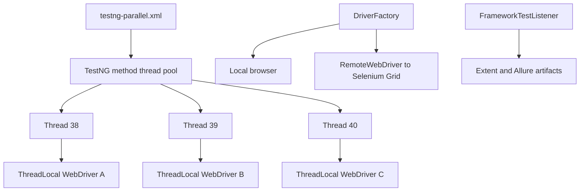
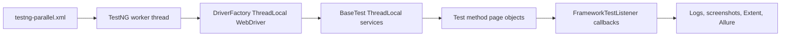

# Module 15 - Parallel Execution and Selenium Grid

## Why This Module Exists

Sequential UI tests are easier to reason about, but they become slow as the
suite grows. Module 15 teaches controlled parallel execution and prepares the
framework for Selenium Grid.

This is the first module where the framework must be correct under concurrent
load. Earlier modules could hide shared-state mistakes because only one test
was usually active at a time. In this module, TestNG can run multiple test
methods at once, which means the framework must prove that browser sessions,
waits, wrapper services, logs, screenshots, and reports stay attached to the
correct test.

The module is deliberately conservative:

- [testng.xml](../../testng.xml) remains a sequential suite.
- [testng-parallel.xml](../../testng-parallel.xml) is the explicit parallel suite.
- local browser execution remains the default.
- Grid execution is available through configuration, but it is not required for
  local verification.

## How To Study This Module

Read the module in this order:

1. Start with [testng-parallel.xml](../../testng-parallel.xml). This file is
   the trigger that changes the execution model from one test at a time to
   multiple test methods at once.
2. Read [DriverFactory.java](../../src/main/java/com/learning/framework/driver/DriverFactory.java).
   This class owns one browser session per TestNG worker thread.
3. Read [BaseTest.java](../../src/test/java/com/learning/tests/base/BaseTest.java).
   This is where the subtle Module 15 bug is fixed: framework services cannot
   remain normal instance fields when TestNG can run methods from the same test
   class instance on different threads.
4. Read [SauceDemoPageObjectTest.java](../../src/test/java/com/learning/tests/saucedemo/SauceDemoPageObjectTest.java)
   and [SauceDemoDataDrivenTest.java](../../src/test/java/com/learning/tests/saucedemo/SauceDemoDataDrivenTest.java).
   Notice that tests now call `driver()`, `elementActions()`, and `waits()`
   instead of reading shared fields.
5. Read [ExtentReportManager.java](../../src/test/java/com/learning/tests/reports/ExtentReportManager.java)
   and [ScreenshotUtils.java](../../src/main/java/com/learning/framework/screenshots/ScreenshotUtils.java).
   Parallel execution affects artifacts too, not only browser sessions.
6. Read [config.properties](../../src/test/resources/config/config.properties)
   and [ConfigReader.java](../../src/main/java/com/learning/framework/config/ConfigReader.java)
   to understand how `executionMode` switches between local browsers and Grid.

## How It Builds On Previous Modules

Module 11 introduced `ThreadLocal<WebDriver>` in `DriverFactory`. Module 13
introduced listener and logging context. Module 14 introduced report artifacts.

Module 15 makes those ideas real under parallel load:



The key learning point is that parallel safety is not one feature. It is a
chain:



If any link in that chain stores test-specific state in a normal shared field,
the parallel suite can become flaky even when every individual Selenium command
is correct.

## Files Added Or Changed

| File path | Status | Purpose |
| --- | --- | --- |
| [testng.xml](../../testng.xml) | changed | renamed as the Module 15 sequential suite |
| [testng-parallel.xml](../../testng-parallel.xml) | added | runs the SauceDemo regression with `parallel="methods"` and `thread-count="3"` |
| [src/test/resources/config/config.properties](../../src/test/resources/config/config.properties) | changed | adds `executionMode=local` and `gridUrl=http://localhost:4444` |
| [src/main/java/com/learning/framework/config/ConfigReader.java](../../src/main/java/com/learning/framework/config/ConfigReader.java) | changed | exposes execution mode and Grid URL |
| [src/main/java/com/learning/framework/driver/DriverFactory.java](../../src/main/java/com/learning/framework/driver/DriverFactory.java) | changed | supports local and Grid execution, logs thread IDs, and keeps one driver per thread |
| [src/test/java/com/learning/tests/base/BaseTest.java](../../src/test/java/com/learning/tests/base/BaseTest.java) | changed | moves driver, wait, and action references to ThreadLocal accessors |
| [src/main/java/com/learning/framework/screenshots/ScreenshotUtils.java](../../src/main/java/com/learning/framework/screenshots/ScreenshotUtils.java) | changed | adds thread ID to screenshot filenames |
| [src/test/java/com/learning/tests/reports/ExtentReportManager.java](../../src/test/java/com/learning/tests/reports/ExtentReportManager.java) | changed | synchronizes report writes and keeps current `ExtentTest` thread-local |
| [src/test/java/com/learning/tests/saucedemo/SauceDemoPageObjectTest.java](../../src/test/java/com/learning/tests/saucedemo/SauceDemoPageObjectTest.java) | changed | uses thread-local framework accessors |
| [src/test/java/com/learning/tests/saucedemo/SauceDemoDataDrivenTest.java](../../src/test/java/com/learning/tests/saucedemo/SauceDemoDataDrivenTest.java) | changed | uses thread-local framework accessors |
| [CLAUDE.md](../../CLAUDE.md) and [AGENTS.md](../../AGENTS.md) | changed | mark Module 15 as the active module |

## Module Source Links

Use these links as the source-reading checklist for this checkpoint. They point only to files that exist at Module 15.

| File | Status | Why It Matters |
| --- | --- | --- |
| [AGENTS.md](../../AGENTS.md) | Changed | Module session metadata |
| [CLAUDE.md](../../CLAUDE.md) | Changed | Module session metadata |
| [src/main/java/com/learning/framework/config/ConfigReader.java](../../src/main/java/com/learning/framework/config/ConfigReader.java) | Changed | Framework configuration source |
| [src/main/java/com/learning/framework/driver/DriverFactory.java](../../src/main/java/com/learning/framework/driver/DriverFactory.java) | Changed | Framework driver lifecycle source |
| [src/main/java/com/learning/framework/screenshots/ScreenshotUtils.java](../../src/main/java/com/learning/framework/screenshots/ScreenshotUtils.java) | Changed | Framework screenshot utility source |
| [src/test/java/com/learning/tests/base/BaseTest.java](../../src/test/java/com/learning/tests/base/BaseTest.java) | Changed | Test framework base class |
| [src/test/java/com/learning/tests/reports/ExtentReportManager.java](../../src/test/java/com/learning/tests/reports/ExtentReportManager.java) | Changed | Reporting test support |
| [src/test/java/com/learning/tests/saucedemo/SauceDemoDataDrivenTest.java](../../src/test/java/com/learning/tests/saucedemo/SauceDemoDataDrivenTest.java) | Changed | SauceDemo TestNG test source |
| [src/test/java/com/learning/tests/saucedemo/SauceDemoPageObjectTest.java](../../src/test/java/com/learning/tests/saucedemo/SauceDemoPageObjectTest.java) | Changed | SauceDemo TestNG test source |
| [src/test/resources/config/config.properties](../../src/test/resources/config/config.properties) | Changed | Runtime test configuration |
| [testng-parallel.xml](../../testng-parallel.xml) | Added | TestNG suite configuration |
| [testng.xml](../../testng.xml) | Changed | TestNG suite configuration |

## The Important Bug This Module Exposes

Having `ThreadLocal<WebDriver>` only in `DriverFactory` is not enough.

The first parallel run exposed that `BaseTest` still held normal instance
fields for `driver`, `waits`, and `elementActions`. TestNG can run methods from
the same test class instance on different threads. Normal fields can be
overwritten by another thread before the current test finishes.

Module 15 fixes that by using thread-local accessors:

- `driver()`
- `waits()`
- `elementActions()`

### Why This Matters In Practice

Before this module, a `BaseTest` field such as `protected WebDriver driver`
looked harmless because only one method used it at a time. Under
`parallel="methods"`, two methods from [SauceDemoPageObjectTest.java](../../src/test/java/com/learning/tests/saucedemo/SauceDemoPageObjectTest.java)
or [SauceDemoDataDrivenTest.java](../../src/test/java/com/learning/tests/saucedemo/SauceDemoDataDrivenTest.java)
can overlap.

The failure mode is difficult for beginners because the code still compiles
and the tests may pass sometimes. A race can look like:

1. Thread A creates browser A and stores it in a normal `driver` field.
2. Thread B creates browser B and overwrites the same normal `driver` field.
3. Thread A continues and builds a page object using browser B.
4. Thread A later tears down what it thinks is its driver while Thread B is
   still using it.

That is why [BaseTest.java](../../src/test/java/com/learning/tests/base/BaseTest.java)
stores the current driver, wait, `WaitUtils`, and `ElementActions` in
`ThreadLocal` variables and exposes them through accessor methods.

Not every field is automatically wrong in a parallel class. The username and
password fields in [SauceDemoPageObjectTest.java](../../src/test/java/com/learning/tests/saucedemo/SauceDemoPageObjectTest.java)
are initialized once in `@BeforeClass` and only read by tests. The dangerous
objects are per-test mutable services such as browser sessions, waits, page
objects, and report test nodes.

## Source Ownership Model

| Source | Ownership Type | Parallel Rule |
| --- | --- | --- |
| [testng-parallel.xml](../../testng-parallel.xml) | suite configuration | controls how TestNG schedules methods |
| [DriverFactory.java](../../src/main/java/com/learning/framework/driver/DriverFactory.java) | framework service | one `WebDriver` per thread |
| [BaseTest.java](../../src/test/java/com/learning/tests/base/BaseTest.java) | test lifecycle support | one set of driver/wait/action references per thread |
| [SauceDemoPageObjectTest.java](../../src/test/java/com/learning/tests/saucedemo/SauceDemoPageObjectTest.java) | test class | creates page objects inside each test method |
| [SauceDemoDataDrivenTest.java](../../src/test/java/com/learning/tests/saucedemo/SauceDemoDataDrivenTest.java) | test class | passes immutable `LoginScenario` rows into each invocation |
| [ExtentReportManager.java](../../src/test/java/com/learning/tests/reports/ExtentReportManager.java) | reporting support | shared report object, thread-local current test node |
| [ScreenshotUtils.java](../../src/main/java/com/learning/framework/screenshots/ScreenshotUtils.java) | framework utility | unique screenshot names include timestamp, thread ID, and test name |
| [config.properties](../../src/test/resources/config/config.properties) | test configuration | defaults to local execution and defines the Grid endpoint |
| [ConfigReader.java](../../src/main/java/com/learning/framework/config/ConfigReader.java) | framework configuration reader | lets Maven `-D` values override local defaults |

## What Is Intentionally Deferred

- Docker Grid setup is documented conceptually but not required locally.
- Cloud providers such as BrowserStack, Sauce Labs, and LambdaTest are deferred.
- CI matrix/grid execution is deferred to Module 17.
- Parallel Cucumber execution is deferred until after Module 16 introduces
  Cucumber.

## Quality Gate

Run:

```bash
mvn test -DsuiteXmlFile=testng.xml
mvn test -DsuiteXmlFile=testng-parallel.xml
mvn test
```

Expected:

- sequential suite passes.
- parallel suite passes.
- logs show multiple thread IDs in the parallel suite.
- Extent and Allure artifacts are generated without cross-test contamination.
- full repository tests continue to pass.

Practical verification notes:

- Use `mvn clean test -DsuiteXmlFile=testng-parallel.xml` when checking
  artifacts so stale files from older runs do not confuse the result.
- `target/logs/test-execution.log` should contain browser creation lines with
  different thread IDs from [DriverFactory.java](../../src/main/java/com/learning/framework/driver/DriverFactory.java).
- `target/extent-report/extent.html` should show the same logical tests that
  ran in the suite, not duplicated or mixed entries.
- `target/allure-results` should contain one set of result artifacts for the
  current clean run.
