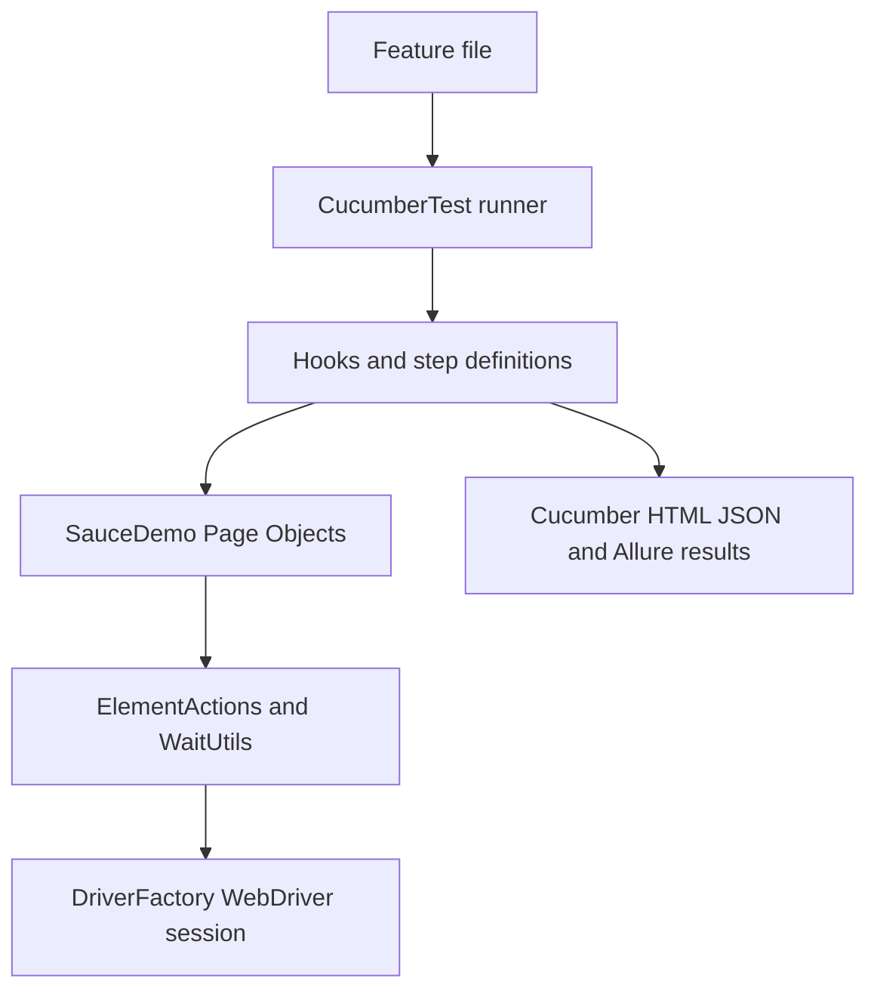

# Module 16 - Cucumber BDD

Module 16 adds Cucumber as a behavior-driven testing layer on top of the
framework built so far. The important design point is that Cucumber does not
replace Selenium, TestNG, Page Objects, wrappers, waits, driver management, or
reporting. It replaces only the top-level test expression: scenarios are now
written in Gherkin and translated into the same framework services through step
definitions.

## Why This Module Exists Now

BDD is useful only after the lower layers are stable. Modules 09 through 15
already introduced Page Objects, wrapper methods, configuration, driver
lifecycle, data, diagnostics, reporting, and parallel-safe browser ownership.
That means Module 16 can focus on the real Cucumber question: how does a plain
language scenario become a browser test without turning step definitions into a
second framework?



## Files Added Or Changed

| File | Status | Ownership | Purpose |
| --- | --- | --- | --- |
| [pom.xml](../../pom.xml) | Changed | Build configuration | Adds `cucumber-java`, `cucumber-testng`, and `allure-cucumber7-jvm`. |
| [testng-cucumber.xml](../../testng-cucumber.xml) | Added | Suite configuration | Runs the Cucumber runner through TestNG. |
| [src/test/resources/features/saucedemo_login.feature](../../src/test/resources/features/saucedemo_login.feature) | Added | BDD feature | Defines login and checkout scenarios in Gherkin. |
| [src/test/java/com/learning/tests/bdd/runners/CucumberTest.java](../../src/test/java/com/learning/tests/bdd/runners/CucumberTest.java) | Added | Cucumber runner | Connects feature files, glue packages, tags, and Cucumber plugins. |
| [src/test/java/com/learning/tests/bdd/hooks/CucumberHooks.java](../../src/test/java/com/learning/tests/bdd/hooks/CucumberHooks.java) | Added | Cucumber lifecycle | Opens and closes one browser per scenario and attaches failure screenshots. |
| [src/test/java/com/learning/tests/bdd/context/CucumberScenarioContext.java](../../src/test/java/com/learning/tests/bdd/context/CucumberScenarioContext.java) | Added | Test support | Holds scenario-scoped framework services with `ThreadLocal`. |
| [src/test/java/com/learning/tests/bdd/steps/SauceDemoSteps.java](../../src/test/java/com/learning/tests/bdd/steps/SauceDemoSteps.java) | Added | Step definitions | Maps Gherkin steps to existing Page Object methods and assertions. |

## Module Source Links

Use these links as the source-reading checklist for this checkpoint. They point only to files that exist at Module 16.

| File | Status | Why It Matters |
| --- | --- | --- |
| [AGENTS.md](../../AGENTS.md) | Changed | Module session metadata |
| [CLAUDE.md](../../CLAUDE.md) | Changed | Module session metadata |
| [pom.xml](../../pom.xml) | Changed | Maven build and dependency configuration |
| [src/test/java/com/learning/tests/bdd/context/CucumberScenarioContext.java](../../src/test/java/com/learning/tests/bdd/context/CucumberScenarioContext.java) | Added | Cucumber BDD test support |
| [src/test/java/com/learning/tests/bdd/hooks/CucumberHooks.java](../../src/test/java/com/learning/tests/bdd/hooks/CucumberHooks.java) | Added | Cucumber BDD test support |
| [src/test/java/com/learning/tests/bdd/runners/CucumberTest.java](../../src/test/java/com/learning/tests/bdd/runners/CucumberTest.java) | Added | Cucumber BDD test support |
| [src/test/java/com/learning/tests/bdd/steps/SauceDemoSteps.java](../../src/test/java/com/learning/tests/bdd/steps/SauceDemoSteps.java) | Added | Cucumber BDD test support |
| [src/test/resources/features/saucedemo_login.feature](../../src/test/resources/features/saucedemo_login.feature) | Added | Cucumber feature file |
| [testng-cucumber.xml](../../testng-cucumber.xml) | Added | TestNG suite configuration |

## Previous Files Reused

| File | Why It Matters In This Module |
| --- | --- |
| [src/main/java/com/learning/framework/driver/DriverFactory.java](../../src/main/java/com/learning/framework/driver/DriverFactory.java) | Cucumber hooks reuse the same local/Grid driver creation rules. |
| [src/main/java/com/learning/framework/actions/ElementActions.java](../../src/main/java/com/learning/framework/actions/ElementActions.java) | Step definitions stay clean because Page Objects still use wrapper actions. |
| [src/main/java/com/learning/framework/waits/WaitUtils.java](../../src/main/java/com/learning/framework/waits/WaitUtils.java) | Cucumber does not add raw sleeps or duplicate wait logic. |
| `src/main/java/com/learning/framework/pages/saucedemo/*.java` | BDD scenarios exercise the same application model used by TestNG tests. |
| [src/main/java/com/learning/framework/screenshots/ScreenshotUtils.java](../../src/main/java/com/learning/framework/screenshots/ScreenshotUtils.java) | Failed Cucumber scenarios reuse the screenshot service from Module 13. |

## What This Module Adds

- Gherkin `Feature`, `Background`, `Scenario`, `Scenario Outline`, `Examples`,
  tags, and `DataTable`.
- A TestNG-compatible Cucumber runner using `AbstractTestNGCucumberTests`.
- Cucumber glue packages for hooks and step definitions.
- Scenario-scoped browser lifecycle separate from `BaseTest`.
- Cucumber HTML and JSON reports under `target/cucumber-report/`.
- Allure Cucumber result generation through the Cucumber plugin.

## What Is Intentionally Deferred

- Large feature suites split by business domain.
- Parallel Cucumber scenario execution. The context is already ThreadLocal, but
  the runner stays sequential so learners can debug feature-to-step flow first.
- Cucumber dependency injection with PicoContainer, Spring, or Guice.
- Custom parameter types and data table transformers.
- CI tag filtering. Module 17 will decide which BDD tags run in pipelines.

## Quality Gate

Run the focused Cucumber suite:

```bash
mvn test -DsuiteXmlFile=testng-cucumber.xml
```

Expected result:

- 5 Cucumber scenarios pass.
- `target/cucumber-report/cucumber.html` is generated.
- `target/cucumber-report/cucumber.json` is generated.
- Allure result files are produced in `target/allure-results`.

Run the existing TestNG framework suite:

```bash
mvn test -DsuiteXmlFile=testng.xml
```

Expected result:

- Existing SauceDemo TestNG tests still pass.
- Adding Cucumber did not break the non-BDD layer.

Run the full repository regression:

```bash
mvn test
```

Expected result:

- All learning tests, framework tests, and Cucumber scenarios pass.
