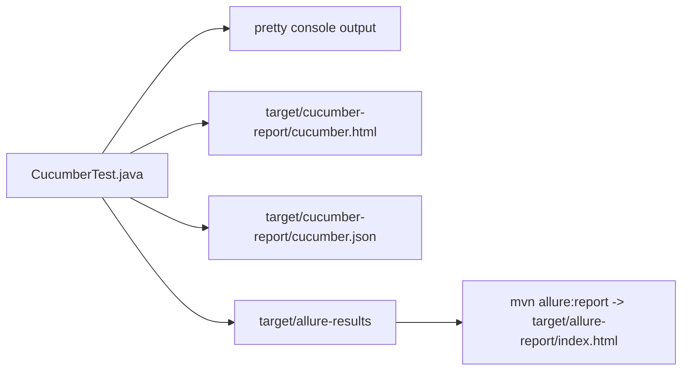

# Reporting, Tags, And Execution

Module 16 adds a dedicated suite file:

[testng-cucumber.xml](../../testng-cucumber.xml)

Run it with:

```bash
mvn test -DsuiteXmlFile=testng-cucumber.xml
```

This command activates the existing Maven profile in [pom.xml](../../pom.xml)
that reads the `suiteXmlFile` property and points Surefire at
[testng-cucumber.xml](../../testng-cucumber.xml). TestNG then runs
[CucumberTest.java](../../src/test/java/com/learning/tests/bdd/runners/CucumberTest.java),
and Cucumber discovers feature scenarios from the runner options.

## Reports

[src/test/java/com/learning/tests/bdd/runners/CucumberTest.java](../../src/test/java/com/learning/tests/bdd/runners/CucumberTest.java)
configures these Cucumber plugins:

| Plugin | Output |
| --- | --- |
| `pretty` | readable console scenario output |
| `html:target/cucumber-report/cucumber.html` | local Cucumber HTML report |
| `json:target/cucumber-report/cucumber.json` | machine-readable Cucumber report data |
| `io.qameta.allure.cucumber7jvm.AllureCucumber7Jvm` | Allure results for Cucumber scenarios |

The Cucumber report is useful for quickly reading scenarios and steps. Allure
is useful when the whole framework report needs a richer dashboard.

Module 16's Cucumber suite does not use the Extent listener from the TestNG
framework suites. The reporting flow is:



Failure screenshots are attached by [CucumberHooks.java](../../src/test/java/com/learning/tests/bdd/hooks/CucumberHooks.java)
using Cucumber's `Scenario.attach(...)`. That is separate from the TestNG
listener path used in earlier modules.

## Tags

Feature-level tags:

- `@bdd`
- `@saucedemo`

Scenario-level tags:

- `@smoke`
- `@regression`
- `@login`
- `@checkout`

Tags are not comments. They are executable filters. Cucumber can filter
scenarios using tag expressions such as:

```bash
mvn test -DsuiteXmlFile=testng-cucumber.xml -Dcucumber.filter.tags="@smoke"
```

The runner also has `tags = "@bdd"`. Command-line tag filters combine with
runner filters, so a scenario must satisfy both.

Examples:

```bash
mvn test -DsuiteXmlFile=testng-cucumber.xml -Dcucumber.filter.tags="@login"
mvn test -DsuiteXmlFile=testng-cucumber.xml -Dcucumber.filter.tags="@smoke and @login"
mvn test -DsuiteXmlFile=testng-cucumber.xml -Dcucumber.filter.tags="@regression and not @checkout"
```

In this module, all scenarios inherit `@bdd` from the feature. A command-line
filter such as `@smoke` narrows the already-selected `@bdd` scenarios.

## Execution Flow

For one scenario, the execution path is:

1. Maven Surefire runs [testng-cucumber.xml](../../testng-cucumber.xml).
2. TestNG loads [CucumberTest.java](../../src/test/java/com/learning/tests/bdd/runners/CucumberTest.java).
3. Cucumber applies the runner tag filter.
4. Cucumber executes `@Before` in [CucumberHooks.java](../../src/test/java/com/learning/tests/bdd/hooks/CucumberHooks.java).
5. Cucumber matches each Gherkin step to [SauceDemoSteps.java](../../src/test/java/com/learning/tests/bdd/steps/SauceDemoSteps.java).
6. Step methods call page objects and assertions.
7. Cucumber executes `@After`, attaching a screenshot only if the scenario
   failed.
8. Cucumber plugins write HTML, JSON, console, and Allure result artifacts.

## Artifact Checklist

After a clean run:

```bash
mvn clean test -DsuiteXmlFile=testng-cucumber.xml
```

check:

- `target/cucumber-report/cucumber.html`
- `target/cucumber-report/cucumber.json`
- `target/allure-results`
- `target/screenshots` only when a scenario fails

Then generate the Allure report:

```bash
mvn allure:report
```

check:

- `target/allure-report/index.html`

## Nuances

Do not create too many tags. Tags should support execution decisions and test
ownership, not decorate every scenario with redundant labels.

Do not make one giant feature file. This module starts with one file because
the project is teaching the Cucumber connection. Real projects usually split
features by business capability.

Do not assume Cucumber reports replace Allure or Extent. Cucumber reports are
excellent for scenario readability. Allure and Extent are broader automation
reports with screenshots, metadata, and historical trends when connected to CI.

Tag expressions should support real execution decisions. Good tag categories
include smoke, regression, business area, risk area, or ownership. Weak tags
include every implementation detail, every page object name, or tags that
duplicate the feature file path.

Because [CucumberTest.java](../../src/test/java/com/learning/tests/bdd/runners/CucumberTest.java)
uses `@DataProvider(parallel = false)`, Module 16 runs scenarios sequentially.
That choice is intentional: the learner can first understand feature-to-step
execution before adding parallel Cucumber complexity.

## Maven Commands To Know

| Command | Purpose |
| --- | --- |
| `mvn test -DsuiteXmlFile=testng-cucumber.xml` | run all Module 16 BDD scenarios selected by the runner |
| `mvn clean test -DsuiteXmlFile=testng-cucumber.xml` | remove stale artifacts, then run the BDD suite |
| `mvn test -DsuiteXmlFile=testng-cucumber.xml -Dcucumber.filter.tags="@smoke"` | run only smoke BDD scenarios within the runner selection |
| `mvn test -DsuiteXmlFile=testng.xml` | verify the original TestNG framework suite still passes |
| `mvn allure:report` | generate static Allure HTML from `target/allure-results` |

## Interview Readiness

Likely question:

> How do you run selected Cucumber scenarios?

Strong answer:

Use tags and tag expressions. For example, mark fast critical scenarios with
`@smoke`, then run them with `-Dcucumber.filter.tags="@smoke"`. In a TestNG
Cucumber setup, the runner class still goes through Maven Surefire or a TestNG
suite, but Cucumber decides which scenarios match the tag expression.

Likely question:

> Why do Cucumber frameworks still need Page Objects?

Strong answer:

Gherkin describes business behavior, and step definitions connect that behavior
to code. Page Objects still protect the automation from HTML details and keep
Selenium commands centralized. Without Page Objects, step definitions become
hard to reuse and expensive to maintain.

Likely question:

> What reports does this Cucumber suite produce?

Strong answer:

[CucumberTest.java](../../src/test/java/com/learning/tests/bdd/runners/CucumberTest.java)
configures Cucumber's console, HTML, JSON, and Allure plugins. The Cucumber
HTML report is useful for reading scenario steps, JSON is useful for machines
or downstream tools, and Allure provides a richer dashboard after running
`mvn allure:report`.

Likely question:

> How would you run only checkout BDD scenarios?

Strong answer:

Use a tag expression:

```bash
mvn test -DsuiteXmlFile=testng-cucumber.xml -Dcucumber.filter.tags="@checkout"
```

The runner's `@bdd` filter still applies, so this selects checkout scenarios
inside the BDD feature set.
