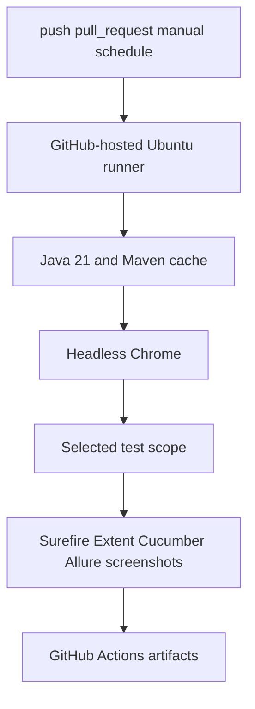
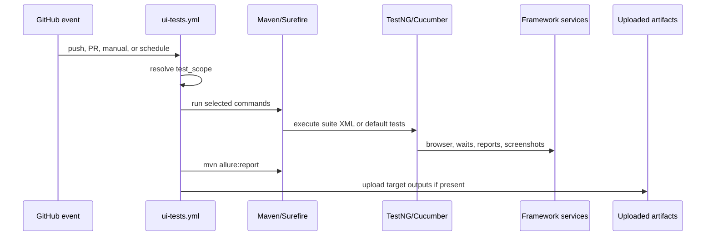

# Module 17 - CI/CD

Module 17 moves the Selenium framework from local-only execution to GitHub
Actions. The goal is not just to run `mvn test` somewhere else. The goal is to
teach how a UI automation framework becomes a repeatable pipeline with clear
triggers, headless browser execution, selected test scopes, and downloadable
failure evidence.

This module is about operationalizing the framework. A local framework proves
that the code can run on your machine. A CI workflow proves that the same
project can run from a clean checkout, with declared Java/Maven dependencies,
without a visible desktop, and still preserve enough evidence to debug a
failure after the runner has disappeared.

## Why This Module Exists Now

CI/CD belongs near the end because the framework now has enough real behavior
to justify pipeline design:

- TestNG suites from Modules 08 and 15.
- Page Object and wrapper framework tests from Modules 09 and 10.
- data-driven tests from Module 12.
- screenshots, logs, Extent, and Allure from Modules 13 and 14.
- Cucumber BDD scenarios from Module 16.



## How To Study This Module

Read the files in this order:

1. [.github/workflows/ui-tests.yml](../../.github/workflows/ui-tests.yml)
   because it is the only implementation file introduced by this module.
2. [pom.xml](../../pom.xml) to connect the workflow commands to Maven Surefire,
   `suiteXmlFile`, Java 21, Selenium, TestNG, Cucumber, and report plugins.
3. [testng.xml](../../testng.xml), [testng-parallel.xml](../../testng-parallel.xml),
   and [testng-cucumber.xml](../../testng-cucumber.xml) to understand each
   suite that CI can run.
4. [ConfigReader.java](../../src/main/java/com/learning/framework/config/ConfigReader.java)
   and [DriverFactory.java](../../src/main/java/com/learning/framework/driver/DriverFactory.java)
   to trace how `-Dheadless=true` reaches browser options.
5. [FrameworkTestListener.java](../../src/test/java/com/learning/tests/listeners/FrameworkTestListener.java),
   [ExtentReportManager.java](../../src/test/java/com/learning/tests/reports/ExtentReportManager.java),
   [AllureReportUtils.java](../../src/test/java/com/learning/tests/reports/AllureReportUtils.java),
   and [CucumberHooks.java](../../src/test/java/com/learning/tests/bdd/hooks/CucumberHooks.java)
   to connect CI artifacts to the framework services that produce them.

The important path is:



## Files Added Or Changed

| File | Status | Ownership | Purpose |
| --- | --- | --- | --- |
| [.github/workflows/ui-tests.yml](../../.github/workflows/ui-tests.yml) | Added | CI workflow | Runs headless Selenium tests in GitHub Actions and uploads reports. |
| [docs/module-17-cicd/00-module-overview.md](00-module-overview.md) | Added | Documentation | Explains what CI adds and how it reuses earlier modules. |
| [docs/module-17-cicd/01-github-actions-workflow.md](01-github-actions-workflow.md) | Added | Documentation | Walks through triggers, jobs, actions, caching, and shell scope selection. |
| [docs/module-17-cicd/02-headless-execution-and-artifacts.md](02-headless-execution-and-artifacts.md) | Added | Documentation | Explains headless Chrome, reports, screenshots, and artifacts. |
| [docs/module-17-cicd/99-interview-review.md](99-interview-review.md) | Added | Documentation | CI/CD interview revision notes. |
| [docs/module-17-cicd/exercises.md](exercises.md) | Added | Exercises | Practice tasks for test scopes, artifacts, and CI reasoning. |

## Module Source Links

Use these links as the source-reading checklist for this checkpoint. They point only to files that exist at Module 17.

| File | Status | Why It Matters |
| --- | --- | --- |
| [.github/workflows/ui-tests.yml](../../.github/workflows/ui-tests.yml) | Added | GitHub Actions CI workflow |
| [AGENTS.md](../../AGENTS.md) | Changed | Module session metadata |
| [CLAUDE.md](../../CLAUDE.md) | Changed | Module session metadata |

## Workflow Implementation Map

| Workflow Section | Source | What It Teaches |
| --- | --- | --- |
| `on` | [.github/workflows/ui-tests.yml](../../.github/workflows/ui-tests.yml) | which GitHub events run UI automation |
| `permissions` | [.github/workflows/ui-tests.yml](../../.github/workflows/ui-tests.yml) | least-privilege read-only repository access |
| `concurrency` | [.github/workflows/ui-tests.yml](../../.github/workflows/ui-tests.yml) | cancel older runs on the same ref to avoid wasting CI time |
| `runs-on` | [.github/workflows/ui-tests.yml](../../.github/workflows/ui-tests.yml) | GitHub-hosted Ubuntu runner selection |
| `actions/checkout` | [.github/workflows/ui-tests.yml](../../.github/workflows/ui-tests.yml) | make repository files available to Maven |
| `actions/setup-java` | [.github/workflows/ui-tests.yml](../../.github/workflows/ui-tests.yml) | install Java 21 and enable Maven dependency caching |
| `Resolve test scope` | [.github/workflows/ui-tests.yml](../../.github/workflows/ui-tests.yml) | choose smoke, regression, BDD, parallel, or full execution |
| `Run selected UI test scope` | [.github/workflows/ui-tests.yml](../../.github/workflows/ui-tests.yml) | map each scope to exact Maven commands |
| artifact upload steps | [.github/workflows/ui-tests.yml](../../.github/workflows/ui-tests.yml) | preserve diagnostics after the runner is gone |

## Workflow Scopes

Read the workflow in [.github/workflows/ui-tests.yml](../../.github/workflows/ui-tests.yml)
with these supporting files open:

- [pom.xml](../../pom.xml) explains the Maven dependencies and Surefire
  execution used by every CI scope.
- [testng.xml](../../testng.xml) is the main TestNG suite used by smoke and
  regression paths.
- [testng-parallel.xml](../../testng-parallel.xml) proves the Module 15
  ThreadLocal driver design under concurrent execution.
- [testng-cucumber.xml](../../testng-cucumber.xml) connects the BDD layer to
  Maven and TestNG.
- [src/main/java/com/learning/framework/config/ConfigReader.java](../../src/main/java/com/learning/framework/config/ConfigReader.java)
  and [src/main/java/com/learning/framework/driver/DriverFactory.java](../../src/main/java/com/learning/framework/driver/DriverFactory.java)
  show how the `-Dheadless=true` property reaches browser creation.

| Scope | Command Path | Why It Exists |
| --- | --- | --- |
| `smoke` | TestNG smoke plus Cucumber `@smoke` | Fast default for push and pull request checks. |
| `regression` | [testng.xml](../../testng.xml) plus full Cucumber suite | Stable framework regression without older raw learning tests. |
| `bdd` | [testng-cucumber.xml](../../testng-cucumber.xml) | BDD-only validation for feature/step work. |
| `parallel` | [testng-parallel.xml](../../testng-parallel.xml) | Focused check for Module 15 parallel safety. |
| `full` | `mvn test` plus [testng-parallel.xml](../../testng-parallel.xml) | Scheduled/manual full confidence run. |

### Scope Strategy

The workflow intentionally does not run the same command for every event.

- Pull requests and pushes default to `smoke` because that gives fast feedback
  on critical TestNG and Cucumber paths.
- Manual runs can choose any scope through `workflow_dispatch`.
- Scheduled runs default to `full` because they are meant to catch wider
  regression, browser drift, dependency drift, and external-site behavior
  changes.

This is a realistic UI automation tradeoff. Running everything on every PR
sounds safer, but if checks take too long, teams start ignoring them. A layered
scope strategy keeps CI useful.

## Source Ownership Model

| Source | Ownership Type | CI Responsibility |
| --- | --- | --- |
| [.github/workflows/ui-tests.yml](../../.github/workflows/ui-tests.yml) | workflow | triggers, environment setup, scope selection, artifacts |
| [pom.xml](../../pom.xml) | build configuration | Java version, dependencies, Surefire, Allure Maven plugin |
| [testng.xml](../../testng.xml) | TestNG suite | smoke/regression framework tests |
| [testng-parallel.xml](../../testng-parallel.xml) | TestNG suite | parallel safety verification |
| [testng-cucumber.xml](../../testng-cucumber.xml) | TestNG suite | BDD scenario execution through Cucumber runner |
| [ConfigReader.java](../../src/main/java/com/learning/framework/config/ConfigReader.java) | framework config | reads `-Dheadless=true` and other Maven overrides |
| [DriverFactory.java](../../src/main/java/com/learning/framework/driver/DriverFactory.java) | framework driver service | creates headless local browser sessions in CI |
| [ScreenshotUtils.java](../../src/main/java/com/learning/framework/screenshots/ScreenshotUtils.java) | framework evidence | writes failure screenshots under `target/screenshots` |

## What Is Intentionally Deferred

- Publishing Allure reports to GitHub Pages.
- Selenium Grid inside CI using service containers.
- branch protection configuration.
- PR comments with report links.
- matrix execution across browsers.
- secret management for private AUTs or environments.

Those topics are real, but Module 17 keeps CI readable before the final
capstone packaging module.

## Quality Gate

Validate workflow YAML parses as YAML:

```bash
ruby -e "require 'yaml'; YAML.load_file('.github/workflows/ui-tests.yml'); puts 'yaml ok'"
```

Run the same smoke path locally:

```bash
mvn test -DsuiteXmlFile=testng.xml -Dgroups=smoke -Dheadless=true
mvn test -DsuiteXmlFile=testng-cucumber.xml -Dcucumber.filter.tags="@smoke" -Dheadless=true
```

Run the focused CI regression path locally:

```bash
mvn test -DsuiteXmlFile=testng.xml -Dheadless=true
mvn test -DsuiteXmlFile=testng-cucumber.xml -Dheadless=true
```

Run report generation:

```bash
mvn allure:report
```

Expected result:

- all commands pass.
- `target/surefire-reports/` exists.
- `target/extent-report/` exists after TestNG framework runs.
- `target/cucumber-report/` exists after BDD runs.
- `target/allure-results/` and `target/allure-report/` exist after report generation.

Do not confuse local verification with a real GitHub-hosted run. Local checks
prove that the workflow commands and suites are valid. The actual CI value is
confirmed after pushing to GitHub and observing the Actions run, which is
intentionally outside this module-rewrite step because no push happens until
explicit confirmation.
