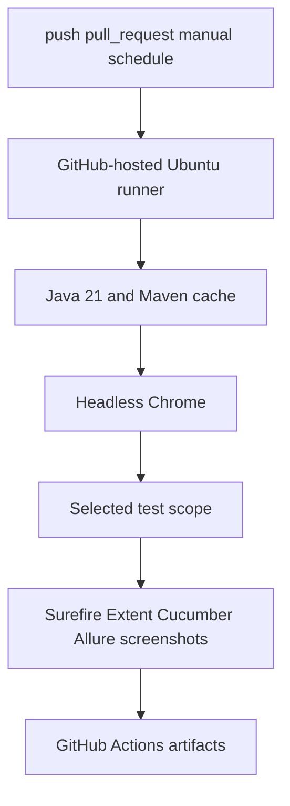

# Module 17 - CI/CD

Module 17 moves the Selenium framework from local-only execution to GitHub
Actions. The goal is not just to run `mvn test` somewhere else. The goal is to
teach how a UI automation framework becomes a repeatable pipeline with clear
triggers, headless browser execution, selected test scopes, and downloadable
failure evidence.

## Why This Module Exists Now

CI/CD belongs near the end because the framework now has enough real behavior
to justify pipeline design:

- TestNG suites from Modules 08 and 15.
- Page Object and wrapper framework tests from Modules 09 and 10.
- data-driven tests from Module 12.
- screenshots, logs, Extent, and Allure from Modules 13 and 14.
- Cucumber BDD scenarios from Module 16.



## Files Added Or Changed

| File | Status | Ownership | Purpose |
| --- | --- | --- | --- |
| `.github/workflows/ui-tests.yml` | Added | CI workflow | Runs headless Selenium tests in GitHub Actions and uploads reports. |
| `docs/module-17-cicd/00-module-overview.md` | Added | Documentation | Explains what CI adds and how it reuses earlier modules. |
| `docs/module-17-cicd/01-github-actions-workflow.md` | Added | Documentation | Walks through triggers, jobs, actions, caching, and shell scope selection. |
| `docs/module-17-cicd/02-headless-execution-and-artifacts.md` | Added | Documentation | Explains headless Chrome, reports, screenshots, and artifacts. |
| `docs/module-17-cicd/99-interview-review.md` | Added | Documentation | CI/CD interview revision notes. |
| `docs/module-17-cicd/exercises.md` | Added | Exercises | Practice tasks for test scopes, artifacts, and CI reasoning. |

## Workflow Scopes

| Scope | Command Path | Why It Exists |
| --- | --- | --- |
| `smoke` | TestNG smoke plus Cucumber `@smoke` | Fast default for push and pull request checks. |
| `regression` | `testng.xml` plus full Cucumber suite | Stable framework regression without older raw learning tests. |
| `bdd` | `testng-cucumber.xml` | BDD-only validation for feature/step work. |
| `parallel` | `testng-parallel.xml` | Focused check for Module 15 parallel safety. |
| `full` | `mvn test` plus `testng-parallel.xml` | Scheduled/manual full confidence run. |

## What Is Intentionally Deferred

- Publishing Allure reports to GitHub Pages.
- Selenium Grid inside CI using service containers.
- branch protection configuration.
- PR comments with report links.
- matrix execution across browsers.
- secret management for private AUTs or environments.

Those topics are real, but Module 17 keeps CI readable before the final
capstone packaging module.

## Quality Gate

Validate workflow YAML parses as YAML:

```bash
ruby -e "require 'yaml'; YAML.load_file('.github/workflows/ui-tests.yml'); puts 'yaml ok'"
```

Run the same smoke path locally:

```bash
mvn test -DsuiteXmlFile=testng.xml -Dgroups=smoke -Dheadless=true
mvn test -DsuiteXmlFile=testng-cucumber.xml -Dcucumber.filter.tags="@smoke" -Dheadless=true
```

Run the focused CI regression path locally:

```bash
mvn test -DsuiteXmlFile=testng.xml -Dheadless=true
mvn test -DsuiteXmlFile=testng-cucumber.xml -Dheadless=true
```

Run report generation:

```bash
mvn allure:report
```

Expected result:

- all commands pass.
- `target/surefire-reports/` exists.
- `target/extent-report/` exists after TestNG framework runs.
- `target/cucumber-report/` exists after BDD runs.
- `target/allure-results/` and `target/allure-report/` exist after report generation.
