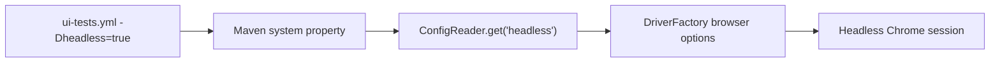

# Headless Execution And Artifacts

CI runners are not the same as a developer laptop. This module keeps the
browser in headless mode and uploads artifacts so failures can be investigated
after the runner disappears.

Headless execution and artifacts are linked. Because nobody can watch the
browser on a GitHub-hosted runner, the framework must leave behind reports,
logs, screenshots, and structured result files.

## Headless Browser Model

Headless Chrome runs without a visible browser window. Selenium commands still
drive a real browser engine, but there is no desktop UI for a human to watch.

The workflow passes:

```text
-Dheadless=true
```

That system property is read by the framework through
[src/main/java/com/learning/framework/config/ConfigReader.java](../../src/main/java/com/learning/framework/config/ConfigReader.java),
which eventually affects
[src/main/java/com/learning/framework/driver/DriverFactory.java](../../src/main/java/com/learning/framework/driver/DriverFactory.java)
and browser options. The CI workflow should not create a separate driver path.
It should reuse the same framework configuration path that local execution
uses.

The flow is:



[DriverFactory.java](../../src/main/java/com/learning/framework/driver/DriverFactory.java)
adds the headless browser argument when `ConfigReader.isHeadless()` returns
true. That means CI and local runs use the same code path, just different
configuration values.

## CI vs Local Browser Differences

Headless CI can expose issues that local visible-browser runs do not:

- different Chrome version on the GitHub-hosted runner.
- different operating system and fonts.
- different network latency to SauceDemo.
- smaller or stricter filesystem permissions.
- no human-visible browser window for debugging.

This is why [.github/workflows/ui-tests.yml](../../.github/workflows/ui-tests.yml)
prints Java, Maven, and Chrome versions and uploads artifacts for every run.

## Why Artifacts Matter

GitHub-hosted runners are temporary. After a job finishes, files in `target/`
are gone unless the workflow uploads them.

The workflow uploads:

| Artifact | Source Path | Reason |
| --- | --- | --- |
| `surefire-reports` | `target/surefire-reports/` | Maven/TestNG pass-fail details and XML output. |
| `extent-report` | `target/extent-report/` | Framework HTML report from Module 14. |
| `cucumber-report` | `target/cucumber-report/` | Cucumber HTML and JSON report from Module 16. |
| `allure-output` | `target/allure-results/`, `target/allure-report/` | Raw Allure results and generated Allure report. |
| `screenshots` | `target/screenshots/` | Failure screenshots from listeners and Cucumber hooks. |

Every artifact step uses `if: always()`. That means reports are uploaded even
when tests fail. This is critical for UI automation because the most valuable
evidence is produced during failure.

## Artifact Ownership Map

| Artifact | Produced By | Uploaded By |
| --- | --- | --- |
| `target/surefire-reports/` | Maven Surefire and TestNG | `Upload Surefire reports` step in [.github/workflows/ui-tests.yml](../../.github/workflows/ui-tests.yml) |
| `target/extent-report/` | [ExtentReportManager.java](../../src/test/java/com/learning/tests/reports/ExtentReportManager.java) during TestNG suites | `Upload Extent report` step |
| `target/cucumber-report/` | Cucumber plugins in [CucumberTest.java](../../src/test/java/com/learning/tests/bdd/runners/CucumberTest.java) | `Upload Cucumber report` step |
| `target/allure-results/` | Allure TestNG and Allure Cucumber integrations | `Upload Allure results and report` step |
| `target/allure-report/` | `mvn allure:report` | `Upload Allure results and report` step |
| `target/screenshots/` | [ScreenshotUtils.java](../../src/main/java/com/learning/framework/screenshots/ScreenshotUtils.java) via TestNG listener or Cucumber hooks | `Upload failure screenshots` step |

The workflow uploads directories, not individual files. That keeps the upload
logic stable as report tools add supporting CSS, JS, JSON, XML, or image files.

## Source Walkthrough

Open [.github/workflows/ui-tests.yml](../../.github/workflows/ui-tests.yml)
and read the artifact upload steps after the Maven execution step. Each upload
maps back to a framework responsibility introduced earlier:

- [src/test/java/com/learning/tests/listeners/FrameworkTestListener.java](../../src/test/java/com/learning/tests/listeners/FrameworkTestListener.java)
  attaches TestNG failure evidence.
- [src/main/java/com/learning/framework/screenshots/ScreenshotUtils.java](../../src/main/java/com/learning/framework/screenshots/ScreenshotUtils.java)
  writes screenshots into the target directory.
- [src/test/java/com/learning/tests/reports/ExtentReportManager.java](../../src/test/java/com/learning/tests/reports/ExtentReportManager.java)
  owns the Extent report lifecycle.
- [src/test/java/com/learning/tests/reports/AllureReportUtils.java](../../src/test/java/com/learning/tests/reports/AllureReportUtils.java)
  attaches Allure-friendly evidence.
- [src/test/java/com/learning/tests/bdd/hooks/CucumberHooks.java](../../src/test/java/com/learning/tests/bdd/hooks/CucumberHooks.java)
  captures BDD scenario context when Cucumber runs in CI.

The important design point is ownership. The workflow uploads files, but it
does not decide what a screenshot means, how a report is structured, or when a
browser should be closed. Those decisions stay inside the framework classes.

## What To Inspect By Failure Type

| Failure Type | First Artifact To Inspect | Why |
| --- | --- | --- |
| TestNG assertion failure | `surefire-reports` and `extent-report` | identifies method failure and framework report context |
| Cucumber step failure | `cucumber-report` | shows scenario, step text, and feature location |
| browser state failure | `screenshots` | captures visible page at failure time |
| report generation issue | `allure-output` and job logs | separates test failure from report plugin failure |
| CI-only failure | job log versions plus reports | checks environment drift before changing code |

Screenshots are expected only when failures occur. A passing run may not have
`target/screenshots/`, which is why the workflow uses `if-no-files-found:
ignore`.

## Nuances

`if-no-files-found: ignore` is intentional. For example, a passing run may not
create screenshots. The workflow should not fail just because there was no
failure screenshot to upload.

`continue-on-error: true` is used only for `mvn allure:report`. If tests fail,
the job should still try to generate a report, but a report-generation issue
should not hide the original test failure.

Chrome and Selenium versions on GitHub-hosted runners can change over time.
That is why the workflow prints `google-chrome --version`. If a test starts
failing only in CI, browser version is one of the first facts to check.

`retention-days: 14` balances usefulness and storage. The artifacts are kept
long enough for learning and debugging, but not forever.

The workflow uses `if: always()` on artifact upload steps because a failed test
still has useful evidence. If uploads ran only on success, the most important
debug files would be missing.

The workflow uses `if-no-files-found: ignore` because different scopes produce
different artifacts. A BDD-only run may not produce an Extent report, and a
passing run may not produce screenshots.

## Local Artifact Check

To simulate the CI artifact flow locally:

```bash
mvn clean test -DsuiteXmlFile=testng.xml -Dgroups=smoke -Dheadless=true
mvn test -DsuiteXmlFile=testng-cucumber.xml -Dcucumber.filter.tags="@smoke" -Dheadless=true
mvn allure:report
```

Then inspect:

- `target/surefire-reports/`
- `target/extent-report/`
- `target/cucumber-report/`
- `target/allure-results/`
- `target/allure-report/`

This does not upload artifacts, but it proves that the source directories the
workflow uploads can be produced by the framework.

## How This Connects To Module 18

Module 18 can package this project as a portfolio-ready framework. CI evidence
will matter there because a portfolio repo is stronger when a reviewer can see:

- tests run automatically.
- reports are generated.
- failures retain useful artifacts.
- the README explains how to run local and CI scopes.

## Interview Readiness

Strong answer:

"In CI, headless browser execution must use the same framework configuration
path as local execution. I pass `-Dheadless=true`, `ConfigReader` reads it, and
`DriverFactory` applies the browser option. Since the runner is temporary, the
workflow uploads Surefire, Extent, Cucumber, Allure, and screenshot artifacts
with `if: always()` so failures are debuggable after the job ends."

## Revision Checklist

- Can you trace `-Dheadless=true` from workflow command to browser options?
- Can you explain which tool produces each `target/` artifact directory?
- Can you explain why `if-no-files-found: ignore` is useful?
- Can you explain why Allure report generation is allowed to continue on error?
- Can you explain what evidence you would inspect for a CI-only UI failure?
