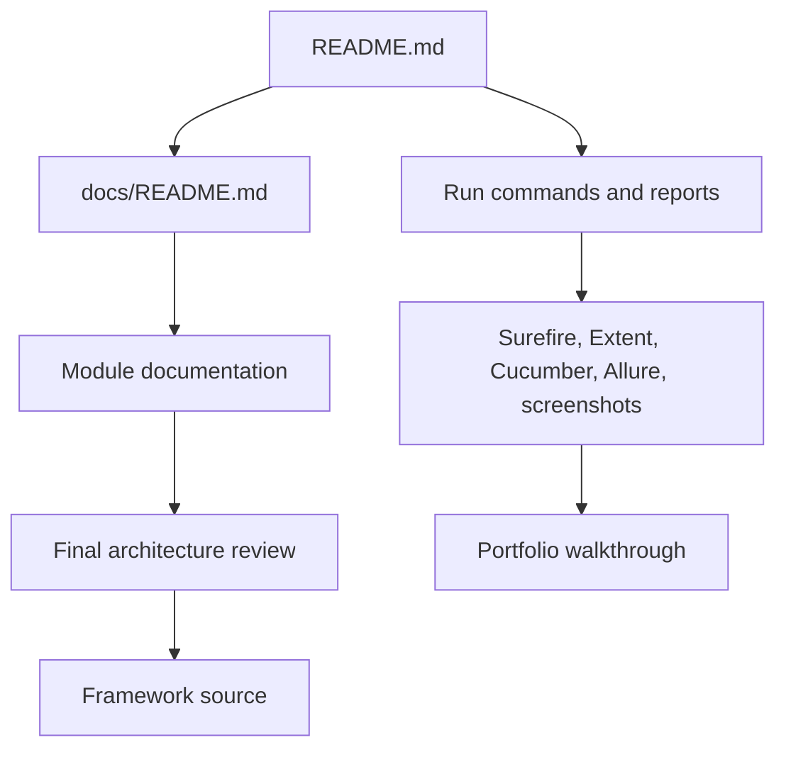

# Module 18 - Capstone And Portfolio Packaging

Module 18 packages the completed learning framework into a portfolio-ready
repository. Earlier modules built the framework. This module makes the final
state easy to inspect, explain, run, and present.

The main learning point is that a framework is not portfolio-ready just because
tests pass. A reviewer also needs to understand the project quickly: what it
teaches, how the architecture evolved, how to run the suites, where reports are
produced, which limitations are honest, and which future enhancements are
reasonable.

## Why This Module Exists Now

Portfolio packaging should happen only after the framework is real. The repo
now has:

- raw Selenium learning coverage.
- TestNG framework execution.
- Page Objects and wrapper methods.
- configuration and driver factory.
- data-driven tests.
- listeners, screenshots, logging, Extent, and Allure.
- parallel execution and Grid support.
- Cucumber BDD.
- GitHub Actions CI.

Module 18 ties those pieces together with final navigation, architecture
review, interview notes, known limitations, and verified run commands.



## How To Study This Module

Read the final packaging layer in this order:

1. [README.md](../../README.md) to understand the public-facing project
   summary, run commands, CI scopes, and limitations.
2. [docs/README.md](../README.md) to see how the full curriculum is indexed.
3. [01-final-architecture-review.md](01-final-architecture-review.md) to
   connect the final framework layers to actual source files.
4. [02-runbook-and-portfolio-guide.md](02-runbook-and-portfolio-guide.md) to
   rehearse local execution and a portfolio walkthrough.
5. [CartPage.java](../../src/main/java/com/learning/framework/pages/saucedemo/CartPage.java)
   to understand the only final code hardening included in this module.
6. [99-interview-review.md](99-interview-review.md) to practice explaining
   the framework as a completed SDET project.

## Files Added Or Changed

| File | Status | Purpose |
| --- | --- | --- |
| [README.md](../../README.md) | Changed | Replaces the stale early-module README with the final framework overview. |
| [docs/README.md](../README.md) | Added | Adds final documentation navigation and source map. |
| [src/main/java/com/learning/framework/pages/saucedemo/CartPage.java](../../src/main/java/com/learning/framework/pages/saucedemo/CartPage.java) | Changed | Hardens the cart-to-checkout transition after the final parallel audit exposed an intermittent public-site click miss. |
| [docs/module-18-capstone-and-portfolio/00-module-overview.md](00-module-overview.md) | Added | Explains final packaging scope and quality gate. |
| [docs/module-18-capstone-and-portfolio/01-final-architecture-review.md](01-final-architecture-review.md) | Added | Reviews final framework layering and design decisions. |
| [docs/module-18-capstone-and-portfolio/02-runbook-and-portfolio-guide.md](02-runbook-and-portfolio-guide.md) | Added | Gives run commands, report paths, resume bullets, and demo flow. |
| [docs/module-18-capstone-and-portfolio/99-interview-review.md](99-interview-review.md) | Added | Final interview talking points. |
| [docs/module-18-capstone-and-portfolio/exercises.md](exercises.md) | Added | Capstone revision exercises. |

## Final Packaging Responsibilities

| File | Role In The Final Project |
| --- | --- |
| [README.md](../../README.md) | first page for a GitHub reviewer; summarizes purpose, stack, architecture, run commands, CI, learning path, and limitations |
| [docs/README.md](../README.md) | curriculum map; lets learners jump to any module and understand source ownership |
| [00-module-overview.md](00-module-overview.md) | explains why the capstone module exists and what changed |
| [01-final-architecture-review.md](01-final-architecture-review.md) | final framework design explanation with source links |
| [02-runbook-and-portfolio-guide.md](02-runbook-and-portfolio-guide.md) | operational runbook and demo script |
| [99-interview-review.md](99-interview-review.md) | final answer framing for SDET interviews |
| [exercises.md](exercises.md) | capstone revision tasks |

## Module Source Links

Use these links as the source-reading checklist for this checkpoint. They point only to files that exist at Module 18.

| File | Status | Why It Matters |
| --- | --- | --- |
| [AGENTS.md](../../AGENTS.md) | Changed | Module session metadata |
| [CLAUDE.md](../../CLAUDE.md) | Changed | Module session metadata |
| [README.md](../../README.md) | Changed | Repository learning guide |
| [docs/README.md](../README.md) | Added | Repository learning guide |
| [src/main/java/com/learning/framework/pages/saucedemo/CartPage.java](../../src/main/java/com/learning/framework/pages/saucedemo/CartPage.java) | Changed | Framework Page Object source |

## The Final Code Hardening

Module 18 includes one scoped framework code change in [CartPage.java](../../src/main/java/com/learning/framework/pages/saucedemo/CartPage.java).
The checkout transition now retries once if the public SauceDemo site leaves
the browser on the cart page after the first checkout click.

This is intentionally not a generic click retry in
[ElementActions.java](../../src/main/java/com/learning/framework/actions/ElementActions.java).
The retry belongs in [CartPage.java](../../src/main/java/com/learning/framework/pages/saucedemo/CartPage.java)
because that page object owns the business transition from cart to checkout and
can verify the expected destination with
[CheckoutPage.waitForInformationStep()](../../src/main/java/com/learning/framework/pages/saucedemo/CheckoutPage.java).

That decision is an important capstone lesson: final hardening should be
specific, observable, and owned by the layer that understands the behavior.
Generic retries can hide real bugs.

## Final Learning Story

The repository should now be explainable as a linear progression:

| Stage | Modules | Learning Outcome |
| --- | --- | --- |
| Java and raw Selenium | 01-07 | understand the language, browser APIs, locators, waits, interactions, and common exceptions |
| TestNG framework base | 08-11 | introduce lifecycle, suites, page objects, wrappers, config, and driver ownership |
| Framework data and diagnostics | 12-14 | add external data, listeners, screenshots, logging, Extent, and Allure |
| Scale and collaboration | 15-17 | add parallel execution, Grid readiness, Cucumber BDD, and CI |
| Portfolio packaging | 18 | make the final project understandable, runnable, and presentable |

## Quality Gate

Run:

```bash
mvn test -DsuiteXmlFile=testng.xml -Dheadless=true
mvn test -DsuiteXmlFile=testng-parallel.xml -Dheadless=true
mvn test -DsuiteXmlFile=testng-cucumber.xml -Dheadless=true
mvn test -Dheadless=true
mvn allure:report
```

Expected result:

- sequential framework suite passes.
- parallel framework suite passes.
- Cucumber suite passes.
- full discovered-test regression passes.
- Allure report is generated.
- root README and docs index point to the final curriculum.

Practical note: the focused final framework checks are the three suite commands
plus `mvn allure:report`. The full `mvn test -Dheadless=true` command also
executes older raw learning tests. If a full run fails in those older modules
because of browser/session instability on public playground pages, separate
that from the final framework packaging changes and report it explicitly.

## What Is Intentionally Deferred

- GitHub Pages publication for Allure.
- cross-browser CI matrix.
- Selenium Grid service containers in CI.
- environment-specific secrets and private AUT support.
- Dockerized local execution.

These are strong future enhancements, but the completed learning framework is
already ready to present as a Selenium Java SDET portfolio project.

## Done Criteria

This module is complete when:

- the final README explains the project without requiring private context.
- the docs index lets a learner navigate the full curriculum.
- the architecture review maps every major framework responsibility to source.
- the runbook gives exact local commands and report paths.
- the final interview guide can support a project walkthrough.
- the module branch and `module-18-complete` tag point to the enhanced
  checkpoint.
