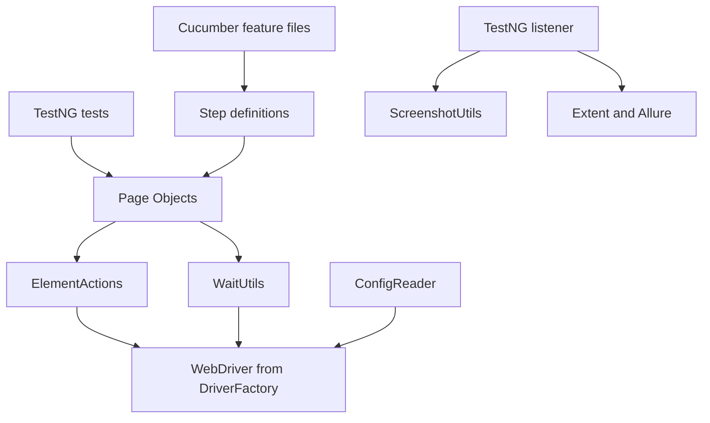

# Final Architecture Review

The final framework is intentionally layered. Each layer has a job, and good
framework maintenance means keeping responsibilities in the correct layer.

## Layer Map

## Design Decisions

Dynamic `By` locators are used instead of PageFactory. This keeps locator
ownership explicit and avoids teaching reflection-based magic before the
learner understands normal Selenium calls.

Page Objects do not own browser lifecycle. Tests, Cucumber hooks, and
framework lifecycle classes decide when browsers start and stop. Page Objects
only model page behavior.

Wrapper methods centralize common Selenium mechanics. `ElementActions` and
`WaitUtils` prevent every Page Object from repeating wait-find-click-type
patterns.

`DriverFactory` owns driver creation and cleanup. This keeps browser selection,
headless settings, Grid mode, timeouts, and window size in one framework
service.

`ThreadLocal` protects parallel execution. A WebDriver session is not shared
across TestNG worker threads or Cucumber scenario context.

BDD is a top layer, not a replacement architecture. Cucumber step definitions
reuse the same Page Objects and framework services that TestNG tests use.

## Final Source Responsibilities

| Class Or File | Responsibility |
| --- | --- |
| [DriverFactory](../../src/main/java/com/learning/framework/driver/DriverFactory.java) | browser creation, local/Grid execution, cleanup |
| [ConfigReader](../../src/main/java/com/learning/framework/config/ConfigReader.java) | typed access to framework configuration |
| [ElementActions](../../src/main/java/com/learning/framework/actions/ElementActions.java) | reusable Selenium interaction wrapper |
| [WaitUtils](../../src/main/java/com/learning/framework/waits/WaitUtils.java) | centralized explicit wait behavior |
| [LoginPage](../../src/main/java/com/learning/framework/pages/saucedemo/LoginPage.java), [ProductsPage](../../src/main/java/com/learning/framework/pages/saucedemo/ProductsPage.java), [CartPage](../../src/main/java/com/learning/framework/pages/saucedemo/CartPage.java), [CheckoutPage](../../src/main/java/com/learning/framework/pages/saucedemo/CheckoutPage.java) | SauceDemo page behavior |
| [BaseTest](../../src/test/java/com/learning/tests/base/BaseTest.java) | TestNG browser lifecycle and framework service setup |
| [FrameworkTestListener](../../src/test/java/com/learning/tests/listeners/FrameworkTestListener.java) | diagnostics, screenshots, reporting hooks |
| [ExtentReportManager](../../src/test/java/com/learning/tests/reports/ExtentReportManager.java) | Extent report lifecycle |
| [AllureReportUtils](../../src/test/java/com/learning/tests/reports/AllureReportUtils.java) | Allure attachment helpers |
| [CucumberTest](../../src/test/java/com/learning/tests/bdd/runners/CucumberTest.java) | TestNG runner for feature files |
| [CucumberHooks](../../src/test/java/com/learning/tests/bdd/hooks/CucumberHooks.java) | Cucumber scenario browser lifecycle |
| [SauceDemoSteps](../../src/test/java/com/learning/tests/bdd/steps/SauceDemoSteps.java) | Gherkin-to-Page-Object bindings |
| [.github/workflows/ui-tests.yml](../../.github/workflows/ui-tests.yml) | CI execution and artifact upload |

## Final Code Reading Path

Read the framework from the outside in:

1. [src/test/java/com/learning/tests/saucedemo/SauceDemoPageObjectTest.java](../../src/test/java/com/learning/tests/saucedemo/SauceDemoPageObjectTest.java)
   shows the TestNG user flow at the highest level.
2. [src/main/java/com/learning/framework/pages/saucedemo/LoginPage.java](../../src/main/java/com/learning/framework/pages/saucedemo/LoginPage.java)
   shows how tests talk to page behavior instead of raw locators.
3. [src/main/java/com/learning/framework/actions/ElementActions.java](../../src/main/java/com/learning/framework/actions/ElementActions.java)
   and [src/main/java/com/learning/framework/waits/WaitUtils.java](../../src/main/java/com/learning/framework/waits/WaitUtils.java)
   show where repeated Selenium mechanics are centralized.
4. [src/main/java/com/learning/framework/driver/DriverFactory.java](../../src/main/java/com/learning/framework/driver/DriverFactory.java)
   and [src/main/java/com/learning/framework/config/ConfigReader.java](../../src/main/java/com/learning/framework/config/ConfigReader.java)
   show how browser sessions are created from configuration.
5. [src/test/java/com/learning/tests/bdd/steps/SauceDemoSteps.java](../../src/test/java/com/learning/tests/bdd/steps/SauceDemoSteps.java)
   and [src/test/resources/features/saucedemo_login.feature](../../src/test/resources/features/saucedemo_login.feature)
   show how Cucumber reuses the same Page Objects instead of creating a second
   automation design.

## Maintenance Rules

Add locators to Page Objects, not tests or steps.

Add repeated Selenium commands to wrapper services only after duplication or
behavioral risk is clear.

Keep waits explicit and close to framework services. Do not add `Thread.sleep`
to tests.

Keep retries specific. If one public training page occasionally misses a safe
navigation click, document and contain that retry in the Page Object that owns
the transition. Do not turn every wrapper click into a silent retry.

Keep test data external when it is scenario data, not framework configuration.

Keep CI scopes intentional. Pull request smoke checks should remain fast enough
to be used consistently.
