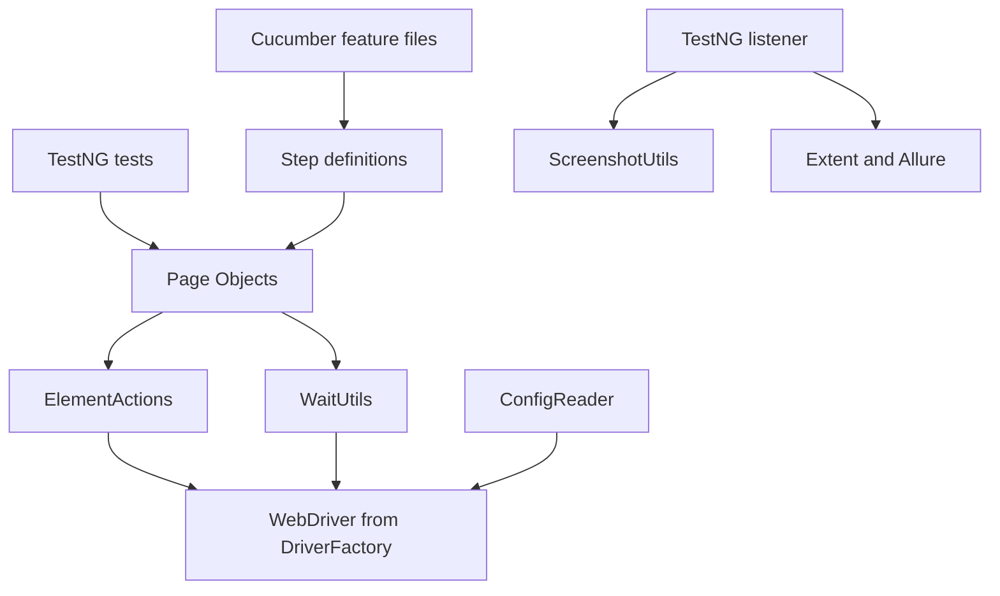

# Final Architecture Review

The final framework is intentionally layered. Each layer has a job, and good
framework maintenance means keeping responsibilities in the correct layer.

This page is the final architecture defense. It should help you answer two
questions:

- where does a behavior start?
- which framework layer owns each responsibility before WebDriver reaches the
  browser?

## Layer Map

## Two Entry Points, One Framework

The final project has two top-level test expression styles:

| Entry Point | Source | What It Expresses |
| --- | --- | --- |
| TestNG tests | [SauceDemoPageObjectTest.java](../../src/test/java/com/learning/tests/saucedemo/SauceDemoPageObjectTest.java) and [SauceDemoDataDrivenTest.java](../../src/test/java/com/learning/tests/saucedemo/SauceDemoDataDrivenTest.java) | Java test methods, groups, assertions, and DataProviders |
| Cucumber BDD | [saucedemo_login.feature](../../src/test/resources/features/saucedemo_login.feature) and [SauceDemoSteps.java](../../src/test/java/com/learning/tests/bdd/steps/SauceDemoSteps.java) | business-readable Gherkin scenarios mapped to Java steps |

Both paths reuse the same page objects, wrappers, waits, driver factory, and
configuration. This is the main final-architecture point: Cucumber is not a
second automation framework.

## Design Decisions

Dynamic `By` locators are used instead of PageFactory. This keeps locator
ownership explicit and avoids teaching reflection-based magic before the
learner understands normal Selenium calls.

The final Page Objects under
[src/main/java/com/learning/framework/pages/saucedemo](../../src/main/java/com/learning/framework/pages/saucedemo)
store locators as `By` values and expose user-facing page behavior. Tests and
steps should not know CSS selectors, IDs, XPath expressions, or wait mechanics.

Page Objects do not own browser lifecycle. Tests, Cucumber hooks, and
framework lifecycle classes decide when browsers start and stop. Page Objects
only model page behavior.

[BaseTest.java](../../src/test/java/com/learning/tests/base/BaseTest.java)
owns TestNG browser setup and teardown. [CucumberHooks.java](../../src/test/java/com/learning/tests/bdd/hooks/CucumberHooks.java)
owns Cucumber scenario setup and teardown. [DriverFactory.java](../../src/main/java/com/learning/framework/driver/DriverFactory.java)
owns the actual WebDriver creation and cleanup.

Wrapper methods centralize common Selenium mechanics. `ElementActions` and
`WaitUtils` prevent every Page Object from repeating wait-find-click-type
patterns.

This is why a page method such as `LoginPage.loginAs(...)` can read like page
behavior instead of raw Selenium script. The wrapper layer is not decoration;
it is where repeated browser interaction rules become consistent.

`DriverFactory` owns driver creation and cleanup. This keeps browser selection,
headless settings, Grid mode, timeouts, and window size in one framework
service.

`ThreadLocal` protects parallel execution. A WebDriver session is not shared
across TestNG worker threads or Cucumber scenario context.

BDD is a top layer, not a replacement architecture. Cucumber step definitions
reuse the same Page Objects and framework services that TestNG tests use.

## Final Source Responsibilities

| Class Or File | Responsibility |
| --- | --- |
| [DriverFactory](../../src/main/java/com/learning/framework/driver/DriverFactory.java) | browser creation, local/Grid execution, cleanup |
| [ConfigReader](../../src/main/java/com/learning/framework/config/ConfigReader.java) | typed access to framework configuration |
| [ElementActions](../../src/main/java/com/learning/framework/actions/ElementActions.java) | reusable Selenium interaction wrapper |
| [WaitUtils](../../src/main/java/com/learning/framework/waits/WaitUtils.java) | centralized explicit wait behavior |
| [LoginPage](../../src/main/java/com/learning/framework/pages/saucedemo/LoginPage.java), [ProductsPage](../../src/main/java/com/learning/framework/pages/saucedemo/ProductsPage.java), [CartPage](../../src/main/java/com/learning/framework/pages/saucedemo/CartPage.java), [CheckoutPage](../../src/main/java/com/learning/framework/pages/saucedemo/CheckoutPage.java) | SauceDemo page behavior |
| [BaseTest](../../src/test/java/com/learning/tests/base/BaseTest.java) | TestNG browser lifecycle and framework service setup |
| [FrameworkTestListener](../../src/test/java/com/learning/tests/listeners/FrameworkTestListener.java) | diagnostics, screenshots, reporting hooks |
| [ExtentReportManager](../../src/test/java/com/learning/tests/reports/ExtentReportManager.java) | Extent report lifecycle |
| [AllureReportUtils](../../src/test/java/com/learning/tests/reports/AllureReportUtils.java) | Allure attachment helpers |
| [CucumberTest](../../src/test/java/com/learning/tests/bdd/runners/CucumberTest.java) | TestNG runner for feature files |
| [CucumberHooks](../../src/test/java/com/learning/tests/bdd/hooks/CucumberHooks.java) | Cucumber scenario browser lifecycle |
| [SauceDemoSteps](../../src/test/java/com/learning/tests/bdd/steps/SauceDemoSteps.java) | Gherkin-to-Page-Object bindings |
| [.github/workflows/ui-tests.yml](../../.github/workflows/ui-tests.yml) | CI execution and artifact upload |

## Final Code Reading Path

Read the framework from the outside in:

1. [src/test/java/com/learning/tests/saucedemo/SauceDemoPageObjectTest.java](../../src/test/java/com/learning/tests/saucedemo/SauceDemoPageObjectTest.java)
   shows the TestNG user flow at the highest level.
2. [src/main/java/com/learning/framework/pages/saucedemo/LoginPage.java](../../src/main/java/com/learning/framework/pages/saucedemo/LoginPage.java)
   shows how tests talk to page behavior instead of raw locators.
3. [src/main/java/com/learning/framework/actions/ElementActions.java](../../src/main/java/com/learning/framework/actions/ElementActions.java)
   and [src/main/java/com/learning/framework/waits/WaitUtils.java](../../src/main/java/com/learning/framework/waits/WaitUtils.java)
   show where repeated Selenium mechanics are centralized.
4. [src/main/java/com/learning/framework/driver/DriverFactory.java](../../src/main/java/com/learning/framework/driver/DriverFactory.java)
   and [src/main/java/com/learning/framework/config/ConfigReader.java](../../src/main/java/com/learning/framework/config/ConfigReader.java)
   show how browser sessions are created from configuration.
5. [src/test/java/com/learning/tests/bdd/steps/SauceDemoSteps.java](../../src/test/java/com/learning/tests/bdd/steps/SauceDemoSteps.java)
   and [src/test/resources/features/saucedemo_login.feature](../../src/test/resources/features/saucedemo_login.feature)
   show how Cucumber reuses the same Page Objects instead of creating a second
   automation design.

## Maintenance Rules

Add locators to Page Objects, not tests or steps.

Add repeated Selenium commands to wrapper services only after duplication or
behavioral risk is clear.

Keep waits explicit and close to framework services. Do not add `Thread.sleep`
to tests.

Keep retries specific. If one public training page occasionally misses a safe
navigation click, document and contain that retry in the Page Object that owns
the transition. Do not turn every wrapper click into a silent retry.

Keep test data external when it is scenario data, not framework configuration.

Keep CI scopes intentional. Pull request smoke checks should remain fast enough
to be used consistently.

## Capstone Hardening: Cart Checkout Retry

[CartPage.checkout()](../../src/main/java/com/learning/framework/pages/saucedemo/CartPage.java)
contains the final hardening change. During the final audit, the public
SauceDemo site occasionally left the browser on the cart page after the first
checkout click. The method now:

1. clicks the checkout button.
2. creates [CheckoutPage.java](../../src/main/java/com/learning/framework/pages/saucedemo/CheckoutPage.java).
3. waits for the checkout information step.
4. retries once only if that destination wait times out.
5. rethrows the timeout on the second failure.

The important design decision is that the retry is behavior-specific. It is
not hidden inside [ElementActions.java](../../src/main/java/com/learning/framework/actions/ElementActions.java),
because not every click is safe to repeat. The cart page understands that
clicking checkout should transition to the checkout information page.

## Final Package Map

| Package Or Folder | Final Role |
| --- | --- |
| `com.learning.framework.actions` | reusable interaction wrappers |
| `com.learning.framework.config` | runtime configuration access |
| `com.learning.framework.driver` | WebDriver lifecycle, local/Grid execution, ThreadLocal isolation |
| `com.learning.framework.pages.saucedemo` | SauceDemo Page Objects |
| `com.learning.framework.screenshots` | screenshot file creation |
| `com.learning.framework.waits` | explicit wait helpers |
| `com.learning.tests.base` | TestNG framework lifecycle |
| `com.learning.tests.bdd` | Cucumber runner, hooks, context, and steps |
| `com.learning.tests.dataproviders` | TestNG data source adapters |
| `com.learning.tests.listeners` | TestNG diagnostics, screenshots, retry attachment, report events |
| `com.learning.tests.reports` | Extent and Allure report helpers |
| `docs` | module-by-module curriculum and final project guide |

## Interview Architecture Framing

A strong explanation starts at behavior and moves downward:

"The framework supports both TestNG tests and Cucumber feature files. Both call
the same SauceDemo Page Objects. Page Objects use wrapper actions and explicit
wait utilities instead of raw repeated Selenium code. DriverFactory and
ConfigReader own browser creation, local/Grid execution, headless mode, window
size, and cleanup. TestNG listeners and Cucumber hooks attach diagnostics.
CI runs selected suites in headless Chrome and uploads artifacts."

Avoid describing the project as "just a Selenium framework." The stronger
story is that it shows how a framework grows from fundamentals into a layered,
diagnosable, parallel-ready, CI-enabled project.

## Revision Checklist

- Can you draw both the TestNG and Cucumber entry paths?
- Can you explain why page objects do not create drivers?
- Can you explain why `CartPage.checkout()` owns the retry instead of
  `ElementActions.click()`?
- Can you explain which package owns data, diagnostics, reports, and BDD?
- Can you identify the source file you would change for a locator issue?
